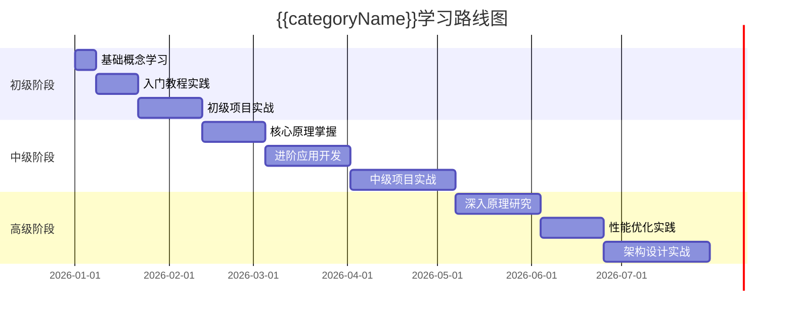

# {{categoryName}}知识体系

> **最后更新**: {{lastModified}}
> **文档数量**: {{documentCount}}
> **学习进度**: {{learningProgress}}
> **技术栈**: {{techStack}}

## 概述

### 学习目标

<!-- 学习本分类知识的目标： -->
- 目标1
- 目标2
- 目标3

### 适用人群

<!-- 本分类知识适合的读者： -->
- 人群1
- 人群2
- 人群3

### 预备知识

<!-- 学习本分类前需要掌握： -->
- 知识1
- 知识2
- 知识3

## 学习路径

### 初级阶段

#### 基础概念

<!-- 初级阶段的基础概念： -->
- [[概念1]]
- [[概念2]]
- [[概念3]]

#### 入门教程

<!-- 入门教程和资源： -->
- [[教程1]]
- [[教程2]]
- [[教程3]]

#### 实践练习

<!-- 初级实践练习： -->
- [[练习1]]
- [[练习2]]
- [[练习3]]

### 中级阶段

#### 核心原理

<!-- 中级阶段的核心原理： -->
- [[原理1]]
- [[原理2]]
- [[原理3]]

#### 进阶应用

<!-- 进阶应用场景： -->
- [[应用1]]
- [[应用2]]
- [[应用3]]

#### 项目实战

<!-- 中级项目实战： -->
- [[项目1]]
- [[项目2]]
- [[项目3]]

### 高级阶段

#### 深入原理

<!-- 高级阶段的深入原理： -->
- [[深入原理1]]
- [[深入原理2]]
- [[深入原理3]]

#### 性能优化

<!-- 性能优化相关： -->
- [[优化1]]
- [[优化2]]
- [[优化3]]

#### 架构设计

<!-- 架构设计相关： -->
- [[架构1]]
- [[架构2]]
- [[架构3]]

## 知识地图

### 核心知识点

```mermaid
graph TD
    A[{{categoryName}}] --> B[核心概念]
    A --> C[关键技术]
    A --> D[最佳实践]

    B --> B1[概念1]
    B --> B2[概念2]
    B --> B3[概念3]

    C --> C1[技术1]
    C --> C2[技术2]
    C --> C3[技术3]

    D --> D1[实践1]
    D --> D2[实践2]
    D --> D3[实践3]
```

### 学习路线图



## 内容索引

### 基础文档

<!-- 基础概念和入门文档： -->
- [[文档1]]
- [[文档2]]
- [[文档3]]
- [[文档4]]
- [[文档5]]

### 教程指南

<!-- 教程和指南文档： -->
- [[教程1]]
- [[教程2]]
- [[教程3]]
- [[教程4]]
- [[教程5]]

### 实战项目

<!-- 实战项目文档： -->
- [[项目1]]
- [[项目2]]
1. [[项目3]]
- [[项目4]]
- [[项目5]]

### 工具资源

<!-- 工具和资源文档： -->
- [[工具1]]
- [[工具2]]
- [[工具3]]
- [[资源1]]
- [[资源2]]

### 问题解决

<!-- 常见问题解决方案： -->
- [[问题1]]
- [[问题2]]
- [[问题3]]
- [[问题4]]
- [[问题5]]

## 最佳实践

### 编码规范

<!-- 编码规范和约定： -->
- [[规范1]]
- [[规范2]]
- [[规范3]]

### 设计模式

<!-- 设计模式应用： -->
- [[模式1]]
- [[模式2]]
- [[模式3]]

### 性能优化

<!-- 性能优化技巧： -->
- [[优化1]]
- [[优化2]]
- [[优化3]]

### 安全防护

<!-- 安全防护措施： -->
- [[安全1]]
- [[安全2]]
- [[安全3]]

## 相关资源

### 官方文档

- [官方文档1](https://example.com)
- [官方文档2](https://example.com)
- [官方文档3](https://example.com)

### 社区资源

- [社区论坛](https://example.com)
- [GitHub仓库](https://example.com)
- [技术博客](https://example.com)

### 学习平台

- [平台1](https://example.com)
- [平台2](https://example.com)
- [平台3](https://example.com)

### 书籍推荐

- [书籍1](https://example.com)
- [书籍2](https://example.com)
- [书籍3](https://example.com)

## 更新记录

| 日期 | 版本 | 更新内容 |
|------|------|----------|
| {{lastModified}} | {{version}} | 创建文档 |
| {{update1Date}} | {{version1}} | {{update1Content}} |
| {{update2Date}} | {{version2}} | {{update2Content}} |

## 学习建议

### 时间安排

<!-- 建议的学习时间安排： -->
- 初级阶段：{{time1}}
- 中级阶段：{{time2}}
- 高级阶段：{{time3}}

### 学习方法

<!-- 有效的学习方法： -->
- 方法1
- 方法2
- 方法3

### 实践建议

<!-- 实践练习建议： -->
- 建议1
- 建议2
- 建议3

### 考核标准

<!-- 学习成果考核标准： -->
- 标准1
- 标准2
- 标准3

---

> **分类信息**
> - **分类**: {{categoryName}}
> - **文档总数**: {{documentCount}}
> - **最后更新**: {{lastModified}}
> - **维护状态**: {{maintenanceStatus}}
> - **推荐学习顺序**: {{learningOrder}}