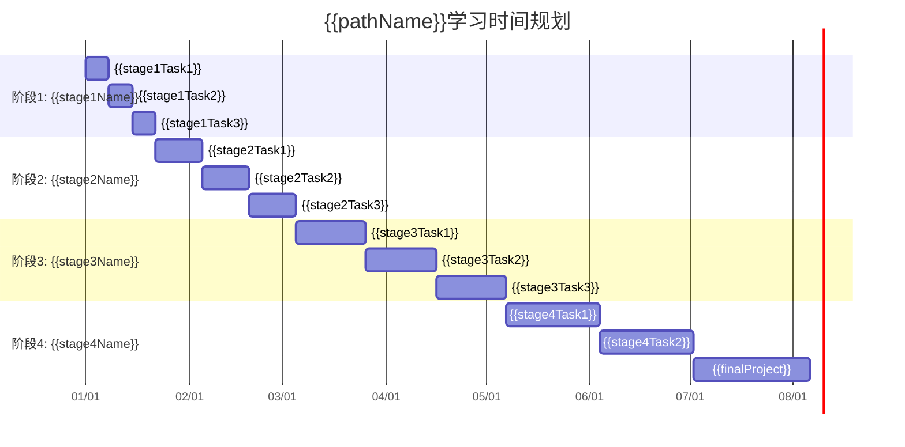

# {{pathName}}学习路径

> **路径类型**: {{pathType}}
> **难度级别**: {{difficultyLevel}}
> **预计时长**: {{estimatedDuration}}
> **完成状态**: {{completionStatus}}
> **最后更新**: {{lastModified}}

## 路径概览

### 学习目标

<!-- 完成本学习路径后，你将能够： -->
- {{goal1}}
- {{goal2}}
- {{goal3}}
- {{goal4}}
- {{goal5}}

### 目标读者

<!-- 本学习路径适合： -->
- {{audience1}}
- {{audience2}}
- {{audience3}}

### 前置要求

<!-- 开始学习前需要满足： -->
- {{prerequisite1}}
- {{prerequisite2}}
- {{prerequisite3}}

### 学习资源

<!-- 主要学习资源： -->
- 资源类型1: {{resource1}}
- 资源类型2: {{resource2}}
- 资源类型3: {{resource3}}

## 学习路线图

### 整体路线

```mermaid
graph LR
    A[起点] --> B[阶段1: {{stage1Name}}]
    B --> C[阶段2: {{stage2Name}}]
    C --> D[阶段3: {{stage3Name}}]
    D --> E[阶段4: {{stage4Name}}]
    E --> F[终点: {{finalGoal}}]

    style A fill:#f9f,stroke:#333
    style F fill:#bbf,stroke:#333
```

### 时间规划



## 阶段详情

### 阶段1: {{stage1Name}}

#### 阶段目标

<!-- 本阶段的学习目标： -->
- {{stage1Goal1}}
- {{stage1Goal2}}
- {{stage1Goal3}}

#### 核心内容

<!-- 本阶段的核心学习内容： -->
1. **{{topic1}}**
   - 学习要点: {{keyPoint1}}
   - 学习资源: [[{{resource1}}]]
   - 实践练习: [[{{exercise1}}]]
   - 预计时间: {{time1}}

2. **{{topic2}}**
   - 学习要点: {{keyPoint2}}
   - 学习资源: [[{{resource2}}]]
   - 实践练习: [[{{exercise2}}]]
   - 预计时间: {{time2}}

3. **{{topic3}}**
   - 学习要点: {{keyPoint3}}
   - 学习资源: [[{{resource3}}]]
   - 实践练习: [[{{exercise3}}]]
   - 预计时间: {{time3}}

#### 阶段考核

<!-- 本阶段的考核要求： -->
- 考核方式: {{assessment1}}
- 通过标准: {{standard1}}
- 考核资源: [[{{test1}}]]

### 阶段2: {{stage2Name}}

#### 阶段目标

<!-- 本阶段的学习目标： -->
- {{stage2Goal1}}
- {{stage2Goal2}}
- {{stage2Goal3}}

#### 核心内容

<!-- 本阶段的核心学习内容： -->
1. **{{topic4}}**
   - 学习要点: {{keyPoint4}}
   - 学习资源: [[{{resource4}}]]
   - 实践练习: [[{{exercise4}}]]
   - 预计时间: {{time4}}

2. **{{topic5}}**
   - 学习要点: {{keyPoint5}}
   - 学习资源: [[{{resource5}}]]
   - 实践练习: [[{{exercise5}}]]
   - 预计时间: {{time5}}

3. **{{topic6}}**
   - 学习要点: {{keyPoint6}}
   - 学习资源: [[{{resource6}}]]
   - 实践练习: [[{{exercise6}}]]
   - 预计时间: {{time6}}

#### 阶段考核

<!-- 本阶段的考核要求： -->
- 考核方式: {{assessment2}}
- 通过标准: {{standard2}}
- 考核资源: [[{{test2}}]]

### 阶段3: {{stage3Name}}

#### 阶段目标

<!-- 本阶段的学习目标： -->
- {{stage3Goal1}}
- {{stage3Goal2}}
- {{stage3Goal3}}

#### 核心内容

<!-- 本阶段的核心学习内容： -->
1. **{{topic7}}**
   - 学习要点: {{keyPoint7}}
   - 学习资源: [[{{resource7}}]]
   - 实践练习: [[{{exercise7}}]]
   - 预计时间: {{time7}}

2. **{{topic8}}**
   - 学习要点: {{keyPoint8}}
   - 学习资源: [[{{resource8}}]]
   - 实践练习: [[{{exercise8}}]]
   - 预计时间: {{time8}}

3. **{{topic9}}**
   - 学习要点: {{keyPoint9}}
   - 学习资源: [[{{resource9}}]]
   - 实践练习: [[{{exercise9}}]]
   - 预计时间: {{time9}}

#### 阶段考核

<!-- 本阶段的考核要求： -->
- 考核方式: {{assessment3}}
- 通过标准: {{standard3}}
- 考核资源: [[{{test3}}]]

### 阶段4: {{stage4Name}}

#### 阶段目标

<!-- 本阶段的学习目标： -->
- {{stage4Goal1}}
- {{stage4Goal2}}
- {{stage4Goal3}}

#### 核心内容

<!-- 本阶段的核心学习内容： -->
1. **{{topic10}}**
   - 学习要点: {{keyPoint10}}
   - 学习资源: [[{{resource10}}]]
   - 实践练习: [[{{exercise10}}]]
   - 预计时间: {{time10}}

2. **{{topic11}}**
   - 学习要点: {{keyPoint11}}
   - 学习资源: [[{{resource11}}]]
   - 实践练习: [[{{exercise11}}]]
   - 预计时间: {{time11}}

3. **{{topic12}}**
   - 学习要点: {{keyPoint12}}
   - 学习资源: [[{{resource12}}]]
   - 实践练习: [[{{exercise12}}]]
   - 预计时间: {{time12}}

#### 阶段考核

<!-- 本阶段的考核要求： -->
- 考核方式: {{assessment4}}
- 通过标准: {{standard4}}
- 考核资源: [[{{test4}}]]

## 综合项目

### 项目名称: {{projectName}}

#### 项目目标

<!-- 项目的整体目标： -->
- {{projectGoal1}}
- {{projectGoal2}}
- {{projectGoal3}}

#### 项目要求

<!-- 项目的具体要求： -->
- 功能要求: {{requirement1}}
- 技术栈: {{techStack}}
- 代码规范: {{codeStandard}}
- 测试要求: {{testRequirement}}
- 文档要求: {{docRequirement}}

#### 项目步骤

<!-- 项目的实施步骤： -->
1. **{{step1}}**
   - 任务: {{task1}}
   - 交付物: [[{{deliverable1}}]]
   - 参考资料: [[{{reference1}}]]

2. **{{step2}}**
   - 任务: {{task2}}
   - 交付物: [[{{deliverable2}}]]
   - 参考资料: [[{{reference2}}]]

3. **{{step3}}**
   - 任务: {{task3}}
   - 交付物: [[{{deliverable3}}]]
   - 参考资料: [[{{reference3}}]]

4. **{{step4}}**
   - 任务: {{task4}}
   - 交付物: [[{{deliverable4}}]]
   - 参考资料: [[{{reference4}}]]

#### 项目评估

<!-- 项目的评估标准： -->
- 功能完整性: {{functionCompleteness}}
- 代码质量: {{codeQuality}}
- 文档完整性: {{docCompleteness}}
- 创新性: {{innovation}}
- 演示效果: {{demoEffect}}

## 学习资源

### 核心教材

<!-- 主要学习教材： -->
- [[{{textbook1}}]]
- [[{{textbook2}}]]
- [[{{textbook3}}]]

### 在线课程

<!-- 推荐的在线课程： -->
- [课程1]({{course1Url}})
- [课程2]({{course2Url}})
- [课程3]({{course3Url}})

### 参考文档

<!-- 参考文档和手册： -->
- [[{{doc1}}]]
- [[{{doc2}}]]
- [[{{doc3}}]]
- [[{{doc4}}]]
- [[{{doc5}}]]

### 工具软件

<!-- 需要使用的工具软件： -->
- [[{{tool1}}]]
- [[{{tool2}}]]
- [[{{tool3}}]]
- [[{{tool4}}]]
- [[{{tool5}}]]

### 社区资源

<!-- 相关社区和论坛： -->
- [社区1]({{community1Url}})
- [社区2]({{community2Url}})
- [社区3]({{community3Url}})

## 学习进度跟踪

### 进度记录

| 日期 | 学习内容 | 完成状态 | 学习时长 | 备注 |
|------|----------|----------|----------|------|
| {{date1}} | {{content1}} | {{status1}} | {{duration1}} | {{note1}} |
| {{date2}} | {{content2}} | {{status2}} | {{duration2}} | {{note2}} |
| {{date3}} | {{content3}} | {{status3}} | {{duration3}} | {{note3}} |
| {{date4}} | {{content4}} | {{status4}} | {{duration4}} | {{note4}} |
| {{date5}} | {{content5}} | {{status5}} | {{duration5}} | {{note5}} |

### 学习统计

<!-- 学习统计数据： -->
- 总学习时长: {{totalDuration}}
- 完成阶段数: {{completedStages}}/{{totalStages}}
- 学习文档数: {{learnedDocs}}
- 实践项目数: {{completedProjects}}
- 整体进度: {{overallProgress}}%

### 学习反思

<!-- 学习过程中的反思和总结： -->
- {{reflection1}}
- {{reflection2}}
- {{reflection3}}

## 常见问题

### 学习问题

#### Q1: {{question1}}

**A:** {{answer1}}

#### Q2: {{question2}}

**A:** {{answer2}}

#### Q3: {{question3}}

**A:** {{answer3}}

### 技术问题

#### Q4: {{question4}}

**A:** {{answer4}}

#### Q5: {{question5}}

**A:** {{answer5}}

#### Q6: {{question6}}

**A:** {{answer6}}

### 学习建议

#### 建议1: {{suggestion1}}

**说明:** {{explanation1}}

#### 建议2: {{suggestion2}}

**说明:** {{explanation2}}

#### 建议3: {{suggestion3}}

**说明:** {{explanation3}}

## 证书与认证

### 学习证书

<!-- 完成学习后可获得的证书： -->
- 证书名称: {{certificateName}}
- 颁发机构: {{issuingOrganization}}
- 获取条件: {{certificateCondition}}
- 证书价值: {{certificateValue}}

### 技能认证

<!-- 相关的技能认证： -->
- 认证1: {{certification1}}
- 认证2: {{certification2}}
- 认证3: {{certification3}}

### 职业发展

<!-- 完成学习后的职业发展路径： -->
- 职业方向1: {{careerPath1}}
- 职业方向2: {{careerPath2}}
- 职业方向3: {{careerPath3}}

## 更新记录

| 版本 | 更新日期 | 更新内容 | 更新人 |
|------|----------|----------|--------|
| {{version1}} | {{updateDate1}} | {{updateContent1}} | {{updater1}} |
| {{version2}} | {{updateDate2}} | {{updateContent2}} | {{updater2}} |
| {{version3}} | {{updateDate3}} | {{updateContent3}} | {{updater3}} |

---

> **学习路径信息**
> - **路径名称**: {{pathName}}
> - **创建日期**: {{createdDate}}
> - **最后更新**: {{lastModified}}
> - **维护状态**: {{maintenanceStatus}}
> - **推荐指数**: {{recommendationRating}}/5
> - **学习难度**: {{learningDifficulty}}
> - **实用价值**: {{practicalValue}}