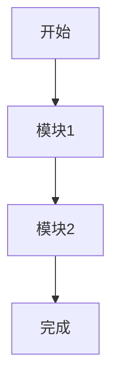

# {{title}}教程

## 教程简介

### 学习目标

<!-- 本教程结束后，你将能够： -->
- 目标1
- 目标2
- 目标3

### 目标读者

<!-- 本教程适合以下读者： -->
- 读者群体1
- 读者群体2

### 预备知识

<!-- 学习本教程前，你需要： -->
- 知识1
- 知识2

### 所需工具

<!-- 学习本教程需要准备： -->
- 工具1
- 工具2

## 环境准备

### 安装步骤

```bash
# 安装必要的软件和工具
```

### 配置说明

```bash
# 配置环境和设置
```

### 验证安装

```bash
# 验证安装是否成功
```

## 基础入门

### 第一步：创建项目

```{{language}}
// 第一步代码示例
```

**说明：**
<!-- 第一步的详细说明 -->

### 第二步：核心功能实现

```{{language}}
// 第二步代码示例
```

**说明：**
<!-- 第二步的详细说明 -->

### 第三步：测试验证

```{{language}}
// 第三步代码示例
```

**说明：**
<!-- 第三步的详细说明 -->

## 进阶实践

### 实战案例：{{caseName}}

```{{language}}
// 实战案例代码
```

**案例背景：**
<!-- 案例背景说明 -->

**实现步骤：**
1. 步骤1
2. 步骤2
3. 步骤3

**效果演示：**
<!-- 案例效果展示 -->

### 常见问题解决

#### 问题1：{{problem1}}

**症状：**
<!-- 问题表现 -->

**原因：**
<!-- 问题原因 -->

**解决方案：**
```{{language}}
// 解决方案代码
```

#### 问题2：{{problem2}}

**症状：**
<!-- 问题表现 -->

**原因：**
<!-- 问题原因 -->

**解决方案：**
```{{language}}
// 解决方案代码
```

## 项目实战

### 项目需求

<!-- 项目需求描述 -->

### 架构设计



### 代码实现

#### 模块1：{{module1}}

```{{language}}
// 模块1代码
```

#### 模块2：{{module2}}

```{{language}}
// 模块2代码
```

#### 模块3：{{module3}}

```{{language}}
// 模块3代码
```

### 测试部署

```bash
# 测试命令
```

```bash
# 部署命令
```

## 总结与扩展

### 知识点总结

<!-- 本教程涵盖的知识点总结 -->

### 学习成果

<!-- 完成本教程后的学习成果 -->

### 下一步学习建议

- 建议1
- 建议2
- 建议3

### 扩展练习

1. 练习1：{{exercise1}}
2. 练习2：{{exercise2}}
3. 练习3：{{exercise3}}

## 资源推荐

### 官方资源

- [官方文档](https://example.com)
- [API参考](https://example.com)
- [示例项目](https://example.com)

### 社区资源

- [社区论坛](https://example.com)
- [GitHub仓库](https://example.com)
- [技术博客](https://example.com)

### 相关教程

- [[相关教程1]]
- [[相关教程2]]
- [[相关教程3]]

---

> **教程信息**
> - **难度**: {{difficulty}}
> - **预计完成时间**: {{estimatedTime}}
> - **技术栈**: {{techStack}}
> - **最后更新**: {{lastModified}}
> - **作者**: {{author}}
> - **反馈**: 如有问题或建议，欢迎反馈