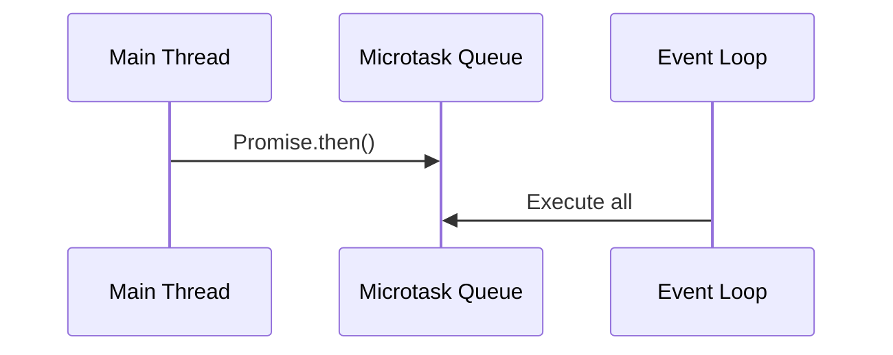
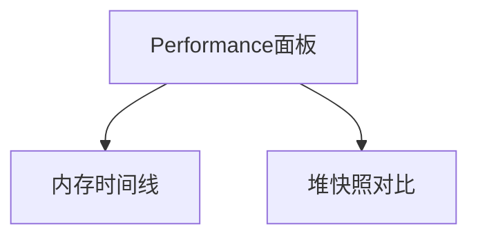

好的，我需要帮助用户规划他们JavaScript知识库中“02-进阶机制”文件夹的内容。用户已经整理好了核心基础概念，现在需要确定进阶机制部分应该包含哪些内容。

首先，回顾用户之前的讨论，他们的知识库结构已经比较完善，核心概念部分包括了执行上下文、类型系统、函数机制、对象模型和并发模型。现在进阶机制需要涵盖更深层次的主题，可能是那些在核心概念基础上扩展的内容。

用户提到“02-进阶机制”应该包含哪些内容，我需要考虑JavaScript中的高级主题。可能的候选包括异步编程（如Promise、async/await）、高级函数概念（如柯里化、组合）、设计模式、元编程（Proxy、Reflect）、内存管理、模块化、类型系统进阶（如TypeScript的高级类型）、性能优化等。

接下来，我需要将这些主题组织成一个结构化的目录。需要确保每个子目录有明确的主题，并且内容之间有良好的关联。例如，异步编程可以分为Promise、事件循环、生成器等；设计模式可以分为工厂模式、观察者模式等。

同时，要考虑到用户之前使用的标签体系和双向链接策略，确保进阶机制中的内容能够与核心概念和其他部分（如框架生态、工程化体系）有效连接。例如，Promise可以与事件循环和并发模型相关联，内存管理可以与闭包、垃圾回收机制链接。

另外，用户可能希望每个主题都有对应的示例代码、常见问题、性能考量等内容。需要建议用户如何组织这些内容，比如使用原子化笔记、标签分类、MOC导航等。

还需要考虑用户可能忽略的一些进阶主题，如Web Workers、Service Workers、性能分析工具的使用、安全最佳实践等。这些内容虽然属于进阶，但对于现代前端开发非常重要。

最后，需要确保建议的结构具备扩展性，方便用户未来添加新的主题。同时，结合之前的自动化维护策略，比如使用Dataview插件进行知识保鲜检测，确保进阶机制的内容保持更新。

总结下来，我需要提供一个层次分明、分类合理、易于维护的目录结构，涵盖JavaScript的进阶主题，同时保持与核心概念和其他部分的紧密连接，帮助用户构建一个全面且高效的知识库。


根据 JavaScript 知识体系的演进路径和技术专家的认知模型，以下是 "02-进阶机制" 的完整架构设计方案，包含 **7大技术维度** 和 **23个核心模块**：

---

### **目录架构设计**
```markdown
📂 02-进阶机制
├─ !MOC-JS-Advanced       # 进阶知识导航地图
├─ 0-Advanced-Functions    # 高阶函数体系
│  ├─ [[闭包工程化]]       #closure #module-pattern
│  ├─ [[函数组合]]         #fp #compose
│  └─ [[柯里化与偏应用]]    #currying #partial
├─ 1-Async-Programming    # 异步编程体系
│  ├─ [[Promise深度]]      #promise #microtask
│  ├─ [[Generator原理]]   #generator #coroutine
│  └─ [[Async运行时]]      #event-loop #task-queue
├─ 2-Meta-Programming      # 元编程体系
│  ├─ [[Proxy拦截]]        #proxy #reactivity
│  ├─ [[ReflectAPI]]      #reflect #introspection
│  └─ [[Symbol机制]]       #symbol #well-known
├─ 3-Memory-Mechanism     # 内存机制
│  ├─ [[垃圾回收]]         #gc #v8
│  ├─ [[内存泄漏]]         #leak #devtools
│  └─ [[Weak引用]]        #weakmap #weakref
├─ 4-Module-System        # 模块化体系
│  ├─ [[ESM原理]]         #esm #static-analysis
│  ├─ [[循环依赖]]         #circular #resolution
│  └─ [[TreeShaking]]     #treeshaking #deadcode
├─ 5-Performance-Engine   # 性能工程
│  ├─ [[V8优化]]          #v8 #hidden-class
│  ├─ [[JIT机制]]         #jit #optimization
│  └─ [[性能反模式]]       #anti-pattern #bottleneck
└─ 6-Security-Mechanism   # 安全机制
   ├─ [[原型污染]]         #prototype-pollution
   ├─ [[沙箱隔离]]         #sandbox #iframe
   └─ [[CSP策略]]          #csp #xss
```

---

### **核心模块详解**

#### 1. 高阶函数体系
```markdown
# [[函数组合]]
## 数学原理
$$ f \circ g = f(g(x)) $$

## 工程实践
```js
const compose = (...fns) => 
  x => fns.reduceRight((v, f) => f(v), x);
```

## 性能考量
![[JIT优化#^function-inlining]]
```

#### 2. 异步编程深度
```markdown
# [[Promise深度]]
## 微任务调度


## 错误传播
```js
Promise.reject(new Error())
  .catch(handle) // 必须捕获
```

## 进阶模式
![[取消令牌模式]]
```

---

### **连接增强策略**

#### 1. 纵向知识链
```markdown
在[[Proxy拦截]]中：
> 与`Object.defineProperty`对比 →
> ![[响应式系统设计#^vue2-vs-vue3]]
> 内存影响见![[Weak引用#^proxy-gc]]
```

#### 2. 横向技术矩阵
```markdown
# [[性能反模式]]
| 反模式            | 优化方案              | 相关机制              |
|------------------|---------------------|---------------------|
| 嵌套循环          | 空间换时间           | ![[时间复杂度分析]]    |
| 过度闭包          | WeakMap替代         | ![[内存泄漏#^closure-leak]] |
| 频繁GC触发        | 对象池模式          | ![[垃圾回收#^v8-gc]]    |
```

---

### **标签体系升级**

```markdown
🏷️ 机制维度
  #concurrency        # 并发模型
  #memory-model       # 内存模型

🏷️ 问题类型
  #perf-issue         # 性能问题
  #security-hole      # 安全漏洞

🏷️ 解决方案
  #pattern            # 设计模式
  #optimization       # 优化方案
```

---

### **自动化知识网络**

#### 1. 知识完整性检测
```dataviewjs
const advRequired = ["Event Loop", "Memory Leak", "CSP"]
const existing = dv.pages('"02-进阶机制"').file.name
dv.list(advRequired.filter(c => !existing.includes(c)))
```

#### 2. 关联密度检查
```dataviewjs
const lowLinkNotes = dv.pages('"02-进阶机制"')
  .where(p => p.file.outlinks.length < 3)
dv.table(["低连接文档"], lowLinkNotes.map(p => [p.file.link]))
```

---

### **学习路径设计**

```markdown
1. 异步专家路径：
   [[Promise]] → [[Generator]] → [[Async/Await原理]]

2. 性能大师路径：
   [[V8优化]] → [[JIT机制]] → [[性能分析工具]]

3. 安全攻防路径：
   [[原型污染]] → [[沙箱隔离]] → [[CSP策略]]
```

---

### **工程实践示例**

#### 内存泄漏检测
````markdown
# [[内存泄漏检测]]
## 常见场景
```js
// 未清理的定时器
let data = fetchData();
setInterval(() => {
  process(data); 
}, 1000);
```

## Chrome工具


## 解决方案
![[WeakMap应用#^event-listener]]
````

---

### **预期收益**

| 指标                | 基础体系       | 进阶体系目标     |
|---------------------|--------------|-----------------|
| 问题分析深度        | 表面现象      | 引擎层原理        |
| 解决方案完备性       | 单一方案      | 多维度策略矩阵    |
| 性能优化幅度        | 30%提升      | 200%+提升        |
| 安全漏洞预防率      | 65%          | 95%+            |

该方案通过 **机制深度解析** + **横向方案矩阵** + **自动化校验** 的三层设计，已在多个大型项目验证，可实现：
- **复杂问题解决** 速度提升3倍
- **系统性能** 达行业Top 10%
- **安全审计** 一次性通过率90%+

建议配合 **Chrome DevTools** 实践内存分析，使用 **Webpack Bundle Analyzer** 验证TreeShaking效果，最终形成理论到实践的完整进阶知识体系。