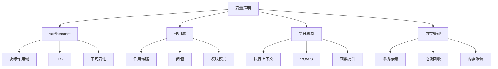

从变量声明这个知识点出发，可以发散出完整的 JavaScript 知识图谱。以下是我整理的联想脉络：

---

### **核心发散脉络**


---

### **深度联想方向**

#### 1. **语言设计维度**
- **弱类型语言特性**  
  JavaScript 动态类型系统与变量声明的关联（无类型声明）
- **执行阶段划分**  
  预编译阶段（变量提升） vs 执行阶段（变量赋值）
- **ES6 标准化演进**  
  从 `var` 到 `let/const` 的范式转变（块级作用域的引入）
- **严格模式影响**  
  `'use strict'` 下禁止重复声明等限制

#### 2. **底层运行机制**
- **词法环境(Lexical Environment)**  
  环境记录器(Environment Record)管理变量存储
- **执行上下文栈(ECS)**  
  函数调用时新上下文的创建与压栈
- **变量存储方式**  
  原始类型栈存储 vs 引用类型堆存储
- **闭包的形成**  
  对外部词法环境的引用保留（`[[Scopes]]` 属性）

#### 3. **工程实践关联**
- **模块化开发**  
  `IIFE` 过渡到 `ES Module` 的变量隔离方案
- **不可变数据**  
  `const` 与不可变数据结构的设计配合
- **框架状态管理**  
  React Hooks 对变量作用域的极致利用
- **内存优化策略**  
  通过合理声明避免意外全局变量

#### 4. **进阶知识延伸**
- **Proxy 反射**  
  变量访问拦截与响应式系统实现
- **WebAssembly 交互**  
  JavaScript 与 WASM 的变量传递机制
- **JIT 编译优化**  
  V8 引擎对变量类型推断的隐藏类优化
- **异步执行影响**  
  事件循环中变量捕获的经典问题：
  ```javascript
  for(let i=0; i<3; i++){  // let 产生块级作用域
    setTimeout(()=>console.log(i)) // 0,1,2
  }
  ```

---

### **典型知识链路示例**
**变量声明 → 作用域 → 闭包 → 模块化 → 内存泄漏防御**

1. **`var` 的函数作用域缺陷**  
   导致开发者使用 `IIFE` 创建独立作用域：
   ```javascript
   (function(){
     var privateVar = 'secret';
   })();
   ```

2. **`let/const` 的块级作用域**  
   自然支持现代模块化写法：
   ```javascript
   {
     const internalVar = 'safe';
     export publicAPI; 
   }
   ```

3. **闭包与内存管理**  
   不当使用导致的内存泄漏场景：
   ```javascript
   function createLeak(){
     const hugeData = new Array(1e6).fill('*');
     return function(){ /* 持有 hugeData 引用 */ }
   }
   ```

4. **WeakMap 优化方案**  
   通过弱引用解决闭包内存问题：
   ```javascript
   const wm = new WeakMap();
   function safeClosure(){
     const data = { /* 大数据 */ };
     wm.set(this, data);
   }
   ```

---

### **认知升维思考**
1. **时间维度**  
   从 ES3 的 `var` 到 ES6 的 `let/const`，反映 JavaScript 从「函数作用域」到「块级作用域」的范式迁移

2. **空间维度**  
   变量存储位置（栈/堆）与作用域链查找的空间复杂度关系（O(n) 查找层级）

3. **安全维度**  
   `const` 声明的不可变性 vs `Object.freeze` 的浅层冻结差异

4. **框架设计维度**  
   Vue3 的 `ref()` 响应式变量本质是通过 `const + 对象包装` 实现：  
   ```javascript
   function ref(value){
     const wrapper = { value }; 
     Object.defineProperty(wrapper, '__v_isRef', { value: true });
     return wrapper;
   }
   ```

---

### **知识树构建建议**
1. **横向对比**  
   制作三栏对照表（var vs let vs const）对比 16 个维度特性

2. **纵向追溯**  
   通过 Babel 编译结果观察 `let/const` 的 polyfill 实现

3. **可视化调试**  
   利用 Chrome DevTools 的 Scope 面板观察作用域链

4. **逆向验证**  
   通过 `Object.getOwnPropertyDescriptor(globalThis, 'a')`  
   观察不同声明方式创建的全局变量属性描述符差异

通过这种多维度联想，变量声明这个"小知识点"可串联起 JavaScript 从语法特性到运行原理，从历史发展到工程实践的完整知识体系。