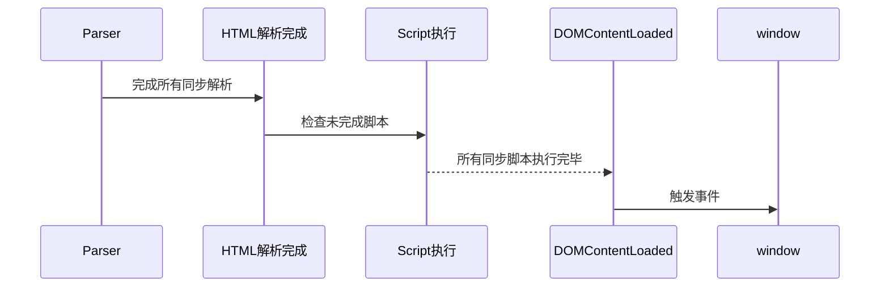

### DOMContentLoaded 事件详解

#### 一、事件触发时机
• **定义**：当初始 HTML 文档完全加载和解析完成（DOM 树构建完毕）时触发，**无需等待**样式表、图像和子框架的加载。
• **触发条件**：
  • HTML 解析器完成所有同步解析任务
  • 所有同步 `<script>` 标签执行完毕
  • 未受 `async`/`defer` 脚本阻塞

#### 二、关键影响因素

##### 1. 同步 JavaScript 脚本
```html
<!-- 案例：阻塞解析 -->
<script src="sync-script.js"></script> 
<!-- DOMContentLoaded 必须等待此脚本下载执行完成 -->
```

##### 2. CSS 与 JavaScript 的交互
```html
<head>
  <link rel="stylesheet" href="styles.css"> <!-- CSS 不直接阻塞 DOM 解析 -->
</head>
<body>
  <script>
    // 访问 CSSOM 会强制等待样式表加载
    console.log(getComputedStyle(document.body).color);
  </script> <!-- 此脚本执行被 CSS 延迟 -->
</body>
```

##### 3. 异步脚本处理
| 脚本类型 | 对 DOMContentLoaded 的影响         | 执行顺序         |
|----------|-----------------------------------|------------------|
| `async`  | 可能中断解析，若在 DOM 完成前执行则延迟事件 | 下载完成立即执行 |
| `defer`  | 不阻塞事件触发                      | DOM 解析后按序执行 |

#### 三、性能优化策略

##### 1. 脚本加载优化
```html
<!-- 推荐写法 -->
<script defer src="analytics.js"></script> <!-- 延迟执行不阻塞 -->
<script async src="ads.js"></script>      <!-- 异步加载非关键资源 -->
```

##### 2. 关键渲染路径优化
```javascript
// 尽早触发事件监听
document.addEventListener('DOMContentLoaded', () => {
  // 初始化非阻塞的界面交互
});
```

##### 3. CSS 资源管理
```html
<!-- 预加载关键 CSS -->
<link rel="preload" href="critical.css" as="style" onload="this.rel='stylesheet'">
<noscript><link rel="stylesheet" href="critical.css"></noscript>
```

#### 四、浏览器行为对比

| 浏览器         | 预解析器行为                          | 事件触发误差范围 |
|----------------|---------------------------------------|------------------|
| Chrome 89+     | 预加载扫描器提前 2KB 扫描资源           | ±10ms           |
| Firefox 85     | 并行下载但严格保持脚本顺序               | ±15ms           |
| Safari 14      | 受限的预加载策略                        | ±20ms           |

#### 五、典型场景分析

##### 场景 1：纯静态页面
```html
<!DOCTYPE html>
<html>
<head>
  <title>Test Page</title>
</head>
<body>
  <p>Hello World</p> <!-- DOMContentLoaded 立即触发 -->
</body>
</html>
```

##### 场景 2：含同步脚本与 CSS
```html
<head>
  <link rel="stylesheet" href="slow.css"> <!-- 3秒加载 -->
</head>
<body>
  <script>
    // 此脚本需等待 CSSOM 构建
    console.log('Blocking script'); // 导致 DOMContentLoaded 延迟 3秒
  </script>
</body>
```

##### 场景 3：使用 defer 脚本
```html
<head>
  <script defer src="deferred.js"></script> <!-- 不阻塞解析 -->
</head>
<body>
  <div>Content</div> <!-- DOMContentLoaded 在解析完成时立即触发 -->
</body>
```

#### 六、调试与检测方法

##### 1. 控制台计时
```javascript
console.time('DOMReady');
document.addEventListener('DOMContentLoaded', () => {
  console.timeEnd('DOMReady'); // 输出准确时间
});
```

##### 2. Performance API 监测
```javascript
const timings = performance.getEntriesByType('navigation')[0];
console.log('DOMContentLoaded:', timings.domContentLoadedEventEnd);
```

##### 3. Lighthouse 审计


#### 七、进阶知识扩展

##### 1. 事件触发流程


##### 2. 与 `window.onload` 对比
| 特性               | DOMContentLoaded       | window.onload          |
|--------------------|------------------------|------------------------|
| 触发时机           | DOM 就绪，无需等待资源 | 所有资源加载完成       |
| 适用场景           | 快速初始化界面          | 需要完整资源的操作     |
| 平均时间差         | 早 1-2 秒               | 晚但完整               |

通过理解这些机制，开发者能更精准地控制页面初始化流程，提升用户体验。建议使用 `defer` 脚本和非阻塞加载策略来优化关键渲染路径。