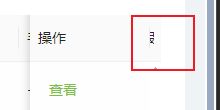

#antd/table 


```
// 倒数第二个th
.ant-table.ant-table-middle .ant-table-thead>tr>th:nth-last-child(2) {
  right: 11px !important;
}
```

这样会导致表头右边透明 

下面进行调整

```
.ant-table.ant-table-middle .ant-table-thead>tr>th:nth-last-child(2)::before {
  position: absolute;
  top: 50% !important;
  right: -4px !important;
  width: 14px !important;
  height: 1.6em;
  background-color: #fafafa !important;
  transform: translateY(-50%);
  transition: background-color 0.3s;
  content: '';
}
```