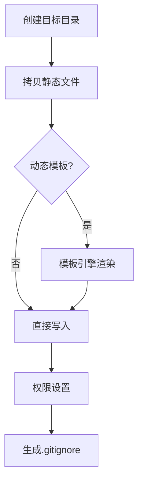

脚手架工具通过命令行指令生成代码模板的实现原理，可以类比为**智能化的文件复印机**，其核心实现链路可分为以下关键环节：

### 一、指令解析机制
```bash
# 用户输入示例
$ create-react-app my-app --typescript
```
1. **参数捕获**：使用`process.argv`获取原始输入
```javascript
// 解析后得到结构化数据
{
  projectName: 'my-app',
  options: {
    typescript: true
  }
}
```
1. **交互补全**：未提供的参数通过Inquirer.js交互式询问
```javascript
const answers = await inquirer.prompt([
  {
    type: 'confirm',
    name: 'useEslint',
    message: '是否启用ESLint?'
  }
])
```

### 二、动态模板引擎
1. **模板文件标记**：使用特殊语法定义可变区域
```handlebars
// 项目根目录/package.json.hbs
{
  "name": "{{projectName}}",
  {{#if ts}}
  "scripts": {
    "build": "tsc"
  },
  {{/if}}
  "dependencies": {
    "react": "^{{reactVersion}}"
  }
}
```
1. **上下文注入**：将用户输入转化为模板变量
```javascript
const context = {
  projectName: 'my-app',
  ts: true,
  reactVersion: '18.2.0'
}
```

### 三、文件生成流水线


### 四、关键技术实现
1. **模板存储方案**：
   - **本地存储**：直接读取`templates/`目录
   - **远程拉取**：使用`degit`或`git-clone`下载仓库
   ```javascript
   const repoUrl = 'https://github.com/user/repo#main'
   await download(repoUrl, targetDir, { clone: true })
   ```
   
2. **智能文件处理**：
   ```javascript
   // 条件过滤示例
   function shouldProcessFile(filename, context) {
     if (filename.endsWith('.ts') && !context.ts) {
       return false // 未启用TS时跳过TypeScript文件
     }
     return true
   }
   ```

### 五、工程化增强
1. **依赖推导算法**：
   ```javascript
   const deps = {
     react: '^18.2.0',
     'react-dom': '^18.2.0'
   }
   
   if (context.ts) {
     deps['@types/react'] = '^18.0.0'
     deps.typescript = '^5.0.0'
   }
   ```

2. **后置操作钩子**：
   ```javascript
   // 安装依赖示例
   if (!options.skipInstall) {
     const cmd = process.env.npm_execpath || 'npm'
     execSync(`${cmd} install`, { stdio: 'inherit', cwd: targetDir })
   }
   ```

### 六、完整工作流示例
以执行`vue create my-project`为例：
1. 解析出项目名`my-project`
2. 弹出交互菜单选择特性（Vuex/Router等）
3. 从npm下载`@vue/cli-service`模板包
4. 根据选择渲染`main.js`、`router/index.js`等文件
5. 自动计算需要的`devDependencies`
6. 执行`npm install`安装依赖
7. 输出完成提示和后续操作建议

### 七、开发工具链
| 功能模块       | 常用工具库          |
|----------------|---------------------|
| 命令行解析     | commander/yargs     |
| 用户交互       | inquirer/enquirer   |
| 文件操作       | fs-extra/globby     |
| 模板渲染       | handlebars/ejs      |
| 进度显示       | ora/listr           |
| 包管理         | execa/cross-spawn   |

### 八、调试技巧
1. **模板热加载**：开发时使用符号链接
   ```bash
   npm link /path/to/template
   ```
2. **沙盒测试**：在临时目录生成项目
   ```javascript
   const tempDir = os.tmpdir()
   await generateProject(tempDir)
   ```

通过这种机制，现代脚手架工具如Vite的`create-vite`能在1秒内完成项目初始化，相比手动创建项目效率提升10倍以上。其核心思想是将最佳实践封装为可配置的模板，通过程序化操作替代重复劳动。