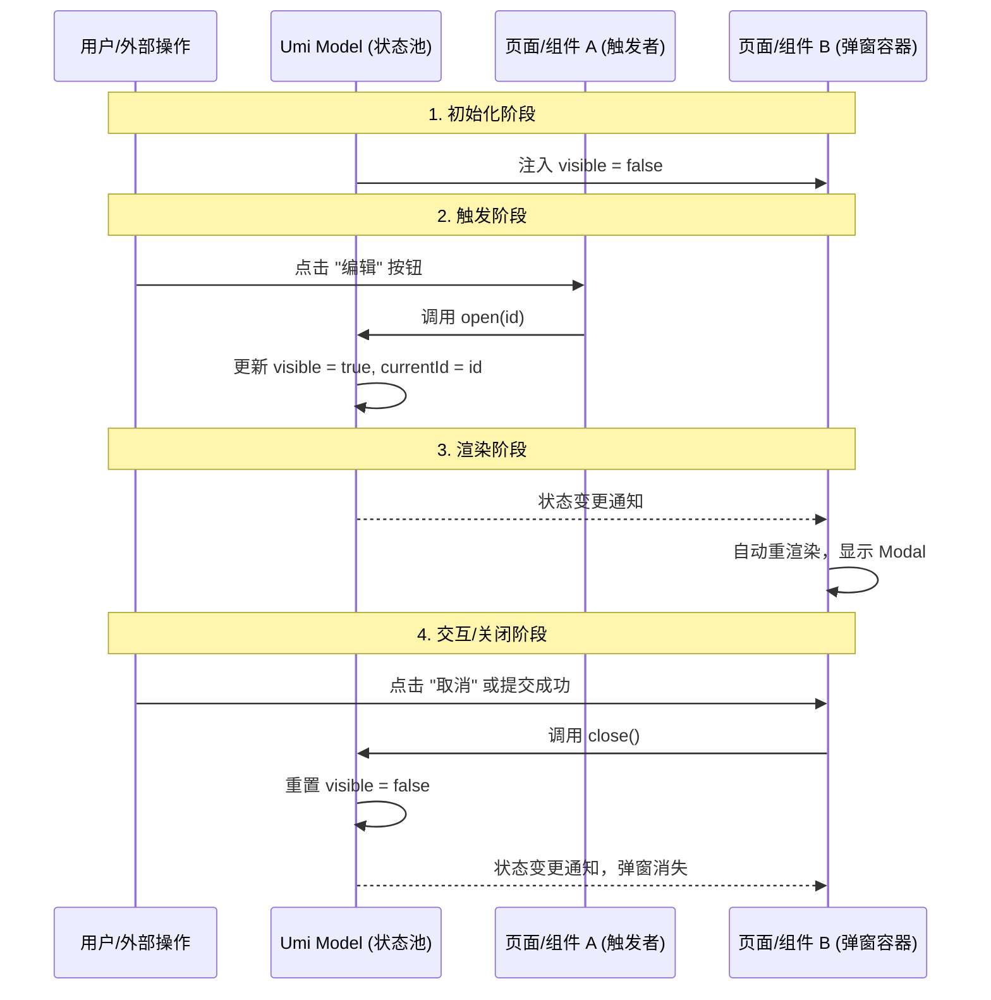

# Model 插件

> `@umijs/plugin-model` 是 Umi 内置的一种轻量级、基于 Hooks 的数据流方案。它旨在解决组件间状态共享的问题，同时避免 Redux 等方案中繁琐的 Boilerplate 代码。

---

## 📋 目录
- [核心理念](#核心理念)
- [快速开始](#快速开始)
- [使用 Model](#使用-model)
- [性能优化：选择器](#性能优化选择器)
- [全局与局部 Model](#全局与局部-model)
- [最佳实践](#最佳实践)

---

## 核心理念

Umi Model 插件的核心理念是：**“一个文件就是一个 Hook”**。

### 1. 本质公式
> **Umi Model = 自定义 Hook + 全局共享 (单例模式)**

你不需要学习 Redux 复杂的 Action/Reducer，只要你会写 React Hook，你就已经掌握了 Umi 的状态管理。

### 2. 直观比喻
- **普通自定义 Hook** 是一面 **“随身镜”**：每个组件调用时都会给自己生成一个独立的状态，互不干扰。
- **Umi Model** 是挂在店中央的一块 **“大屏幕”**：应用中任何地方（页面、组件、甚至是 Header）看到的都是同一块屏幕。一个人改了，全场同步。

---

## 快速开始

### 1. 定义 Model
在 **`src/models`** 目录下创建文件（注意：目录名必须是复数 `models`）。例如 `src/models/useAuthModel.ts`：

```typescript
import { useState, useCallback } from 'react';

export default function useAuthModel() {
  const [user, setUser] = useState<string | null>(null);

  const login = useCallback((name: string) => {
    setUser(name);
  }, []);

  const logout = useCallback(() => {
    setUser(null);
  }, []);

  return {
    user,
    login,
    logout,
  };
}
```

> **注意**：文件名（不带后缀）即为 Model 的 ID。上例中的 Model ID 为 `useAuthModel`。

---

## 使用 Model

在组件中通过 `useModel` 钩子获取状态。

```tsx
import { useModel } from 'umi';

const LoginPage = () => {
  const { user, login, logout } = useModel('useAuthModel');

  return (
    <div>
      {user ? (
        <>
          <p>当前用户：{user}</p>
          <button onClick={logout}>退出登录</button>
        </>
      ) : (
        <button onClick={() => login('Admin')}>点击登录</button>
      )}
    </div>
  );
};
```

---

## 性能优化：选择器

`useModel` 默认会订阅 Model 的所有变更。如果 Model 状态非常大，而组件只依赖其中一小部分，可以使用 **Selector** 来减少不必要的重渲染。

```tsx
// 只有当 user 发生变化时，该组件才会重渲染
const { user } = useModel('useAuthModel', (model) => ({
  user: model.user,
}));
```

---

## 全局与局部 Model

- **全局 Model**：放置在 `src/models` 目录下的所有文件。它们在整个应用生命周期内是单例的，状态全局共享。
- **局部 Model**：通常结合 `useModel` 的局部化能力或在页面目录下定义。但在 Umi 约定中，`src/models` 是最常用的全局状态存储地。

---

## 💡 核心进阶：页面内“小模块” Modal vs 全局 Modal

在实际开发 Page（页面）时，你会遇到很多小模块（比如子组件 `UserList`、`EditForm`），这时你需要决定 Modal 放在哪。

### 1. 场景决策指南

| 维度 | 页面/组件内“小模块” Modal | 全局/应用级 Model Modal |
| :--- | :--- | :--- |
| **存放位置** | 页面组件内部（使用 `useState`） | `src/models/` 目录（使用 `useModel`） |
| **状态归属** | **私有状态**：这个 Modal 只为当前页面服务 | **共享状态**：多个页面或全局组件（如导航栏）都要用 |
| **控制权** | 只能由**当前组件**或其父组件控制 | **应用内任何地方**都能控制（Header、Sidebar、深层组件） |
| **生命周期** | 随组件销毁而重置 | 除非手动清空，否则状态在应用运行期间一直保持 |
| **适用场景** | 简单的表单提交、详情查看（仅当前页面用） | 登录弹窗、全局搜索、跨页面的通知提示 |

### 2. 为什么“小模块”不建议全塞进全局 models？
1. **命名冲突**：全局 `models` 是单例，如果你有多个页面都有 `editModal`，名字很难取。
2. **内存占用**：全局 `models` 一旦加载除非刷新页面否则不销毁，会一直占用内存。
3. **维护心智**：改一个页面的弹窗，还要跑去全局 `src/models` 文件夹找代码，路径太长。

---

### 3. Modal 数据流生命周期

理解数据是怎么“跑”起来的，是掌握 Umi Model 的关键。



---

### 4. 代码实战演练与目录管理

#### A. 局部 Modal（推荐用于 90% 的场景）
**目录结构：**
```text
src/
  pages/
    User/
      index.tsx          # 页面主文件
      components/
        EditModal.tsx    # 弹窗小模块，只给 User 页面用
```

**代码实现：**
在 `index.tsx` 中定义状态，传给 `EditModal`：
```tsx
// src/pages/User/index.tsx
import { useState } from 'react';
import EditModal from './components/EditModal';

const UserPage = () => {
  const [visible, setVisible] = useState(false);
  return (
    <>
      <Button onClick={() => setVisible(true)}>编辑用户</Button>
      <EditModal visible={visible} onClose={() => setVisible(false)} />
    </>
  );
};
```

---

#### B. 全局 Modal（用于跨组件联动）
**目录结构：**
```text
src/
  models/
    useAuthModel.ts      # 存放全局登录状态
  components/
    LoginModal.tsx       # 全局登录弹窗
  layouts/
    index.tsx            # 全局布局，在这里挂载弹窗
```

**代码实现：**
1. **定义模型** `src/models/useAuthModel.ts`:
```typescript
import { useState } from 'react';

export default () => {
  const [isLoginModalOpen, setIsLoginModalOpen] = useState(false);
  return { isLoginModalOpen, setIsLoginModalOpen };
};
```

2. **在全局布局中挂载** `src/layouts/index.tsx`:
```tsx
import { useModel, Outlet } from 'umi';
import LoginModal from '@/components/LoginModal';

export default () => {
  const { isLoginModalOpen } = useModel('useAuthModel');
  return (
    <div>
      <Header />
      <Outlet /> {/* 页面内容 */}
      <LoginModal visible={isLoginModalOpen} /> {/* 弹窗挂在最外层 */}
    </div>
  );
};
```

3. **在任何地方触发** (如 Header):
```tsx
const { setIsLoginModalOpen } = useModel('useAuthModel');
return <Button onClick={() => setIsLoginModalOpen(true)}>登录</Button>;
```

---

## 最佳实践

1. **命名规范**：建议以 `useXXXModel.ts` 命名，体现其 Hook 的本质。
2. **逻辑拆分**：不要把所有全局状态塞进一个大的 Model，按业务领域拆分到不同的 `models/` 文件中。
3. **配合 useRequest**：在 Model 中使用 Umi 的 `useRequest` 处理异步数据获取，将加载状态和数据存储在 `models` 中。
4. **状态下沉**：如果状态只在两个相邻子组件间共享，优先考虑 Props 传递或 React Context，避免滥用全局 `src/models`。

---

## 🔗 相关链接
- [Umi 官方文档 - 数据流](https://umijs.org/docs/max/data-flow)
- [Request 插件](./03-Request插件.md)

---

**最后更新**：2026-01-14
**维护规范**：遵循 [.cursorrules](../../../.cursorrules)

#Umi #Model插件 #数据流 #ReactHooks #状态管理
