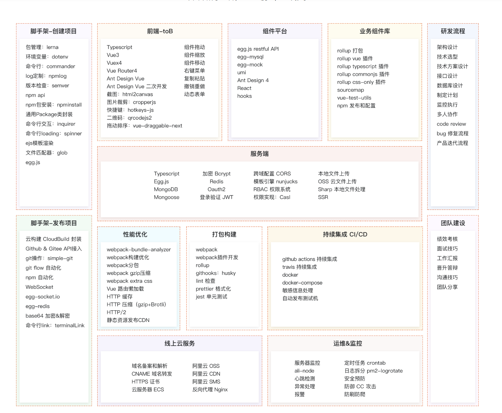

# 高级前端架构师知识图谱

## 脚手架 - 创建项目
- **包管理**: lerna
- **环境变量**: dotenv
- **命令行**:
  - commander
  - log-symbols
  - npmlog
- **版本检查**: semver
- **npm api**: npm install
- **通用Package**: 并发封装
- **命令行交互**: inquirer
- **命令行loading**: spinner
- **ejs模板渲染**
- **文件匹配器**: glob.js
- **框架**: egg.js

## 前端 ToB
- **基础工具**:
  - Typescript
  - Vue3
  - Vuex4
  - Vue Router4
  - Ant Design Vue
  - Ant Design Vue 二次开发
- **图形处理**:
  - html2canvas
  - qrcodejs2
  - vue-draggable-next
- **组件特性**:
  - 组件拖拽
  - 组件释放
  - 右键菜单
  - 热键注册: hotkeys-js
  - 动态菜单

## 组件平台
- egg.js restful API
- egg-mysql
- egg-mock
- umi
- Ant Design 4
- React
- hooks

## 业务组件库
- **rollup 打包**
- **rollup 插件**:
  - rollup typescript 插件
  - rollup commonjs 插件
  - rollup css-only 插件
- **其他工具**:
  - sourcemap
  - vue-test-utils
  - npm 发布和配置

## 服务端
- **语言与框架**:
  - Typescript
  - Egg.js
  - MongoDB
  - Mongoose
- **功能支持**:
  - 加密 Bcrypt
  - Redis
  - 跨域管理 CORS
  - 模板引擎 nunjucks
  - 登录授权 JWT
  - RBAC 权限系统
  - 权限受控: Casl
- **文件处理**:
  - 本地文件上传
  - OSS 云文件上传
  - Sharp 本地文件处理
  - SSR

## 脚手架 - 发布项目
- **云构建**:
  - CloudBuild 对接
- **代码托管**:
  - Github & Gitee API接入
  - git操作: simple-git
  - git flow自动化
- **npm自动化**
- **实时通信**:
  - WebSocket
  - egg-socket.io
- **其他工具**:
  - base64 加密解密
  - 命令行link: terminalLink

## 性能优化
- webpack-bundle-analyzer
- webpack持久缓存
- webpack分包
- webpack gzip压缩
- webpack extra css
- Vue 响应式渲染
- **HTTP 优化**:
  - HTTP 拦截
  - HTTP 压缩 (gzip+Brotli)
  - HTTP/2
  - 静态资源请求+CDN

## 打包构建
- webpack
- webpack插件开发
- rollup
- git钩子: husky
- lint检查
- prettier格式化
- jest 单元测试

## 持续集成 CI/CD
- github actions 持续集成
- travis 持续集成
- docker
- docker-compose
- 依赖自动更新
- 自动发布到测试机

## 线上云服务
- **域名系统**:
  - 域名备案和解析
  - CNAME 处理静态域名
  - HTTPS 证书
- **服务器服务**:
  - 云服务器 ECS
  - 阿里云 OSS
  - CDN加速
  - 反向代理 Nginx
  - 短信网关 SMS

## 运维&监控
- **任务调度**:
  - 定时任务 crontab
- **进程管理**:
  - alinode
  - pm2-logrotate
- **异常处理**:
  - 安全预防
  - 异常报警
  - 防御 CC 攻击
- **日志处理**:
  - 日志分析
  - 报表

## 开发流程
- **设计**:
  - 架构设计
  - 技术选型
  - 技术方案设计
  - 接口设计
  - 数据库设计
  - 制定计划
- **协作**:
  - 增量执行
  - 多人协作
  - code review
- **项目流程**:
  - bug 修复流程
  - 产品迭代流程

## 团队建设
- 代码分核
- 面试技巧
- 工作汇报
- 晋升路径
- 沟通技巧
- 团队分享
