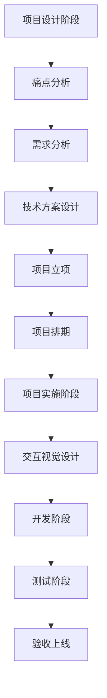

### 大厂标准项目流程全解析

#### 一、项目全生命周期框架


#### 二、核心阶段详解

1. **项目设计阶段**
   - **痛点分析**  
     - 典型场景：
       - 页面加载速度 >3s（性能瓶颈）
       - 用户创建项目耗时 >5min（效率痛点）
       - 订单转化率 <10%（业务瓶颈）
     - 产出物：《业务痛点分析报告》

   - **需求分析**  
     | 要素                | 说明                          | 示例                    |
     |---------------------|-----------------------------|-------------------------|
     | PRD文档             | 包含业务背景/用户故事/验收标准      | 《IMCLI脚手架PRD_v1.0》 |
     | Axure原型图         | 低保真/高保真交互原型             | 功能流程图/界面交互稿      |
     | 可量化指标          | SMART原则制定目标               | 项目创建时间≤3秒         |

   - **技术方案设计**  
     ```markdown
     ## 技术方案核心要素
     - 技术选型：Vue3 + TypeScript
     - 架构设计：Monorepo + Lerna
     - API规范：RESTful + Swagger
     - 风险评估：
       * 多包依赖管理复杂度 ★★★☆
       * 版本一致性维护成本 ★★☆☆
     ```

2. **项目立项阶段**
   - **Kick Off会议流程**  
     1. 项目背景宣导（PM）
     2. 技术方案讲解（架构师）
     3. 资源协调确认（各模块负责人）
     4. 风险预案讨论（全员）
     5. 里程碑确认（PMO）

   - **虚拟项目组构成**  
     ```mermaid
     pie
         title 项目组角色构成
         "前端开发" : 35
         "后端开发" : 30
         "测试工程师" : 20
         "UI设计师" : 15
     ```

3. **项目实施阶段**
   - **开发规范示例**  
     ```javascript
     // 代码提交规范
     feat: 新增脚手架初始化功能 # 新功能
     fix: 修复版本号校验逻辑    # Bug修复
     docs: 更新API文档        # 文档变更
     chore: 调整构建配置       # 工具变更
     ```

   - **测试流程矩阵**  
     | 测试类型   | 执行方      | 工具链               | 通过标准           |
     |------------|-------------|----------------------|--------------------|
     | 单元测试   | 开发人员    | Jest + Testing-Library | 覆盖率 ≥80%       |
     | E2E测试    | 测试团队    | Cypress              | 核心流程100%通过   |
     | 性能测试   | 运维团队    | LoadRunner           | TPS ≥1000         |

#### 三、关键文档模板
1. **PRD文档结构**
   ```markdown
   # 项目名称
   ## 背景说明
   - 当前痛点：手动创建项目平均耗时8分钟
   - 业务影响：每月浪费200+人时

   ## 需求范围
   - 核心功能：
     * 项目模板快速生成
     * 依赖自动安装

   ## 验收标准
   - 指标验证：创建耗时 ≤3秒（P95)
   - 兼容性要求：支持Node 14+ 
   ```

2. **技术方案checklist**
   - [ ] 技术选型可行性验证
   - [ ] 第三方库License审查
   - [ ] 核心模块流程图
   - [ ] 性能压测方案
   - [ ] 回滚预案

#### 四、敏捷开发实践
1. **迭代周期管理**
   ```mermaid
   gantt
       title 双周迭代示例
       dateFormat  YYYY-MM-DD
       section 需求
       需求评审     :a1, 2023-08-01, 2d
       section 开发
       功能开发     :2023-08-03, 5d
       Code Review : crit, 2023-08-08, 1d
       section 测试
       测试用例评审 : 2023-08-04, 1d
       测试执行     : 2023-08-09, 3d
   ```

2. **每日站会要点**
   - 昨日进展（实际产出）
   - 今日计划（明确目标）
   - 当前阻塞（需要协助）
   - 风险预警（提前暴露）

> **特别说明**：对于无UI项目（如脚手架），可简化交互设计环节，但需增加：  
> - CLI交互设计文档  
> - 命令行帮助文档规范  
> - 错误码体系设计

完整项目流程示例可参考：[阿里云研发流程白皮书](https://developer.aliyun.com/whitepaper)  
（注：实际流程可能因公司规模/项目类型有所调整）