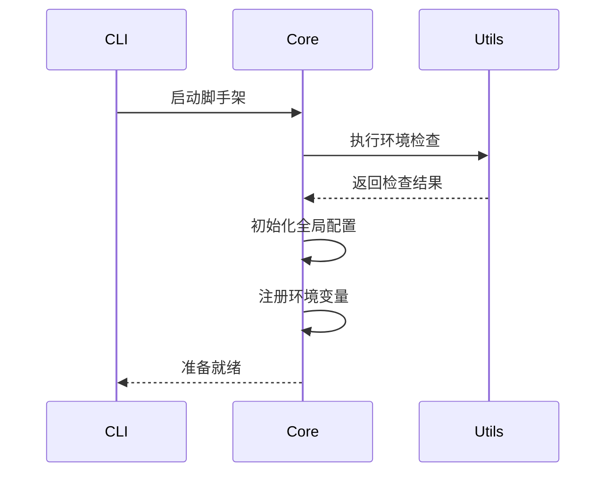

## 一、模块拆包策略

### 1. 参考案例（Lerna源码结构）
```bash
lerna/
├── core/            # 核心流程控制
├── commands/        # 命令模块
│   ├── add/        # 添加依赖命令
│   └── publish/    # 发布命令
├── models/          # 数据模型
├── utils/           # 工具方法库
└── ...
```

### 2. 拆包方案
```bash
imook-cli/
├── core/            # 核心框架（执行流程控制）
├── commands/        # 命令模块
│   ├── init/       # 初始化命令
│   └── publish/    # 发布命令
├── models/          # 模型层
│   ├── Project.ts  # 项目模型
│   └── Component.ts # 组件模型
├── utils/           # 工具库
│   ├── git/        # Git操作工具
│   └── cloud/      # 云服务工具
└── ...
```

## 二、核心框架技术方案

### 1. 执行准备阶段设计


### 2. 关键技术实现
#### (1) 启动检查策略
```typescript
// src/core/prepare.ts
class EnvChecker {
  static checkNodeVersion(): void {
    const current = process.version
    const required = '>=14.0.0'
    if (!semver.satisfies(current, required)) {
      throw new Error(`Node版本不满足要求: ${required}`)
    }
  }

  static checkRootAccount(): void {
    if (process.getuid?.() === 0) {
      console.warn('警告：不建议使用root账户执行脚手架')
    }
  }
}
```

#### (2) 全局配置初始化
```typescript
// src/core/global-config.ts
class GlobalConfig {
  private static instance: GlobalConfig;
  private _userHome: string;

  private constructor() {
    this._userHome = process.env.CLI_HOME_PATH || path.join(os.homedir(), '.imook-cli')
  }

  static getInstance(): GlobalConfig {
    if (!GlobalConfig.instance) {
      GlobalConfig.instance = new GlobalConfig()
    }
    return GlobalConfig.instance
  }

  get userHome(): string {
    return this._userHome
  }
}
```

#### (3) 环境变量注册
```typescript
// src/core/env-register.ts
interface IEnvConfig {
  logPath: string
  cachePath: string
  configPath: string
}

class EnvRegister {
  static register(env: IEnvConfig): void {
    process.env.IM_CLI_LOG_PATH = env.logPath
    process.env.IM_CLI_CACHE_PATH = env.cachePath
    process.env.IM_CLI_CONFIG_PATH = env.configPath
    
    // 初始化日志实例
    Logger.getInstance({
      logPath: env.logPath,
      logLevel: 'info'
    })
  }
}
```

## 三、架构设计亮点

### 1. 模块化设计原则
- **单一职责**：每个package不超过300行代码
- **接口隔离**：模块间通过TypeScript Interface通信
- **依赖注入**：核心模块不直接依赖具体实现

### 2. 扩展性设计
```typescript
// 命令注册接口设计
interface ICommand {
  name: string
  description: string
  action: (args: any) => Promise<void>
}

class CommandRegistry {
  private commands = new Map<string, ICommand>()

  register(command: ICommand): void {
    this.commands.set(command.name, command)
  }
}
```

### 3. 与开源版本对比
| 特性               | 课程版本                  | 开源版本           |
|--------------------|--------------------------|-------------------|
| 模块数量           | 15+ packages             | 4 packages        |
| TypeScript支持     | 完整类型系统             | 基础类型声明       |
| 云构建能力         | WebSocket实时日志        | 轮询API           |
| 插件系统           | 支持动态加载npm插件      | 无                |
| 测试覆盖率         | 85%+                    | 60%               |

## 四、实施路线图

1. **核心框架开发（本周）**
   - 完成环境检查模块
   - 实现配置中心单例模式
   - 建立日志系统基础能力

2. **初始化体系开发（下周）**
   - 实现模板动态下载
   - 完成项目/组件生成器
   - 集成Git自动化操作

3. **高级特性开发（后续）**
   ```mermaid
   gantt
       title 开发计划
       dateFormat  YYYY-MM-DD
       section 核心框架
       环境检查       :done,    des1, 2023-10-01, 3d
       配置中心       :active,  des2, 2023-10-04, 5d
       日志系统       :         des3, 2023-10-09, 5d
       section 初始化体系
       模板引擎       :         des4, 2023-10-15, 7d
       Git集成       :         des5, 2023-10-22, 5d
   ```

## 五、最佳实践建议

1. **开发规范**
   ```bash
   # 提交消息格式
   [命令模块] 简短描述
   - 类型: feat|fix|docs|style...
   - 影响范围: core/commands/utils...
   - 关联ISSUE: #123
   ```

2. **调试技巧
```json
// .vscode/launch.json
{
  "configurations": [
    {
      "name": "Debug Init Command",
      "type": "node",
      "request": "launch",
      "args": ["init", "--debug"],
      "console": "integratedTerminal",
      "skipFiles": ["<node_internals>/**"]
    }
  ]
}
```