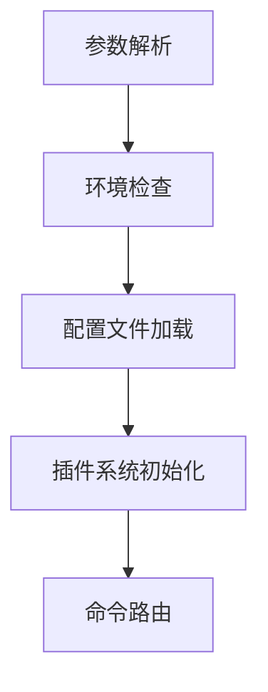

## 一、模块重构实施步骤

### 1. 项目结构调整
```bash
# 新项目结构
imook-cli/
├── packages/
│   ├── core/          # 核心框架
│   ├── commands/      # 命令模块
│   ├── models/        # 数据模型
│   └── utils/         # 工具库
├── lerna.json         # Lerna配置
└── package.json       # 根项目配置
```

### 2. Lerna配置更新
```json
// lerna.json
{
  "packages": [
    "packages/core",
    "packages/commands/*",
    "packages/models/*",
    "packages/utils/*"
  ],
  "version": "0.4.0",
  "npmClient": "yarn",
  "useWorkspaces": true
}
```

## 二、关键问题解决方案

### 1. 模块链接问题处理
```bash
# 清理旧链接
rm -rf node_modules packages/*/node_modules

# 重新建立链接
lerna clean -y && lerna bootstrap
```

### 2. 权限问题处理
```bash
# 修复全局安装权限
sudo chown -R $(whoami) $(npm config get prefix)/{lib/node_modules,bin,share}
```

## 三、核心功能实现

### 1. 版本检查模块实现
```typescript
// packages/core/src/version-checker.ts
import semver from 'semver';
import logger from '@imook-cli/utils';

export class VersionChecker {
  static checkNodeVersion(required: string): void {
    const current = process.version;
    
    if (!semver.satisfies(current, required)) {
      logger.error(`Node版本不满足要求，当前版本：${current}，需要版本：${required}`);
      process.exit(1);
    }
  }
}
```

### 2. 本地优先加载机制
```javascript
// packages/core/bin/index.js
#!/usr/bin/env node

const importLocal = require('import-local');

if (importLocal(__filename)) {
  require('@imook-cli/utils').logger.info('正在使用本地开发版本');
} else {
  require('../lib')(process.argv.slice(2));
}
```

## 四、调试与验证

### 1. 本地开发调试流程
```bash
# 在根目录执行
lerna exec --scope @imook-cli/core -- yarn link
yarn link @imook-cli/core

# 测试命令
imook-cli --version
```

### 2. 版本冲突解决方案
```bash
# 查看全局安装版本
npm ls -g @imook-cli/core

# 强制清除旧版本
npm uninstall -g @imook-cli/core && npm cache clean --force
```

## 五、最佳实践建议

### 1. 模块命名规范
| 模块类型       | 命名模式                | 示例                  |
|--------------|-----------------------|---------------------|
| 核心框架       | @imook-cli/core       | @imook-cli/core     |
| 命令模块       | @imook-cli/command-*  | @imook-cli/command-init |
| 工具模块       | @imook-cli/utils-*    | @imook-cli/utils-git   |

### 2. 日志管理规范
```typescript
// packages/utils/src/logger.ts
import npmlog from 'npmlog';

class CustomLogger {
  constructor() {
    npmlog.addLevel('debug', 1000, { fg: 'blue' });
    npmlog.addLevel('notice', 2000, { fg: 'green' });
  }

  info(...args) {
    npmlog.log('info', ...args);
  }

  debug(...args) {
    npmlog.log('debug', ...args);
  }
}

export default new CustomLogger();
```

## 六、常见问题排查表

| 现象                      | 可能原因                  | 解决方案                          |
|--------------------------|-------------------------|---------------------------------|
| 模块找不到                | 1. 链接未正确建立<br>2. 路径配置错误 | 1. 重新执行lerna bootstrap<br>2. 检查tsconfig.json路径映射 |
| 权限拒绝                  | 全局安装权限不足          | 使用sudo或修改npm全局安装目录权限     |
| 本地版本未生效            | import-local路径错误     | 检查bin文件路径与package.json配置一致性 |
| 日志输出异常              | 日志级别配置错误          | 设置环境变量：DEBUG=imook-cli:*      |

## 七、后续开发计划

1. **核心流程完善**


1. **质量保障措施**
- 单元测试覆盖率要求：核心模块100%
- E2E测试用例：覆盖所有命令基础场景
- 代码规范检查：ESLint + Prettier + Husky

通过以上重构和规范实施，将建立起一个可维护、易扩展的现代化脚手架框架基础。建议在后续开发中采用测试驱动开发（TDD）模式，确保每个新增功能都有对应的测试用例覆盖。