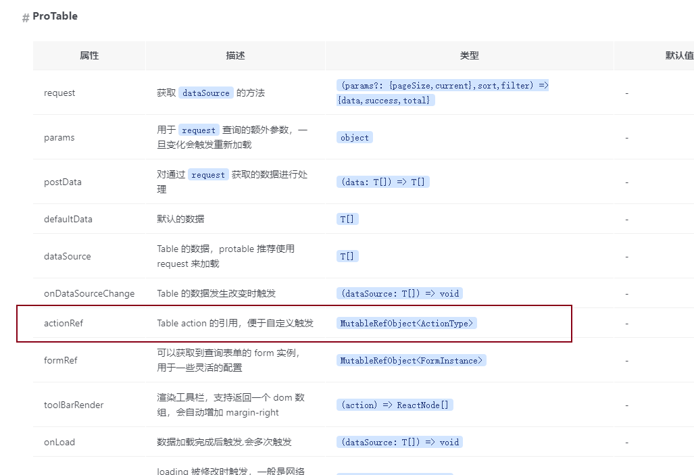

## 手动调整分页

需求：
一页十条数据，共11条数据，删除第11条数据后（也就是最后一页的最后一条），页面显示暂无数据（这个时候第二页是没数据的，但是查询接口还是保持查询第二页的书数据），应跳转至上一页

下面是解决方案
actionRef


const { setPageInfo, pageInfo, reload } = actionRef.current

```
  const actionRef = useRef();

      <ProTable
        columns={columnsWithEllipsis}
        actionRef={actionRef}
        
```

辅助函数：获取最后一页有几条数据
```js
/**
 * 计算最后一页的有几条数据
 *
 * @param {number} totalCount - 总共的条目数量
 * @param {number} pageSize - 每页显示的条目数量
 * @param {number} totalPages - 总页数
 * @returns {number} - 最后一页的条目数量
 */
export const calculateLastPageCount = (totalCount, pageSize, totalPages) => {
  // 计算余数，即除完以后剩下的数量
  const remainder = totalCount % pageSize;

  // 如果总共只有一页，则直接返回余数（如果余数为 0 则返回每页数量）
  if (totalPages === 1) {
    return remainder === 0 ? pageSize : remainder;
  } else {
    // 如果不止一页，则最后一页的数量就是余数（如果余数为 0 则返回每页数量）
    return remainder === 0 ? pageSize : remainder;
  }
}
```

listRes

```jsx
const [listRes, setListRes] = useState(null)

// list 是接口返回的表格相关数据

setListRes({
  len: res.list ? res.list.length : 0,
  pageSize: params.pageSize,
  totalPages: res.totalPages,
  totalCount: res.totalCount,
})
```

```jsx
let res = await delete(record.id)
const { setPageInfo, pageInfo, reload } = actionRef.current
const LastPageCount = calculateLastPageCount(listRes.totalCount, listRes.pageSize, listRes.totalPages)
/**
 * 1. 删除的是最后一页
 * 2. 删除的数量大于最后一页的总数量
 * 3. 页面向前一页
 * 
 * listRes.totalPages 总页数
 * pageInfo.current 当前页
 * 
 * */
if (listRes.totalPages === pageInfo.current && LastPageCount >= 1) {
  setPageInfo({
    ...pageInfo,
    current: pageInfo.current - 1
  });
} else {
  reload();
}
```