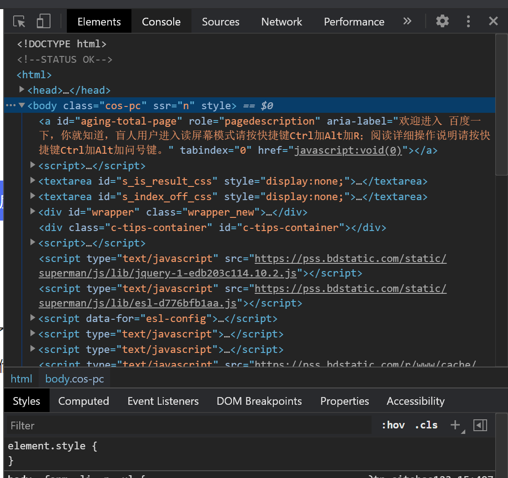
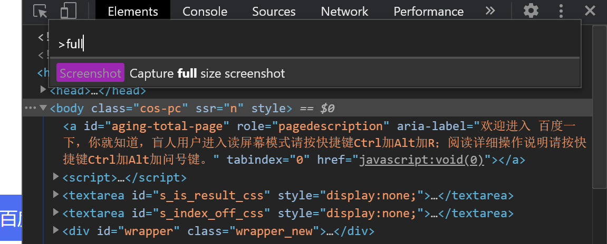

# 开发技巧
## 对象的解构赋值之useRef的便捷写法
解构赋值语法是一种 Javascript 表达式。可以将数组中的值或对象的属性取出，赋值给其他变量。

>const obj = { a: 1,b: 2,c: 3}
 : 是重命名
 = 是默认值

通过上面对 obj 对象的结构，会得到 a1、b2、c3 和 d4 这 4 个变量，同时由于 obj 里面没有 d 属性，所以 d4 会被赋予默认值 default。

```
const { a: a1, b: b2, c: c3, d: d4 = "default" } = obj
console.log(a1,b2,c3,d4)
```


```
因为useRef的时候获取值都需要从ref.current对象中获取如下面的例子

const count= useRef(0) 

// 当你需要使用或者修改的时候都需要通过count.current进行修改，如果需要修改的地方多的话也要重复写很多current
这时候就可以通过解构赋值进行优化

const {current:count} = useRef(0)

```

## 关于if中判断条件

```js
// 基础
if( x === 'a' || x === 'b' || x === 'c' || x === 'd'){
  // logic
}

// 优化
if(['a', 'b', 'c', 'd'].includes(x)){
  // logic
}

```

```js
// 基础
if (type === 'test1') {
  test1();
}
else if (type === 'test2') {
  test2();
}
else if (type === 'test3') {
  test3();
}
else if (type === 'test4') {
  test4();
} else {
  throw new Error('Invalid value ' + type);
}
// 优化
const types = {
  test1: test1,
  test2: test2,
  test3: test3,
  test4: test4
};
let func = types[type];
(!func) && throw new Error('Invalid value ' + type); func();

```
## 实用的代码片段

过滤空值

```js
const groceries = ['apple', null, 'milk', undefined, 'bread', '',0];

const cleanList = groceries.filter(Boolean);

console.log(cleanList);

// 'apple', 'milk', 'bread';

// Boolean 是一个函数，它会对遍历数组中的元素，并根据元素的真假类型，对应返回 true 或 false.

```
快速mock表格数据

```js
const arr = Array(10).fill(1);

// 快速初始化表格数据
const dataSource = Array(10).fill(1).map((v)=>{
  return {
    key:v,
    name:111
  }
})

```
数值快速取整
```js


~~2147483648.1//-2147483648

~~'1111aa'// 0

~~'1111.999'// 1111

~~'-1111.999'// -1111

效果 
只支持32位以内的数据，超过范围就会得出错误的结果
遇到非数值会返回0
小数点会被直接删掉直接返回整数


原理

~是js里的按位取反操作符 ， ~~ 就是执行两次按位取反，其实就是保持原值，但是注意虽然是原值，但是对布尔型变量执行这个操作，会转化成相应的数值型变量，也就是

~~true === 1，~~false === 0。 ~~"" == 0 ~~[] == 0
类似Number（）

```


# 关于隐式类型转换
## 遇到算数运算符
在遇到算数运算符(- 、* 、/ 和 %)的时候会在运算之前将参与运算的双方转换成数字。
```jsx
3 + true // 4
```
那么问题又来了，true 怎么就转换成数字了呢？实际上我们通过 Number(true) 就可以看到， true 转换为数字之后就是为 1，相反，false 转换为数字之后就对应为 0。
## 数值和字符串相加
数字(toString())转换为字符串，然后执行字符串连接操作。
```jsx
"1" + 2;    // "12"
1 + "2";    // "12"
1 + 2 + "3";    // "33"
```
## 条件判断运算 == 中的转换规则

1. 如果比较的两者中有布尔值(Boolean)，会把 Boolean 先转换为对应的 Number，即 0 和 1，然后进行比较。
2. 如果比较的双方中有一方为 Number，一方为 String时，会把 String 通过 Number() 方法转换为数字，然后进行比较。
3. 如果比较的双方中有一方为 Boolean，一方为 String时，会将双方转换为数字，然后再进行比较。
4. 如果比较的双方中有一方为 Number，一方为Object时，则会调用 valueOf 方法将Object转换为数字，然后进行比较。

需要强调的是，在 Javascript 中，只有 空字符串、数字0、false、null、undefined 和 NaN 这 6 个值为假之外，其他所有的值均为真值。

> 关于空数组 [] 是不是false
> false==[] //=>true
> 里应该不是[]的值是假，而是比较的时候，false和[]都转换成了0，所以才相等，[]转换为布尔值是ture，验证方法为 !![] -> true


## 关于NaN
说到 NaN，就不得不提一下 isNaN() 方法，isNaN() 方法自带隐式类型转换，该方法在测试其参数之前，会先调用 Number() 方法将其转换为数字。所以 isNaN('1') 这个语句中明明用一个字符串去测试，返回值仍然为 false 也就不足为怪了。

> isNaN(true) // false

## + 号运算
“+”既可以表示字符串连接，又可以表示算术加，这取决于它的操作数，如果有一个为字符串的，那么，就是字符串连接了。

在 + 号运算中还有一种更复杂的情况，那就是数字/字符串和对象进行运算的时候，上面已经举例说明了数字和对象运算的情况，我们再来说一下字符串和对象运算的情况。

当字符串和对象进行 + 运算的时候，Javascript 会通过对象的 toString() 方法将其自身转换为字符串，然后进行连接操作。
```jsx
"1" + { toString: function() {return 1;} }    // "11"
```
之所以说它特殊，是因为当一个对象同时包含 toString() 和 valueOf() 方法的时候，运算符 + 应该调用哪个方法并不明显(做字符串连接还是加法应该根据其参数类型，但是由于隐式类型转换的存在，类型并不显而易见。)，Javascript 会盲目的选择 valueOf() 方法而不是 toString() 来解决这个问题。这就意味着如果你打算对一个对象做字符串连接的操作，但结果却是......
```jsx
var obj = {
    toString: function() { return "Object CustomObj"; },
    valueOf: function() { return 1; }
};

console.log("Object: " + obj);    // "Object: 1"
```
隐式类型转换会给我们造成很多麻烦，那么该怎么避免呢？
建议在所有使用条件判断的时候都使用全等运算符 === 来进行条件判断。全等运算符会先进行数据类型判断，并且不会发生隐式类型转换。


# 笔记技巧

## 浏览器如何截全屏长图
快捷键 Ctrl+Shift+I （大写的i） 或者 F12 打开 开发工具栏，如下图：


快捷键 Ctrl+Shift+P 调出查找界面

输入命令 full 回车即可，截图成功并自动下载。


## 本地部署文档

[sgo: 将任意一个目录设置成一个静态服务器，用于快速原型设计的开发服务器。 将目录设置为静态服务器。它提供了404整洁的界面，用于列出目录的内容并切换到子文件夹。](https://gitee.com/jaywcjlove/sgo#%E5%91%BD%E4%BB%A4%E5%B8%AE%E5%8A%A9)

```
npm install -g sgo # 安装 sgo
sgo --fallback index.html # 创建静态服务，预览网站
```

## 流程

创建一个 Doc 的文件夹 输入指令

```
npm install -g sgo

git clone https://github.com/ant-design/ant-design.git --depth 1 -b gh-pages // 安装antd文档
```

这个时候文件夹生成对应文档的文件夹


然后进入对应文件夹输入指令 

```
cd ant-design
sgo --fallback index.html
```

就部署成功了


## 各种文档资源

React
```
git clone https://github.com/reactjs/zh-hans.reactjs.org.git --depth 1 -b gh-pages
cd zh-hans.reactjs.org # 进入目录
sgo --fallback index.html # 创建静态服务，预览网站
```

Vue

```
git clone https://github.com/reactjs/zh-hans.reactjs.org.git --depth 1 -b gh-pages
cd zh-hans.reactjs.org # 进入目录
sgo --fallback index.html # 创建静态服务，预览网站
```

Ant Design

```
git clone https://github.com/ant-design/ant-design.git --depth 1 -b gh-pages
# or Gitee
git clone https://gitee.com/ant-design/ant-design.git --depth 1 -b gh-pages
```

Ant Design Pro

```
git clone https://github.com/ant-design/ant-design-pro.git --depth 1 -b gh-pages
# or Gitee
git clone https://gitee.com/ant-design/ant-design-pro-site.git --depth 1 -b master
```
Element

```
# Vue版
git clone https://github.com/ElemeFE/element.git --depth 1 -b gh-pages
# React版
git clone https://github.com/ElemeFE/element-react.git --depth 1 -b gh-pages
```

## Clean-mark

网页转 markdown 的工具

```JSX
npm install clean-mark --global
```

```JSX
clean-mark "https://jeffjade.com/2017/12/31/136-talk-about-nicelinks-site/"
```

# 工具推荐

## obsidian

标签：双向链接 markdown 开源免费 强大的插件系统 数据本地化 知识图谱 检索方便

[Obsidian 的高级玩法|打造能跳转到任何格式文件的笔记 - 掘金](https://juejin.cn/post/7145351315705577485#heading-52)

**痛点**

* 在笔记中引用了某本书的一些话，过一段时间想回原文考究时却很难找到出处
* 在根据某本书学习时，想要摘抄原文的一些话却只能自己跟着书手敲一遍到自己的笔记中
* 想对视频做笔记
* 在流程图中想对特定关键字跳转到某篇自己的笔记
* 想把笔记内容导入到 anki 去背诵
* 想把网页文章变成自己本地的一篇笔记
* 笔记之间能想维基百科那样跳转

那么 Obsidian 是怎么解决这些痛点的呢：


* 在笔记中快速引用 pdf 原文 (对应痛点：在根据某本书学习时，想要摘抄原文的一些话却只能自己跟着书手敲一遍到自己的笔记中) 
* 能跳转到 pdf 原文 (对应痛点：在笔记中引用了某本书的一些话，过一段时间想回原文考究时却很难找到出处) 
* 能跳转到视频的某个时间点 (对应痛点：想对视频做笔记) 
* 在流程图中跳转到自己的笔记 (对应痛点：在流程图中想对特定关键字跳转到某篇自己的笔记) 
* 把笔记内容导入到 anki 去背诵 (对应痛点：想把笔记内容导入到 anki 去背诵） 
* 剪藏网页文章到本地 (对应痛点：想把网页文章变成自己本地的一篇笔记） 
* 笔记之间能跳转 (对应痛点：笔记之间能像维基百科那样跳转） 

如果 Obsidian 解决的痛点满足你的需求，可以看 [Obsidian 的安装](https://link.juejin.cn?target=)、[基础使用](https://link.juejin.cn?target=)

