# 开发技巧

## 对象的解构赋值之useRef的便捷写法
解构赋值语法是一种 Javascript 表达式。可以将数组中的值或对象的属性取出，赋值给其他变量。

>const obj = { a: 1,b: 2,c: 3}
 : 是重命名
 = 是默认值

通过上面对 obj 对象的结构，会得到 a1、b2、c3 和 d4 这 4 个变量，同时由于 obj 里面没有 d 属性，所以 d4 会被赋予默认值 default。

```js
const { a: a1, b: b2, c: c3, d: d4 = "default" } = obj
console.log(a1,b2,c3,d4)
```


```js
//因为useRef的时候获取值都需要从ref.current对象中获取如下面的例子

const count= useRef(0) 

// 当你需要使用或者修改的时候都需要通过count.current进行修改，如果需要修改的地方多的话也要重复写很多current
这时候就可以通过解构赋值进行优化

const {current:count} = useRef(0)
```

## 实用的代码片段
快速mock表格数据

```js
const arr = Array(10).fill(1);

// 快速初始化表格数据
const dataSource = Array(10).fill(1).map((v)=>{
  return {
    key:v,
    name:111
  }
})

```
数值快速取整
```js

~~2147483648.1//-2147483648

~~'1111aa'// 0

~~'1111.999'// 1111

~~'-1111.999'// -1111

效果 
只支持32位以内的数据，超过范围就会得出错误的结果
遇到非数值会返回0
小数点会被直接删掉直接返回整数

原理

~是js里的按位取反操作符 ， ~~ 就是执行两次按位取反，其实就是保持原值，但是注意虽然是原值，但是对布尔型变量执行这个操作，会转化成相应的数值型变量，也就是

~~true === 1，~~false === 0。 ~~"" == 0 ~~[] == 0

```
[隐式类型转换](https://www.yuque.com/muliminty/qxcv4o/lsgrni#nSmGq)

# 有趣的知识点增加了

你可以在前端代码中直接使用 emoji 字符

```html
<span>😂😴🥰</span>

也可以使用转义字符

<!-- 😂😴🥰 -->
<span>&#x1F602;&#x1F634;&#x1F970;</span>
```

```js
const str = '😂😴🥰'
console.log(str) // '😂😴🥰'
```
[HTML entity encoder/decoder](https://mothereff.in/html-entities#%26%23x1F602%3B%26%23x1F634%3B%26%23x1F970)

最有意思的是 emoji 可以直接使用js的函数进行操作。

通过「零宽连字」连接多个 emoji 表情

零宽连字 ZWJ（Zero-width joiner）的 Unicode 码位是 U+200D，主要用于一些复杂排版语言（阿拉伯语、印地语）的两个字符之间，可以使这两个本不会发生连字的字符产生了连字效果。

它可以用在 emoji 表情之间，让 emoji 表情连在一起，比如：

```js
const zwj = '\u200D';
const family1 = [
  '👨', // 男人
  '👩', // 女人
  '👦' // 男孩
]
console.log(family1.join(zwj)) // '👨‍👩‍👦'

const family2 = [
  '👨', // 男人
  '👩', // 女人
  '👦' // 女孩
]
console.log(family2.join(zwj)) // '👨‍👩‍👦'
```

实际上加几个人都没关系，其他非人物类型的的 emoji 也可以随意连接，只不过不一定有“连字”效果：

```js
const zwj = '\u200D';
const family1 = ['👨', '👨', '👦']
// 可以两个爸爸......
console.log(family1.join(zwj)) // '👨‍👨‍👦'

const family2 = ['👩', '👩', '👧' ]
// 也可以两个妈妈......
console.log(family2.join(zwj)) // '👩‍👩‍👦'

const family3 = ['👨', '👩', '👦', '👧']
// 两个孩子
console.log(family3.join(zwj)) // '👨‍👩‍👦‍👧'

const family4 = ['👴', '👵', '👨', '👩', '👦', '👧']
// 三世同堂
console.log(family4.join(zwj)) // '👴‍👵‍👨‍👩‍👦‍👧'

const family5 = ['👩', '👩', '👧', '👧']
// 神奇的家庭组合：两个妈妈和两个女儿
console.log(family5.join(zwj)) // '👩‍👩‍👧‍👧'

const other = ['😂', '🥰', '😘', '😀']
console.log(other.join(zwj)) // '😂‍🥰‍😘‍😀'
```

还有一些特定的 emoji 之间会有“连字”效果，比如：

```js
const zwj = '\u200D';
// 白旗 彩虹
const demo1 = ['🏳️', '🌈']
// 彩虹旗
console.log(demo1.join(zwj)) // '🏳️‍🌈'

// 男人 学士帽
const demo2 = ['👨', '🎓']
// 男学生
console.log(demo2.join(zwj)) // '👨‍🎓'

// 男人 电脑
const demo3 = ['👨', '💻']
// 技术人员
console.log(demo3.join(zwj)) // '👨‍💻'
```

除了通过「零宽连字」进行连接产出新的 emoji，还可以用 0-9*# 拼上键帽修饰符的代理对： '\ufe0f\u20e3'，会产出一组键帽 emoji：

```js
const res = [0, 1, 2, 3, 4, 5, 7, 8, 9, '*', '#'].map(
  num => num + '\ufe0f\u20e3'
)
console.log(res) // ['0️⃣', '1️⃣', '2️⃣', '3️⃣', '4️⃣', '5️⃣', '7️⃣', '8️⃣', '9️⃣', '*️⃣', '#️⃣']
```

当然可以既然拼接表情，不妨试试切割

你可以通过展开运算符进行拆分

```
console.log([...'😂']) // ['😂']
console.log([...'👨🏿']) // ['👨', '🏿']
console.log([...'👩‍👩‍👧‍👧']) // ['👩', '‍', '👩', '‍', '👧', '‍', '👧']
console.log([...'👴‍👵‍👨‍👩‍👦‍👧']) // ['👴', '‍', '👵', '‍', '👨', '‍', '👩', '‍', '👦', '‍', '👧']
```


# 上网小技巧

## 浏览器如何截全屏长图
快捷键 Ctrl+Shift+I （大写的i） 或者 F12 打开 开发工具栏，如下图：

快捷键 Ctrl+Shift+P 调出查找界面
输入命令 full 回车即可，截图成功并自动下载。


## 本地部署文档

[sgo: 将任意一个目录设置成一个静态服务器，用于快速原型设计的开发服务器。 将目录设置为静态服务器。它提供了404整洁的界面，用于列出目录的内容并切换到子文件夹。](https://gitee.com/jaywcjlove/sgo#%E5%91%BD%E4%BB%A4%E5%B8%AE%E5%8A%A9)

```
npm install -g sgo # 安装 sgo
sgo --fallback index.html # 创建静态服务，预览网站
```

### 流程

创建一个 Doc 的文件夹 输入指令

```
npm install -g sgo

git clone https://github.com/ant-design/ant-design.git --depth 1 -b gh-pages // 安装antd文档
```

这个时候文件夹生成对应文档的文件夹


然后进入对应文件夹输入指令 

```
cd ant-design
sgo --fallback index.html
```

就部署成功了


### 各种文档资源

React
```
git clone https://github.com/reactjs/zh-hans.reactjs.org.git --depth 1 -b gh-pages
cd zh-hans.reactjs.org # 进入目录
sgo --fallback index.html # 创建静态服务，预览网站
```

Vue

```
git clone https://github.com/reactjs/zh-hans.reactjs.org.git --depth 1 -b gh-pages
cd zh-hans.reactjs.org # 进入目录
sgo --fallback index.html # 创建静态服务，预览网站
```

Ant Design

```
git clone https://github.com/ant-design/ant-design.git --depth 1 -b gh-pages
# or Gitee
git clone https://gitee.com/ant-design/ant-design.git --depth 1 -b gh-pages
```

Ant Design Pro

```
git clone https://github.com/ant-design/ant-design-pro.git --depth 1 -b gh-pages
# or Gitee
git clone https://gitee.com/ant-design/ant-design-pro-site.git --depth 1 -b master
```

Element

```
# Vue版
git clone https://github.com/ElemeFE/element.git --depth 1 -b gh-pages
# React版
git clone https://github.com/ElemeFE/element-react.git --depth 1 -b gh-pages
```

## Clean-mark

网页转 markdown 的工具

```JSX
npm install clean-mark --global
```

```JSX
clean-mark "https://jeffjade.com/2017/12/31/136-talk-about-nicelinks-site/"
```


## document.body.contentEditable=true


打开网站，地址栏输入javascript:void(document.body.contentEditable='true');当然也可以直接在控制台输入 document.body.contentEditable=true或document.designMode = "on"然后就可以随心所欲的改变网页内容了


# 工具推荐

## obsidian

标签：双向链接 markdown 开源免费 强大的插件系统 数据本地化 知识图谱 检索方便

[MarkDown语法 超详细教程 - 经验分享 - Obsidian 中文论坛](https://forum-zh.obsidian.md/t/topic/435)

[Obsidian 的高级玩法|打造能跳转到任何格式文件的笔记 - 掘金](https://juejin.cn/post/7145351315705577485#heading-52)

[想一小时上手obsidian？这一篇就够了。【玩转Obsidian的保姆级教程】 - 知乎](https://zhuanlan.zhihu.com/p/428519519)

[Obsidian拓展计划 - 知乎](https://www.zhihu.com/column/c_1559828696105644032)

**痛点**

* 在笔记中引用了某本书的一些话，过一段时间想回原文考究时却很难找到出处
* 在根据某本书学习时，想要摘抄原文的一些话却只能自己跟着书手敲一遍到自己的笔记中
* 想对视频做笔记
* 在流程图中想对特定关键字跳转到某篇自己的笔记
* 想把笔记内容导入到 anki 去背诵
* 想把网页文章变成自己本地的一篇笔记
* 笔记之间能想维基百科那样跳转

那么 Obsidian 是怎么解决这些痛点的呢：

* 在笔记中快速引用 pdf 原文 (对应痛点：在根据某本书学习时，想要摘抄原文的一些话却只能自己跟着书手敲一遍到自己的笔记中) 
* 能跳转到 pdf 原文 (对应痛点：在笔记中引用了某本书的一些话，过一段时间想回原文考究时却很难找到出处) 
* 能跳转到视频的某个时间点 (对应痛点：想对视频做笔记) 
* 在流程图中跳转到自己的笔记 (对应痛点：在流程图中想对特定关键字跳转到某篇自己的笔记) 
* 剪藏网页文章到本地 (对应痛点：想把网页文章变成自己本地的一篇笔记） 
* 笔记之间能跳转 (对应痛点：笔记之间能像维基百科那样跳转） 


### 网课神器飞书妙记

飞书妙记是字节跳动旗下的一款音视频转写文字的在线工具，无论是会议录音还是视频，上传后能够快速转写整理为文字，极大地方便后期整理编辑。

飞书妙记的功能特性
支持字音对应播放、倍速播放和精准搜索，方便二次整理核对
能根据人声区分说话的人，就算不听音频也能知道谁在说话
支持多语言识别，也能直接翻译，效率神器
智能提炼关键词，帮助我们更快整理纪要
支持上传本地音视频、导入云空间文件、移动端和网页端录音，还能直接录制飞书会议，多种使用场景


## utools

uTools 简介
官网：[uTools官网 - 新一代效率工具平台](https://u.tools/)

下面是官方对uTools的简介：

一切皆插件，自取所需

每个人遇到的问题各不相同，uTools 优秀的插件化设计，让你可以自取所需，任意组合
插件一般仅数百 KB 大小，简洁美观、没有广告，解决你的问题，一个插件即可

呼之即来，用完即走

在任何界面下通过快捷键「Alt + 空格」呼出 uTools，或是点击鼠标中键呼出超级面板
一个软件该有的样子：即用即走，无打扰，不中断你当下的工作

个人使用下来，有点类似与微信小程序的味道。点开即用，不用安装

### 主页面

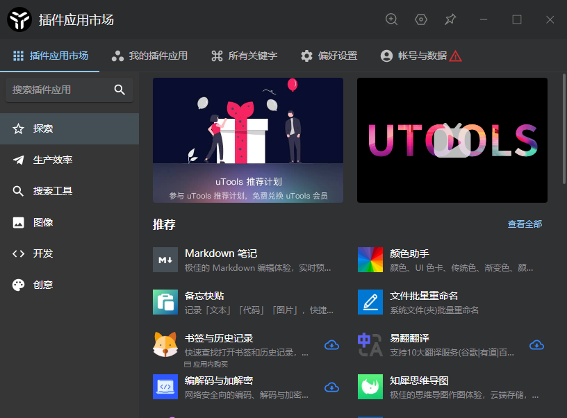

### 文件搜索及打开应用
uTools 主输入框和「超级面板」，一个偏向于键盘操作流，另外一个主攻鼠标操作。你可以找到最适合自己的操作姿势

>通过快捷键「Alt + 空格」呼出 uTools，在输入框中输入需要查找内容，回车即可查找或打开应用。

+ 搜索文件，自带预览功能
为了提高搜索效率，建议下载Everything配合使用。

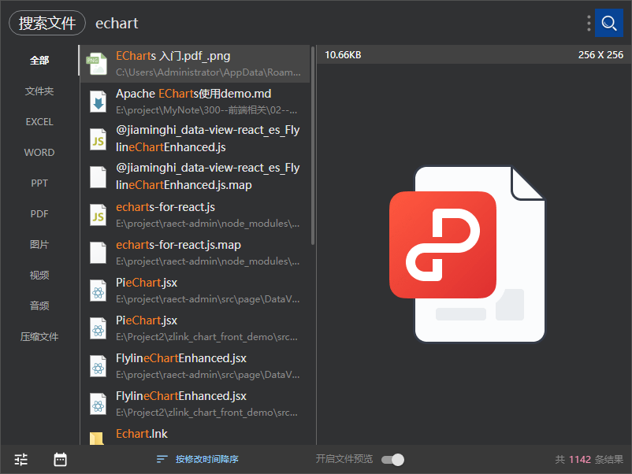

+ 快速打开本地应用
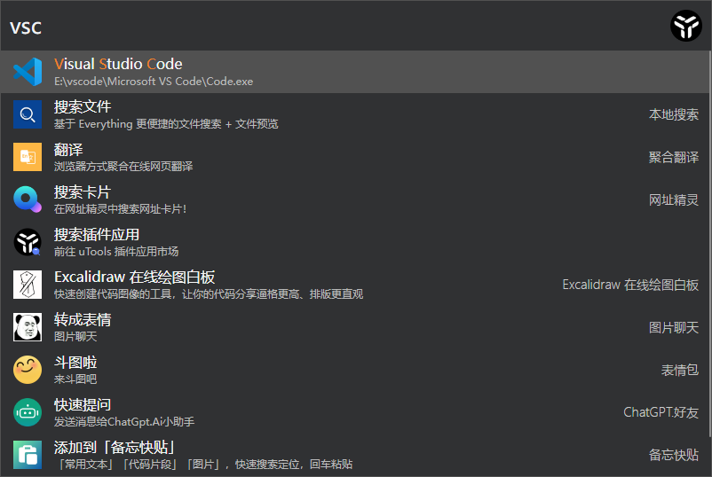

+ 快速打开本地设置
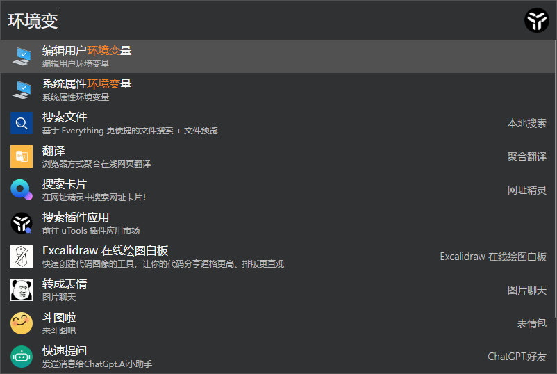

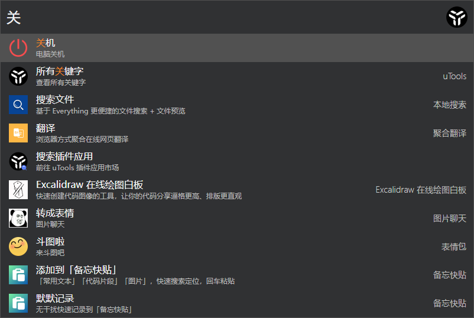

### 超级面板

注：可以通过【鼠标中键】，快速打开 uTools 超级面板，uTools 会根据当前选择的内容（文本、截图、文件、文件夹）自动匹配已安装的插件供你选择。与平时使用右键类似的习惯。


### 插件下载
uTools 最大的特点就是拥有强大的插件系统，现在已有 400+ 的插件供你选择。

通过快捷键「Alt + 空格」呼出 uTools，在输入框中输关键字【插件或cj】-->【回车】 即可呼出插件市场页面

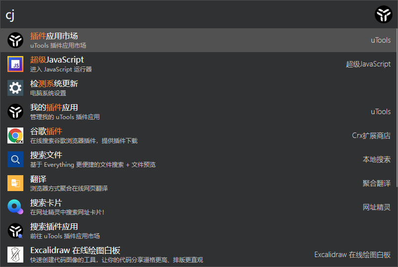


### 插件推荐

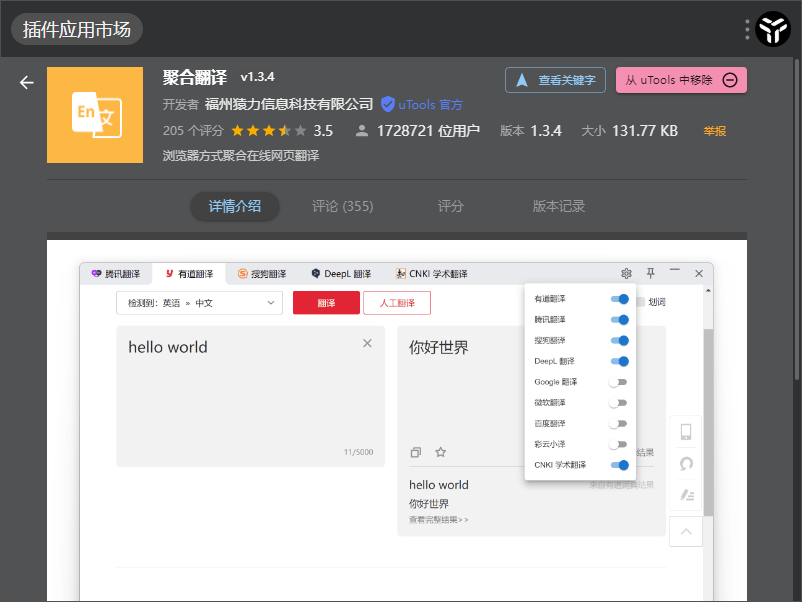

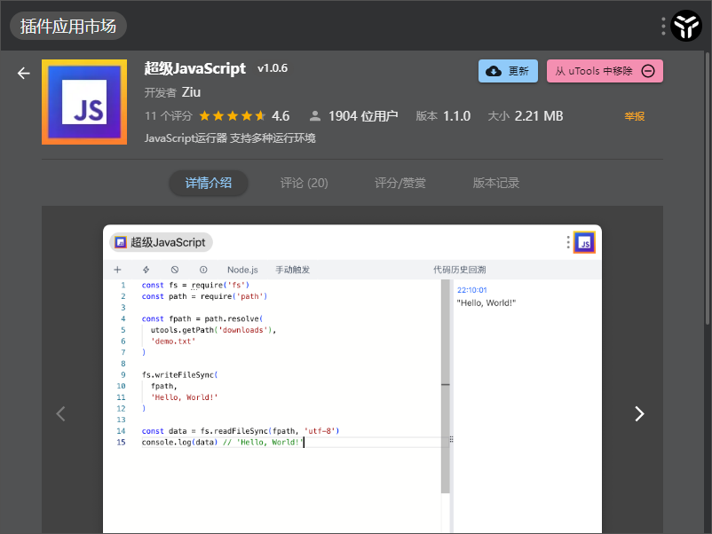


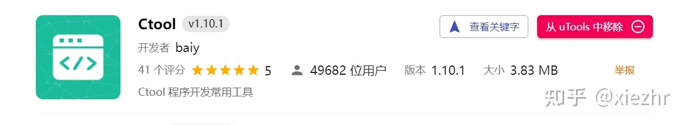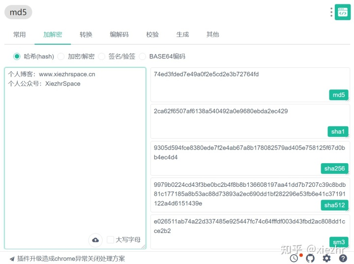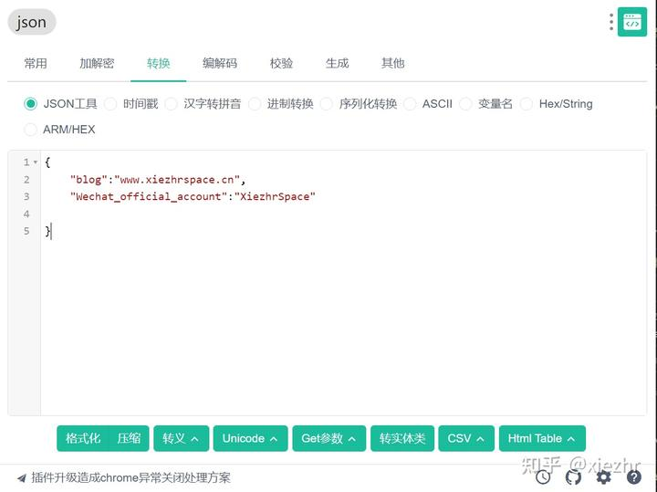