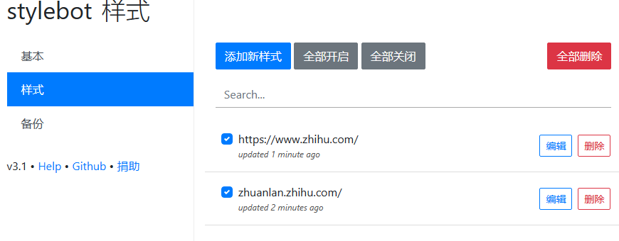

参考以上回答，使用谷歌插件stylish，经过尝试，以下是可行的：

```
https://www.zhihu.com/
zhuanlan.zhihu.com/
```

```
.ztext .content_image, .ztext .origin_image, .TitleImage, .RichContent-cover 
,.TopstoryItem img
,.Card img 
,.HotItem-img img
,.GlobalSideBar
,.VideoCard-player
,.TopstoryItem--advertCard
,.QuestionInvitation
,.Recommendations-Main
,.Question-sideColumn
{
    display:none;
}
.GifPlayer {
    display: none;
}

```

增强版

```
.Topstory-mainColumnCard{
  padding-top: 60px;
}
.TopstoryTabs,Topstory-tabs{
    position: fixed;
    top: 60px;
    z-index: 10;
}

.Topstory-mainColumn + div,
.TopstoryPageHeader,
.AppHeader-userInfo,
.AppHeader-inner a,
.AppHeader-inner ul{
      display:none;
}

.ztext .content_image,
.ztext .origin_image
{
    display:none;
}

.ztext .content_image,
.ztext .origin_image,
.TitleImage,
.RichContent-cover {
display:none;
}

.ztext .content_image, .ztext .origin_image, .TitleImage, .RichContent-cover 
,.TopstoryItem img
,.Card img 
,.HotItem-img img
,.GlobalSideBar
,.VideoCard-player
,.TopstoryItem--advertCard
,.QuestionInvitation
,.Recommendations-Main
,.Question-sideColumn
{
    display:none;
}
.GifPlayer {
    display: none;
}
```