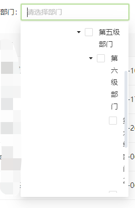
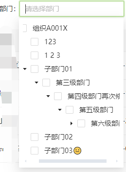

# 样式异常问题及修复方案

## 树节点过多时，未出现横向滚动条

### 问题描述

在使用 `TreeSelect` 组件时，当树节点过多时，未出现横向滚动条，导致超出宽度的部分无法正常显示，如下图所示：



### 解决方案

通过调整 `TreeSelect` 组件的样式和配置，确保树节点在内容过多时显示横向滚动条，避免显示问题。

```jsx
<TreeSelect
  treeData={treeData}
  maxTagCount={2}
  maxTagTextLength={4}
  placeholder={t('flowWork.holidayManagement.deptTip')}
  treeCheckable={true}
  treeCheckStrictly={true}
  showCheckedStrategy={TreeSelect.SHOW_ALL}
  onChange={handleChange}
  listHeight={332}
  width="md"
/>
```

### 样式调整

我们可以通过自定义 `popupClassName` 来修改组件的样式，并针对 `ant-select-tree-list-holder` 元素设置 `overflow` 规则，从而确保在内容超出宽度时能够显示横向滚动条。

#### 自定义样式规则

```css
.TreeSelectClassName {
  background-color: #7AC143;

  .ant-select-tree-title {
    white-space: nowrap; /* 禁止文字换行 */
  }

  /* 调整树节点列表的样式，允许横向滚动 */
  .ant-select-tree-list-holder > div {
    overflow: unset !important;
  }
}
```

### 效果

通过上述调整后的效果如下图所示：



### 总结

通过设置 `white-space: nowrap` 禁止节点标题换行，以及调整 `overflow` 的行为，可以有效解决树节点超出宽度不显示的问题。在复杂的表单组件中，合理的样式控制有助于提升用户体验。

---

最终调整

```
          <Form.Item name="deptIdList"
              style={{ marginRight: '15px', minWidth: '200px' }}
              label={t('flowWork.holidayManagement.dept')}>
              <TreeSelect
                open={true}
                popupClassName='tree-select-className'
                treeData={treeData}
                maxTagCount={2}
                maxTagTextLength={4}
                placeholder={t('flowWork.holidayManagement.deptTip')}
                treeCheckable={true}
                treeCheckStrictly={true}
                showCheckedStrategy={TreeSelect.SHOW_ALL}
                onChange={(e) => handleSubmit()}
                listHeight={5000}
              // listHeight={250}
              />
            </Form.Item>


.tree-select-className {
  // min-width: 300px !important;
  width: unset !important;

  max-height: calc(100vh - 300px) !important;
  .ant-select-tree-title {
    white-space: nowrap;
  }

  // // 调整部门查询框的样式
  .ant-select-tree-list-holder>div {
    overflow: unset !important;
    width: unset !important;
  }
}
```