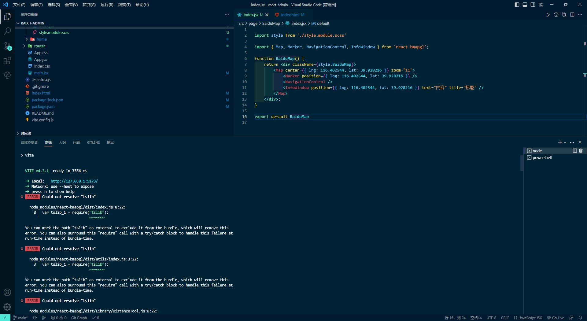
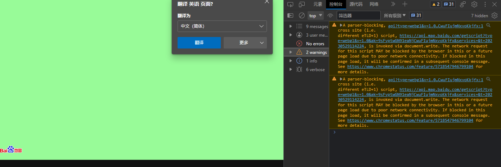

# 异常处理

## Could not resolve "tslib"

此语法需要导入的帮助程序，但找不到模块“tslib”



**解决方式** 安装最新版本的tslib

```
npm install -D tslib@latest
```

参考链接[This syntax requires an imported helper but module 'tslib' cannot be found | bobbyhadz](https://bobbyhadz.com/blog/typescript-syntax-requires-imported-helper-but-module-tslib-cannot#:~:text=If%20you%20aren't%20trying%20to%20use%20tslib%20helper,files%2C%20re-run%20npm%20install%20and%20restart%20your%20IDE.)

## 百度地图引用时 报出A Parser-blocking, cross site (i.e. different eTLD+1) script



页面引入百度地图api时

chrome控制台报出警示问题 A Parser-blocking, cross site (i.e. different eTLD+1) script, http://api.map.baidu.com/getscript?v=2.0&ak=Kpjp7jddqVUhWK5VkrfNt3YNezY88NtR&services=&t=20170517145936, is invoked via document.write. The network request for this script MAY be blocked by the browser in this or a future page load due to poor network connectivity. If blocked in this page load, it will be confirmed in a subsequent console message.See https://www.chromestatus.com/feature/5718547946799104 for more details. (anonymous) @ api:1

查了一些资料，大概意思是说 ：页面渲染完成后使用了document.write()
这是不被允许的，
根据上面的提示，把api引用url里面的 api 改为 getscript

<script src="http://api.map.baidu.com/api?v=2.0&ak=你申请的ak"></script>

api 改为 getscript以后

<script src="http://api.map.baidu.com/getscript?v=2.0&ak=你申请的ak"></script>