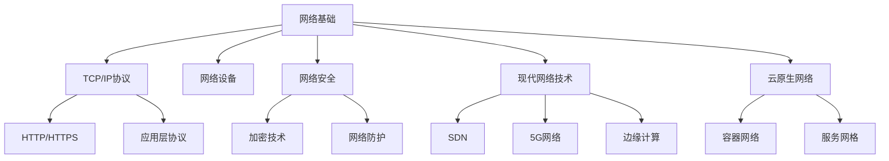

# 计算机网络 MOC（Map of Contents）

> 计算机网络知识地图，提供全面网络技术的结构化导航和学习路径

---

## 📚 学习路径

### 基础入门路径

适合初学者，从基础概念开始逐步深入：

1. **网络基础** → **TCP/IP协议** → **HTTP/HTTPS** → **应用层协议**
2. **网络基础** → **HTTP/HTTPS** → **网络安全基础** → **现代网络技术**

### 专业进阶路径

适合有一定基础的学习者，深入特定领域：

1. **网络安全方向**：网络安全基础 → 对称加密/非对称加密 → 防火墙技术 → VPN技术
2. **现代网络方向**：软件定义网络 → 5G网络 → 边缘计算 → 物联网网络
3. **云原生方向**：容器网络 → Kubernetes网络 → 服务网格 → 网络策略

---

## 🌐 网络技术全景

```
计算机网络全景图
┌─────────────────────────────────────────────────────────────┐
│                    计算机网络                              │
├─────────────────────────────────────────────────────────────┤
│  01-网络基础          │  02-HTTP-HTTPS           │
│  ├─ OSI模型          │  ├─ HTTP协议             │
│  ├─ TCP/IP协议栈     │  ├─ HTTP2-HTTP3          │
│  └─ 网络设备         │  ├─ HTTPS与TLS           │
│                     │  └─ HTTP缓存             │
├─────────────────────────────────────────────────────────────┤
│  03-TCP-IP           │  04-应用层协议           │
│  ├─ IP地址与子网     │  ├─ WebSocket            │
│  ├─ 路由与转发       │  ├─ FTP                  │
│  ├─ TCP协议          │  └─ SMTP-POP3            │
│  ├─ UDP协议          │                         │
│  └─ DNS原理          │                         │
├─────────────────────────────────────────────────────────────┤
│  05-网络安全         │  06-现代网络技术         │
│  ├─ 网络安全基础     │  ├─ 软件定义网络         │
│  ├─ 威胁模型         │  ├─ 5G网络               │
│  ├─ 安全架构         │  ├─ 边缘计算             │
│  ├─ 对称加密         │  └─ 物联网网络           │
│  ├─ 非对称加密       │                         │
│  ├─ 哈希函数         │                         │
│  ├─ 数字签名         │                         │
│  ├─ 防火墙技术       │                         │
│  ├─ 入侵检测系统     │                         │
│  ├─ VPN技术          │                         │
│  ├─ 网络访问控制     │                         │
│  ├─ SSL/TLS协议      │                         │
│  ├─ IPSec协议        │                         │
│  ├─ SSH协议          │                         │
│  └─ 安全邮件协议     │                         │
└─────────────────────────────────────────────────────────────┘
┌─────────────────────────────────────────────────────────────┐
│  07-云原生网络                                           │
│  ├─ 容器网络概述     │                                 │
│  ├─ Kubernetes网络模型 │                                 │
│  └─ 服务网格概述     │                                 │
└─────────────────────────────────────────────────────────────┘
```

---

## 🎯 核心主题索引

### 网络基础

| 主题 | 核心概念 | 关键技术 | 应用场景 |
|------|----------|----------|----------|
| OSI模型 | 七层网络架构 | 分层通信协议 | 网络故障排查 |
| TCP/IP | 四层网络模型 | TCP/IP协议栈 | 互联网通信 |
| 网络设备 | 交换机、路由器 | 网络硬件配置 | 网络建设运维 |

### 传输协议

| 协议 | 特点 | 优势 | 应用场景 |
|------|------|------|----------|
| TCP | 可靠、面向连接 | 保证数据完整性 | 文件传输、Web应用 |
| UDP | 不可靠、无连接 | 传输速度快 | 实时音视频、DNS |
| HTTP/HTTPS | 应用层协议 | 安全传输、状态码 | Web应用、API接口 |

### 网络安全

| 领域 | 基础技术 | 高级应用 | 防护策略 |
|------|----------|----------|----------|
| 加密技术 | 对称/非对称加密 | 数字签名、证书 | 数据加密、身份认证 |
| 网络防护 | 防火墙、IDS | VPN、NAC | 访问控制、威胁检测 |
| 安全协议 | SSL/TLS、IPSec | VPN安全通道 | 安全通信、远程访问 |

### 现代网络

| 技术 | 核心架构 | 应用价值 | 典型产品 |
|------|----------|----------|----------|
| SDN | 控制与数据分离 | 网络可编程化 | OpenDaylight、ONOS |
| 5G | eMBB、URLLC、mMTC | 高速、低时延、大连接 | 5G基站、核心网 |
| 边缘计算 | 边缘处理架构 | 降低时延、节省带宽 | MEC节点、边缘云 |

### 云原生网络

| 组件 | 核心功能 | 技术特点 | 开源方案 |
|------|----------|----------|----------|
| 容器网络 | Pod间通信 | 网络命名空间、Veth | Flannel、Calico |
| 服务网格 | 服务间通信管理 | 边车代理、mTLS | Istio、Linkerd |
| Kubernetes网络 | 集群网络模型 | CNI插件、网络策略 | CNI、kube-proxy |

---

## 🔍 知识关联

### 概念关联图



### 技术演进路径

1. **传统网络 → 软件定义网络**
   - 从硬件定义到软件定义
   - 从封闭到开放架构
   - 从手动到自动化

2. **中心化网络 → 边缘计算**
   - 从集中处理到边缘处理
   - 从高时延到低时延
   - 从云端到边缘协同

3. **物理网络 → 虚拟网络**
   - 从物理隔离到虚拟隔离
   - 从静态到动态
   - 从专用到共享

---

## 📚 学习资源推荐

### 书籍

1. **基础理论**
   - 《计算机网络》（谢希仁）
   - 《TCP/IP详解》
   - 《HTTP权威指南》

2. **网络安全**
   - 《网络安全基础》
   - 《密码学原理与实践》
   - 《网络攻防技术》

3. **现代网络**
   - 《软件定义网络：技术、实践与演进》
   - 《5G移动网络：从理论到实践》
   - 《边缘计算：原理与实践》

4. **云原生网络**
   - 《Kubernetes网络权威指南》
   - 《云原生网络》
   - 《Istio服务网格技术》

### 在线资源

1. **学习平台**
   - Coursera计算机网络课程
   - edX网络工程课程
   - Kubernetes官方文档

2. **技术社区**
   - IETF（互联网工程任务组）
   - CNCF（云原生计算基金会）
   - ONF（开放网络基金会）

3. **实践工具**
   - Wireshark（网络抓包）
   - Mininet（SDN仿真）
   - Kind（本地Kubernetes集群）

---

## 🎓 技能评估

### 初级技能

- [ ] 理解OSI七层模型
- [ ] 掌握TCP/IP协议基础
- [ ] 了解HTTP协议工作原理
- [ ] 熟悉常见网络设备功能

### 中级技能

- [ ] 掌握网络安全基础概念
- [ ] 理解VPN和防火墙技术
- [ ] 了解SDN基本概念
- [ ] 熟悉容器网络基础

### 高级技能

- [ ] 掌握高级密码学技术
- [ ] 设计安全网络架构
- [ ] 部署现代网络解决方案
- [ ] 构建云原生网络环境

---

## 🛠️ 实践项目建议

### 网络基础项目

1. **家庭网络搭建**
   - 路由器配置
   - 家庭网络安全设置
   - 网络故障排查

2. **小型企业网络设计**
   - 网络拓扑设计
   - 设备选型
   - IP地址规划

### 网络安全项目

1. **个人安全实验室**
   - 防火墙配置
   - VPN搭建
   - 安全策略实施

2. **网络攻防实践**
   - 漏洞扫描
   - 渗透测试
   - 安全加固

### 现代网络项目

1. **SDN实验环境**
   - Mininet搭建
   - SDN控制器部署
   - 简单应用开发

2. **5G/边缘计算原型**
   - 边缘节点部署
   - 边缘应用开发
   - 性能测试

### 云原生网络项目

1. **Kubernetes网络实践**
   - 多种CNI插件部署
   - 网络策略配置
   - 故障排查

2. **服务网格实现**
   - Istio部署配置
   - 流量管理实验
   - 安全策略实施

---

## 🔗 快速导航

- [网络基础](./01-网络基础/README.md) - 从零开始学习网络基础知识
- [TCP/IP协议](./03-TCP-IP/README.md) - 深入理解互联网核心协议
- [网络安全](./05-网络安全/README.md) - 全面掌握网络安全技术
- [现代网络技术](./06-现代网络技术/README.md) - 了解前沿网络技术发展
- [云原生网络](./07-云原生网络/README.md) - 探索云原生环境下的网络架构

---

**最后更新**：2025-01-26
**维护规范**：详见 [笔记规范文档](../../../../../.cursorrules)

#计算机网络 #MOC #知识地图 #学习路径 #技术全景