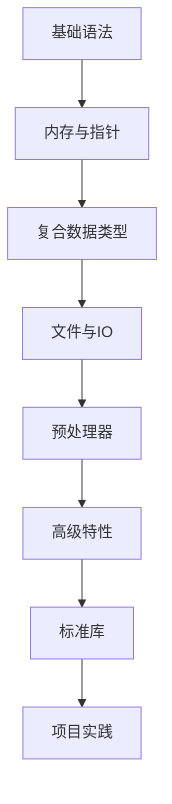

# 🌟 C语言知识地图 (MOC)

> 本文档是C语言学习的导航索引，涵盖从基础到高级的各个方面。按照学习路径组织，方便系统性学习和查阅。

## 📚 学习路径

---

## 🔰 1. C语言基础

### 1.1 语言概述 🏛️
- **C语言的历史与发展**
- **C语言的特点与应用领域**
- **C语言标准**（C89/C90、C99、C11、C17/C18）
- **开发环境搭建**（编译器选择、IDE配置）

### 1.2 基本语法 📝
- **程序结构**（预处理、主函数、头文件）
- **标识符与关键字**
- **数据类型**（基本类型、类型修饰符）
- **变量与常量**
- **运算符与表达式**
- **注释规范**

### 1.3 控制流 🔄
- **条件语句**（if-else、switch-case）
- **循环语句**（for、while、do-while）
- **跳转语句**（break、continue、goto、return）

### 1.4 函数 ⚙️
- **函数定义与声明**
- **函数参数与返回值**
- **函数调用方式**
- **递归函数**
- **内联函数**
- **函数指针**

### 1.5 数组与字符串 📊
- **一维数组与多维数组**
- **数组初始化与访问**
- **字符数组与字符串**
- **字符串处理函数**（strcpy、strcat、strcmp等）

---

## 🧠 2. 内存管理与指针

### 2.1 内存模型 💾
- **程序内存布局**（栈、堆、全局区、常量区、代码区）
- **变量的存储类别**（auto、register、static、extern）
- **生命周期与作用域**

### 2.2 指针基础 👉
- **指针概念与声明**
- **指针运算**
- **指针与数组的关系**
- **指针与函数参数**
- **指针与字符串**

### 2.3 高级指针 🔍
- **多级指针**
- **函数指针与回调函数**
- **指针数组与数组指针**
- **void指针**
- **const与指针**

### 2.4 动态内存管理 ♻️
- **内存分配函数**（malloc、calloc、realloc）
- **内存释放**（free）
- **内存泄漏与内存碎片**
- **内存对齐**

---

## 🧩 3. 复合数据类型

### 3.1 结构体 🏗️
- **结构体定义与声明**
- **结构体成员访问**
- **结构体数组**
- **结构体指针**
- **自引用结构体**
- **结构体内存对齐**

### 3.2 联合体 🔄
- **联合体定义与使用**
- **联合体与结构体的区别**
- **联合体应用场景**

### 3.3 枚举类型 📋
- **枚举定义与使用**
- **枚举常量**
- **枚举的内部表示**

### 3.4 类型定义 🏷️
- **typedef的使用**
- **类型别名**

---

## 📂 4. 文件操作与输入输出

### 4.1 标准输入输出 ⌨️
- **格式化输入输出**（printf、scanf）
- **字符输入输出**（getchar、putchar）
- **缓冲区管理**

### 4.2 文件操作 📄
- **文件指针**
- **文件打开与关闭**（fopen、fclose）
- **文件读写**（fread、fwrite、fprintf、fscanf）
- **文件定位**（fseek、ftell、rewind）
- **二进制文件与文本文件**

### 4.3 错误处理 ⚠️
- **错误码**（errno）
- **错误报告函数**（perror、strerror）

---

## ⚙️ 5. 预处理器

### 5.1 预处理指令 📜
- **#include指令**
- **#define与宏定义**
- **条件编译**（#if、#ifdef、#ifndef）
- **#pragma指令**

### 5.2 宏 🔧
- **带参数的宏**
- **宏展开与副作用**
- **预定义宏**
- **可变参数宏**

---

## 🚀 6. 高级特性

### 6.1 位操作 🔢
- **位运算符**
- **位域**
- **位掩码**

### 6.2 多文件编程 📑
- **头文件与源文件**
- **外部变量与函数**
- **静态库与动态库**
- **模块化设计**

### 6.3 并发编程 ⚡
- **多线程基础**（pthread库）
- **线程同步**（互斥锁、条件变量）
- **信号处理**

---

## 🔬 7. C语言与汇编

### 7.1 内联汇编 ⚙️
- **基本语法**
- **汇编与C的交互**

### 7.2 底层编程 💻
- **内存映射**
- **硬件访问**
- **系统调用**

---

## 📚 8. 标准库

### 8.1 标准C库 📦
- **字符串处理**（string.h）
- **数学函数**（math.h）
- **时间处理**（time.h）
- **通用工具**（stdlib.h）
- **断言**（assert.h）

### 8.2 常用第三方库 🧰
- **网络编程库**
- **图形界面库**
- **数据库接口**

---

## 🛠️ 9. 编程实践

### 9.1 代码风格与规范 📏
- **命名约定**
- **注释规范**
- **代码格式化**

### 9.2 调试技术 🔍
- **调试工具**（GDB、Valgrind）
- **断点与单步执行**
- **内存检测**

### 9.3 性能优化 ⚡
- **算法优化**
- **编译优化**
- **内存优化**

### 9.4 跨平台开发 🌐
- **条件编译**
- **平台特定代码**
- **可移植性考虑**

---

## 📊 10. 数据结构与算法实现

### 10.1 基本数据结构 🧱
- **链表**（单链表、双链表、循环链表）
- **栈与队列**
- **树**（二叉树、AVL树、红黑树）
- **图**
- **哈希表**

### 10.2 常用算法 🧮
- **排序算法**（快速排序、归并排序、堆排序）
- **搜索算法**（二分查找、深度优先搜索、广度优先搜索）
- **字符串算法**（KMP、正则表达式）

---

## 🏆 11. 项目实践

### 11.1 小型项目 🔨
- **文本编辑器**
- **简单数据库**
- **网络聊天程序**

### 11.2 嵌入式项目 🤖
- **单片机编程**
- **驱动开发**
- **实时操作系统**

---
