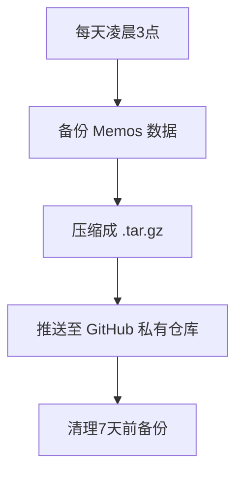

将 Memos 数据备份到 **GitHub 私有仓库**（Private Repository）是一个安全且方便的方法，以下是详细步骤：

---

## **📌 步骤 1：准备备份脚本**
### **1.1 创建备份目录**
```bash
mkdir -p ~/memos_backup
cd ~/memos_backup
```

### **1.2 编写备份脚本 `backup_memos.sh`**
```bash
#!/bin/bash

# 备份配置
BACKUP_DIR="$HOME/memos_backup/data"
REPO_DIR="$HOME/memos_backup/memos-backup"  # GitHub 仓库本地目录
GIT_REPO="git@github.com:你的用户名/memos-backup.git"  # GitHub 仓库地址

# 1. 备份 Memos 数据
mkdir -p "$BACKUP_DIR"
docker cp memos:/var/opt/memos "$BACKUP_DIR/memos_$(date +%Y%m%d)"

# 2. 压缩备份
tar -czf "$BACKUP_DIR/memos_$(date +%Y%m%d).tar.gz" "$BACKUP_DIR/memos_$(date +%Y%m%d)"

# 3. 初始化 Git 仓库（如果不存在）
if [ ! -d "$REPO_DIR" ]; then
    git clone "$GIT_REPO" "$REPO_DIR"
fi

# 4. 复制备份到 Git 仓库目录
cp "$BACKUP_DIR/memos_$(date +%Y%m%d).tar.gz" "$REPO_DIR/"

# 5. 提交到 GitHub
cd "$REPO_DIR"
git add .
git commit -m "Backup Memos $(date +%Y-%m-%d)"
git push origin main

# 6. 清理旧备份（可选）
find "$BACKUP_DIR" -type f -mtime +7 -delete  # 删除7天前的备份
```

### **1.3 赋予脚本执行权限**
```bash
chmod +x ~/memos_backup/backup_memos.sh
```

---

## **📌 步骤 2：创建 GitHub 私有仓库**
1. **访问 [GitHub](https://github.com/new)**，创建一个新仓库：
   - **Repository name**: `memos-backup`
   - **Visibility**: **Private**（确保数据安全）
   - **Initialize with a README**: ✅（可选）

2. **获取仓库 Git 地址**：
   - **SSH**: `git@github.com:你的用户名/memos-backup.git`
   - **HTTPS**: `https://github.com/你的用户名/memos-backup.git`（需要密码）

---

## **📌 步骤 3：配置 Git 免密推送**
### **3.1 生成 SSH Key（如果没有）**
```bash
ssh-keygen -t ed25519 -C "your_email@example.com"
cat ~/.ssh/id_ed25519.pub
```
将公钥添加到 **GitHub → Settings → SSH and GPG keys**。

### **3.2 测试 SSH 连接**
```bash
ssh -T git@github.com
```
如果返回 `Hi 你的用户名! You've successfully authenticated` 则成功。

---

## **📌 步骤 4：设置定时自动备份（Cron Job）**
```bash
crontab -e
```
添加以下内容（每天凌晨 3 点备份）：
```bash
0 3 * * * /bin/bash ~/memos_backup/backup_memos.sh
```

---

## **📌 步骤 5：恢复 Memos 数据**
### **5.1 从 GitHub 下载备份**
```bash
git clone git@github.com:你的用户名/memos-backup.git
cd memos-backup
```

### **5.2 解压并恢复数据**
```bash
# 停止 Memos 容器
docker stop memos

# 解压备份
tar -xzf memos_20240627.tar.gz

# 复制回容器
docker cp ./memos_20240627 memos:/var/opt/memos

# 重启容器
docker start memos
```

---

## **📌 优化建议**
1. **加密敏感数据**（如使用 `openssl` 加密备份）：
   ```bash
   openssl enc -aes-256-cbc -salt -in memos_data.tar.gz -out memos_encrypted.tar.gz -pass pass:你的密码
   ```
2. **使用 GitHub Actions 自动备份**（适合高级用户）。
3. **定期清理旧备份**（在脚本中添加 `find ... -delete`）。
4. **监控备份状态**（如发送通知到 Telegram/Discord）。

---

## **📜 最终流程图**


这样，你的 **Memos 数据** 就会自动、安全地备份到 GitHub！🚀