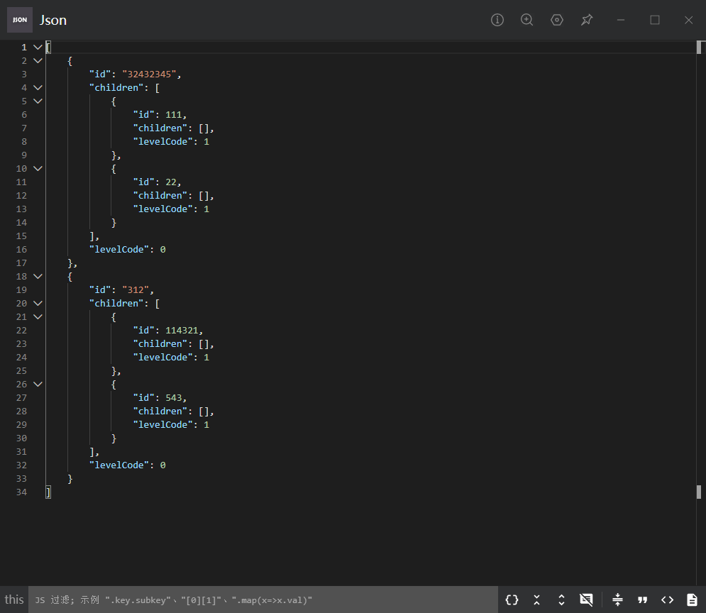

```js
function addLevelCode(data, level = 0) {
  data.forEach((item) => {
    item.levelCode = level;
    if (item.children) {
      addLevelCode(item.children, level + 1);
    }
  });
  return data;
}

let data = [
  {

    id: "32432345",
    children: [
      // ...
      {
        id: 111,
        children: []
      },
      {
        id: 22,
        children: []
      }
    ],
  },
  {

    id: "312",
    children: [
      // ...
      {
        id: 114321,
        children: []
      },
      {
        id: 543,
        children: []
      }
    ],
  },
];

let result = addLevelCode(data);
console.log(result);

```

实现效果

