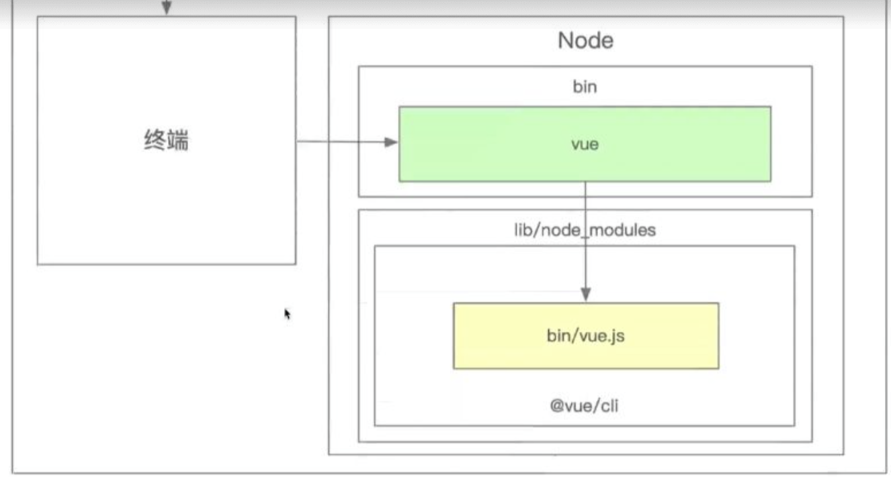
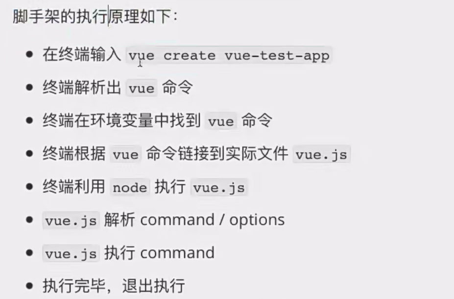

### 脚手架的简介
- **脚手架是操作系统的客户端**：通过终端命令来执行，帮助开发者进行项目初始化、依赖安装等任务。
- **命令构成**：
  - **主命令**（如`view`）：表示脚手架工具本身。
  - **子命令**（如`create`）：指示脚手架执行某个动作。
  - **参数**（如`view-test-APP`）：传递给脚手架的具体信息或配置。
  - **选项**（如`--force`、`-r`）：调整命令执行的行为。

### 脚手架的执行过程
1. **用户输入命令**：例如`view create view-test-APP`。
2. **终端查找命令**：通过`which view`找到对应的命令路径。
3. **软链接指向实际执行文件**：终端找到命令后，通过软链接指向`view.js`文件。
4. **执行命令**：通过`node`解析和执行`view.js`，该文件进一步解析命令和选项，执行相应的功能（如创建项目、安装依赖等）。

### 脚手架开发的思路
1. **创建npm项目**：首先需要一个`npm`项目，类似于脚手架工具的实现。
2. **安装依赖**：工具核心功能依赖于`node_modules`，需要安装相关的npm依赖。
3. **开发执行命令的逻辑**：在`view.js`文件中，处理命令解析和选项配置，执行相应的任务（如创建文件、安装依赖等）。

### 开发脚手架的关键步骤：
1. **解析命令**：分析命令行输入，将其分解为具体的命令和选项。
2. **执行命令**：根据解析结果执行相应的操作，如创建项目、安装依赖等。
3. **反馈给用户**：根据执行结果，向用户反馈执行状态或操作提示。

理解脚手架的工作原理后，开发者可以更清晰地理解如何构建和定制自己的脚手架工具，提升开发效率，减少重复操作。

如果你有任何具体的实现问题，或对开发脚手架有进一步的疑问，随时可以提问。

