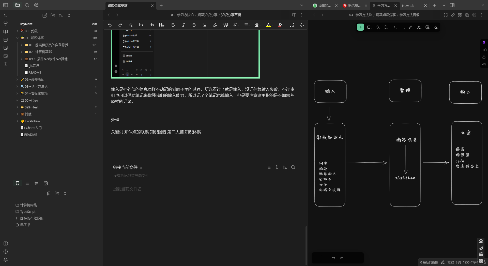
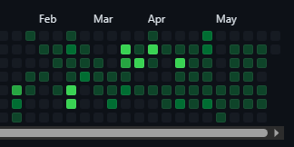
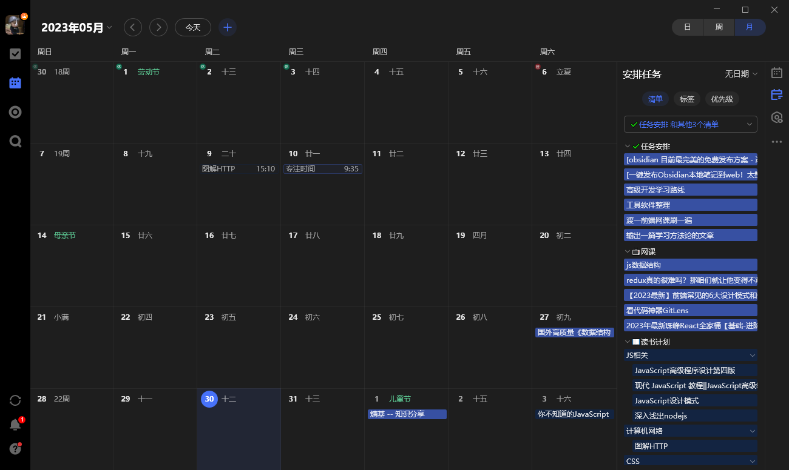

分享我平时的学习方法和心路历程。

## 工具

### obsidian

标签：双向链接  markdown 开源免费 强大的插件系统 数据本地化 知识图谱 检索方便

[想一小时上手obsidian？这一篇就够了。【玩转Obsidian的保姆级教程】 - 知乎](https://zhuanlan.zhihu.com/p/428519519)
[Obsidian 的高级玩法|打造能跳转到任何格式文件的笔记 - 掘金](https://juejin.cn/post/7145351315705577485#heading-52)
[Obsidian拓展计划 - 知乎](https://www.zhihu.com/column/c_1559828696105644032)

### 滴答清单

标签：多平台同步、功能全面、更新快 、 markdown、记录方便

[滴答清单与GTD时间管理 - 知乎](https://www.zhihu.com/column/timehack)

### git GitHub vscode 

标签：备份 版本控制 多电脑同步 正反馈 自定义

## 我的知识管理方法 -- 第二大脑

### 是什么

我们需要一个外部的、集成的数字存储库，用于存储你所学的东西，以及它们来自哪里。它是一个存储和检索系统，将知识点打包成离散的数据包，这些离散的数据包可以在未来任意时间点供我们使用。

其实整个外脑就是由两个系统构成的~

+　储存笔记的系统
+　索引笔记的系统

这个储存和检索系统就是第二大脑，一套便捷高效的笔记系统。

### 为什么

**大脑是用来思考的，不是用来记忆的**

我觉得记忆，尤其是死记硬背是一件很累的事情，而且你花了大量的时间去背下来之后，过一段时间之后也会忘的七七八八。

但是在现实生活中，我们又需要处理和记住很多信息和知识点，以便使用的时候可以随用随取，那应该怎么办呢？那就是搭建知识管理系统（第二大脑）

**第二大脑是为了帮助大脑更好的记住。**

你看，零散的知识点被大脑索引是很困难的，但是有逻辑有结构的东西则不同，后者一索引就是一大片，一整个体系。当你把点状的知识编织成一张网后，它们就会形成你的思维模型，这样，你用的时候才能想起来。

而把知识打入外脑的过程就是在编织你这张网，所以建立外脑的本质就是体系化你知识的过程！！！

### 怎么做 

参考了费曼学习法以及GTD工作法结合作为知识管理系统搭建的框架

费曼学习法包括五个步骤：

+ 确立一个学习目标
+ 理解要学习的知识
+ 以教代学，用输出代替输入
+ 进行回顾和反思
+ 实现知识的简化和吸收

GTD 工作流总共有 5 个步骤：收集、厘清、整理、归档、回顾。

选择了滴答清单作为辅助工具，并选择obsidian作为第二大脑的载体。

**第一步 梳理学习目标，收集，厘清**

大脑更擅长思考和创造，而不是储存。每天不停接收的信息不一会就会把我们的大脑装满，我们需要尽快清空大脑，把大脑清空使我们能更加专注于当前首要的工作（加一个番茄钟）。

每天遇到的网络文章，阅读的书籍摘录和评论，网课教程，以及每天脑袋里迸发出来的灵感，在当时的零散时间没办法专心看完的文章或者视频，（坐地铁，等车...）我会直接丢进收集箱。

这个收集箱的地方取决于信息来源的平台，可以是哔哩哔哩的稍后观看，抖音的收藏夹，微信的收藏。怎么方便怎么来，为了方便，我是在各个信息的来源平台，使用分享功能直接分享到滴答清单中，然后配合日历功能统一管理。

这样可以在周末复盘的时候很清晰的知道自己还有什么没处理，然后直接在日历中进行分配在未来的某个时刻来完成这项稍后阅读的项目，滴答清单就会在当时对你进行提醒。

**第二步 整理、归档、回顾**

**第三步 以教代学，用输出代替输入**

