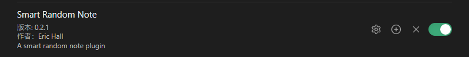
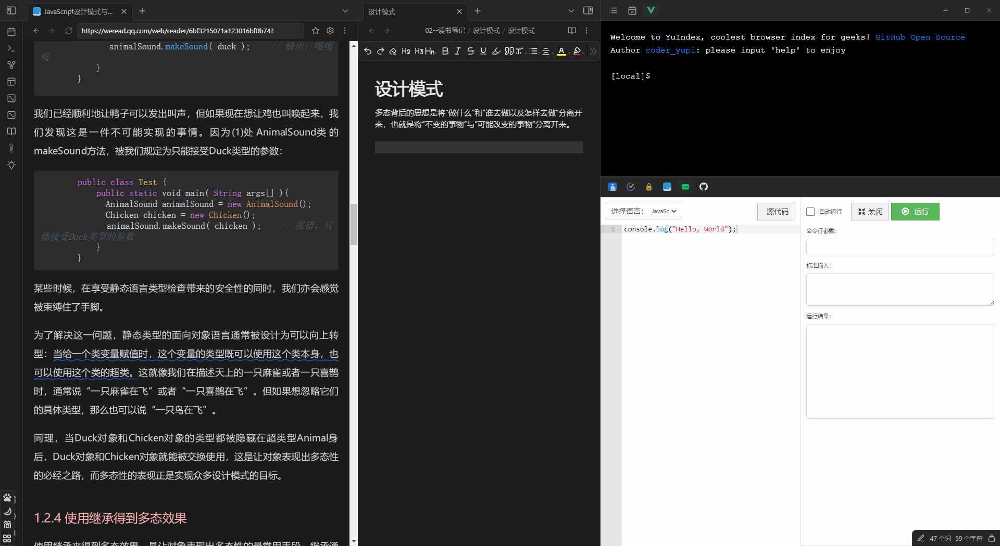

分享我平时的学习方法和心路历程。

## 工具

### obsidian

标签：双向链接  markdown 开源免费 强大的插件系统 数据本地化 知识图谱 检索方便

[想一小时上手obsidian？这一篇就够了。【玩转Obsidian的保姆级教程】 - 知乎](https://zhuanlan.zhihu.com/p/428519519)

[Obsidian 的高级玩法|打造能跳转到任何格式文件的笔记 - 掘金](https://juejin.cn/post/7145351315705577485#heading-52)

[Obsidian拓展计划 - 知乎](https://www.zhihu.com/column/c_1559828696105644032)

### 滴答清单

标签：多平台同步、功能全面、更新快 、 markdown、记录方便

[滴答清单与GTD时间管理 - 知乎](https://www.zhihu.com/column/timehack)

### git GitHub vscode 

标签：备份 版本控制 多电脑同步 正反馈 自定义

## 我的知识管理方法 -- 第二大脑

### 是什么

我们需要一个外部的、集成的数字存储库，用于存储你所学的东西，以及它们来自哪里。它是一个存储和检索系统，将知识点打包成离散的数据包，这些离散的数据包可以在未来任意时间点供我们使用。

其实整个第二大脑就是由两个系统构成的~

+　储存笔记的系统
+　索引笔记的系统

这个储存和检索系统就是第二大脑，一套便捷高效的笔记系统。

### 为什么

**大脑是用来思考的，不是用来记忆的**

我觉得记忆，尤其是死记硬背是一件很累的事情，而且你花了大量的时间去背下来之后，过一段时间之后也会忘的七七八八。

但是在现实生活中，我们又需要处理和记住很多信息和知识点，以便使用的时候可以随用随取，那应该怎么办呢？那就是搭建知识管理系统（第二大脑）

**第二大脑是为了帮助大脑更好的记住。**

你看，零散的知识点被大脑索引是很困难的，但是有逻辑有结构的东西则不同，后者一索引就是一大片，一整个体系。当你把点状的知识编织成一张网后，它们就会形成你的思维模型，这样，你用的时候才能想起来。

而把知识打入第二大脑的过程就是在编织你这张网，所以建立第二大脑的本质就是体系化你知识的过程！！！

### 怎么做 

参考了费曼学习法以及GTD工作法结合作为知识管理系统搭建的框架

费曼学习法包括五个步骤：

+ 确立一个学习目标
+ 理解要学习的知识
+ 以教代学，用输出代替输入
+ 进行回顾和反思
+ 实现知识的简化和吸收

GTD 工作流总共有 5 个步骤：收集、厘清、整理、归档、回顾。

选择了滴答清单作为辅助工具，并选择obsidian作为第二大脑的载体。

**第一步 梳理学习目标，收集，厘清**

大脑更擅长思考和创造，而不是储存。每天不停接收的信息不一会就会把我们的大脑装满，我们需要尽快清空大脑，把大脑清空使我们能更加专注于当前首要的工作（加一个番茄钟）。

每天遇到的网络文章，阅读的书籍摘录和评论，网课教程，以及每天脑袋里迸发出来的灵感，在当时的零散时间没办法专心看完的文章或者视频，（坐地铁，等车...）我会直接丢进收集箱。

这个收集箱的地方取决于信息来源的平台，可以是哔哩哔哩的稍后观看，抖音的收藏夹，微信的收藏。怎么方便怎么来，为了方便，我是在各个信息的来源平台，使用分享功能直接分享到滴答清单中，然后配合日历功能统一管理。

这样可以在周末复盘的时候很清晰的知道自己还有什么没处理，然后直接在日历中进行分配在未来的某个时刻来完成这项稍后阅读的项目，滴答清单就会在当时对你进行提醒。

**第二步 整理、回顾**

整理、归档、回顾、都是使用obsidian完成。

接下来就简单的介绍一下Obsidian，以及我是怎么使用它进行知识管理的。

**为什么选择ob**

+ 一款本地存储的MarkDown编辑器，写文章时插入子标题、代码块、列表、图片都挺方便。
+ 文件管理功能很强大，支持多层文件夹、多层标签、双向链接、关系图谱。
+ 搜索功能方便。
+ **插件非常丰富**，可以支持笔记漫游、手绘图、看板、大纲、日历，标签，等等可以当个人数据库使用。
+ 配合git或者坚果云可以实现多端同步。

**怎么使用ob整理笔记**，或者说合理的搭建知识管理系统。

**整理**就是将知识分门别类整理，该留的留该删的删，同时有一种方便的方式能够在我需要的时候随手找到这些知识。知识管理主流的有两种思路：

+ 文件夹管理法
+ 标签管理法

在早期以 Evernote 为首的「知识管理」工具中，大多推荐采用「文件夹管理」笔记条目，这种方法就是将我们在物理世界管理笔记的方法原样照搬到软件中，即通过文件夹的层级关系组织和管理「笔记条目」，一个典型的文件夹管理方式如下： 

文件夹管理法的优缺点比较明显：

+ 优点：文件夹管理法很容易理解，也是非常符合人类直觉的方式，几乎没有学习成本。
+ 缺点：由于同一条笔记只能属于一个文件夹层级，这让我们在存储笔记的时候会遇到分类模糊的问题，同时当我们找笔记的时候也会比较模糊，也就导致了可能会用下面的这种命名方式

区别于文件夹管理法，标签管理法具备了足够的灵活性，标签管理法认为笔记、笔记本之间不应该有明确的层次结构，笔记被设想成一个不断变化的相互联系的虚拟矩阵，笔记和笔记之间通过「标签」进行关联。

以《流浪地球2》为例，如果要用文件夹的方式，要怎么进行归类。

科幻片，冒险，灾难，小说改，国产...

任何一件事物都可以有很多个维度。如果你把某事物按照一个维度归类，你就相当于把它给定死了，同理我们的知识依旧如此。

打标签就是为解决这个问题设置的，你可以给一个知识点打上无数个标签，当你搜索任何一个标签维度的时候都能够索引到这个知识点。

正如上面案例中，只要给《流浪地球2》打上了合理的标签，无论直接搜索流浪地球，或者你搜索科幻片也能找到它，搜索灾难片也能找到它，甚至搜索吴京也能找到它...

这样就打破了「文件夹管理法」的层级限制，同一个笔记可以标记不同的「标签」从而和其他笔记组成各种不同的关联，我们可以从一篇笔记找到同类的各种笔记，这样从一个笔记跳转到另一个笔记，从而启发我们的「灵感」。

上文说过知识管理系统（第二大脑）就是通过下面两个系统整合而来的。

+　储存笔记的系统
+　索引笔记的系统

所以我将文件夹管理法，和标签管理法分别对应储存笔记的系统以及索引笔记的系统进行管理。

储存笔记的系统，即在文件夹的分类。
 
索引体系统，就是把标签与标签之间也建立起逻辑关系，形成体系和结构，最后内化成我们的知识体系。

一句话解释，储存体用于管理 “文件夹的系统”，而索引体则用于管理 “标签的系统”。

关于文件夹和标签的管理方式网上有很多不同的见解，就挑选自己合适的方法，这里就不做过多介绍了。[文件夹和标签系统 - 搜索](https://cn.bing.com/search?q=%E6%96%87%E4%BB%B6%E5%A4%B9%E5%92%8C%E6%A0%87%E7%AD%BE%E7%B3%BB%E7%BB%9F)

至于回顾的话，ob内置了漫游笔记功能，可以实现随机的回顾一片你厂库的笔记。另外如果想要单独回顾某一个领域的内容也可以配合一下插件实现

这里分享一片文章，也是我为啥选择这个笔记软件的原因

[Obsidian 的高级玩法|打造能跳转到任何格式文件的笔记 - 掘金](https://juejin.cn/post/7145351315705577485#heading-52)

**第三步 以教代学，用输出代替输入**

