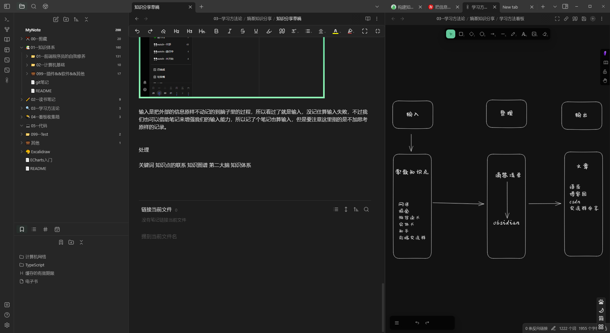
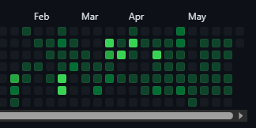
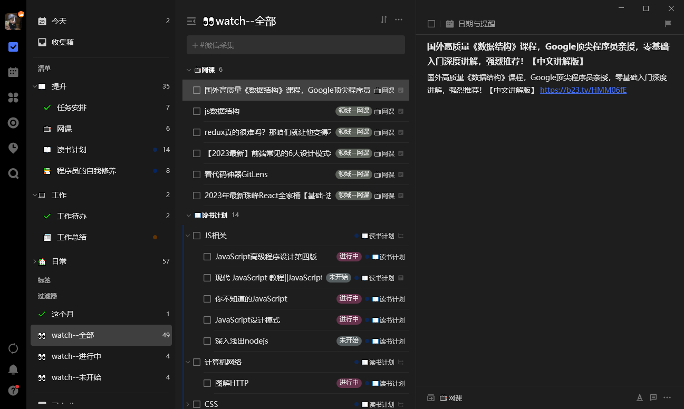
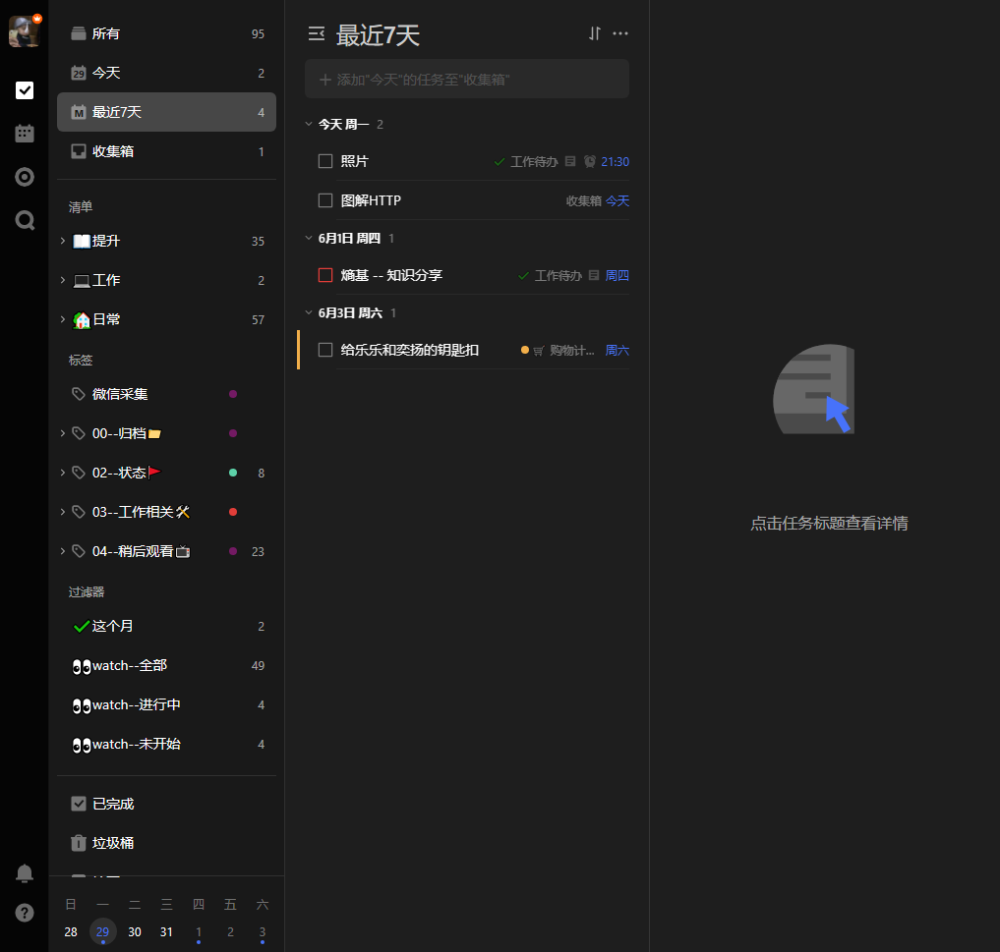
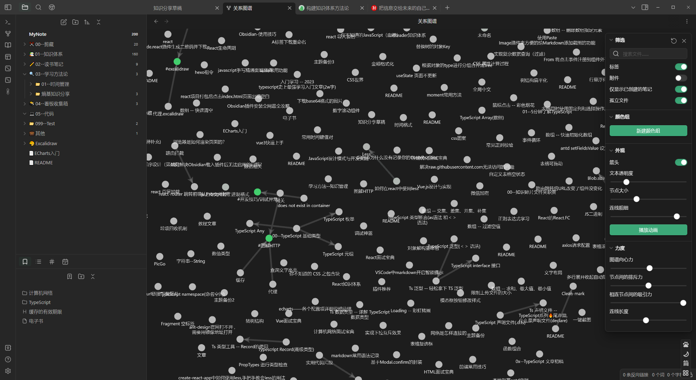

**软件**
+ obsidian
+ 滴答清单
+ 息流
+ flomo
+ git
+ GitHub
+ vscode

**输入**
 现在是一个信息过载的时代，每天我们生活中都充实着各式各样的信息，从新闻、公众号文章、到知乎热点。
 虽然每天收集各类有用的信息，这让我每天我们感觉良好，觉得每天都在进步。但是收集和学习不同。

 收藏等于学会？？ 
 请定期清空你的收集箱
 

+ 网课 
+ 掘金
+ 微信读书
+ 实体书
+ 知乎
+ 前端交流群

**输出**
+ 语雀
+ 博客园
+ csdn
+ 交流群分享

知识整理
+ 思维导图
+ 白板
+ 复盘

### 大脑是用来思考的，不是用来记忆的。
 零碎知识点和知识体系的区别

 

### GTD操作系统

 做完的笔记不一定会回头看，主要是做笔记过程中的思考过程
 但是要做好目录索引 在需要这个知识点时候能够快速定位到位置

费曼学习法
费曼学习法：以教代学，以输出倒闭输入。

写文章的过程中我就报着要分享出去的态度去学习的，有了这层压力在，我看的时候其实是非常认真的，毕竟分享不好丢脸的是自己。
在准备分享内容的过程中，我肯定是理解到一定深度后才能写出来，不理解一定是卡壳的，假如有不会的，我就必须回去重看努力思考。
整个输出的过程则是对我自身经验的一次梳理，逼着我想清楚我到底是怎么做的，这么做对不对，别人听了会有什么问题，可能会被提什么问题。

经过我不断的学习和实践，最终归纳出构建第二大脑的三个步骤——收集、总结、链接。

---
学习方法

### 首先学习需要的环境（软件）

选择自己习惯的软件的好了

#### obsidian--主要的笔记整理软件 

原因：双向链接  markdown 开源免费  强大的插件系统 数据本地化 

#### 滴答清单 收集箱  GTD时间管理大师

原因：多平台同步、功能全面、更新快 、 markdown、记录方便

#### vscode

学习代码运行代码 自定义 obsidian 插件 样式

#### 归档  git GitHub 

对笔记仓库进行管理。防丢
热力图 

### 输入  制定计划

现在是一个信息过载的时代，每天我们生活中都充实着各式各样的信息，从新闻、公众号文章、到知乎热点。

以前端学习为例，会主动或者被动的接触到相关知识  刷抖音哔哩哔哩都能看到一些五六分钟的知识点视频

+ 网课 哔哩哔哩 抖音
+ 掘金 知乎 博客园 
+ 微信读书
+ 实体书 
+ 前端交流群

一般是微信读书看完感觉不错，再买实体书二刷

怎么做   

收集

滴答清单

这里可以挑选自己习惯的应用 比如印象笔记或者onenote 的剪藏 或者是edge的集锦，浏览器自带的收藏夹 

看到感兴趣的知识点，好文 篇幅太长，来不及看的没关系 反正收藏等于学会  你已标记了一处地点。。

整理到收集箱之后 就是进行知识的输入 

一段时间之后你可能会被收集箱大量的文章内容劝退 无从下手 

可能看着ts的文档，然后又想着计算机网络还没看，这时候又有别的任务，大大小小的事情积压在一起

这时候 使用滴答清单做收集箱的好处就出来了 我们都知道，大脑更擅长思考和创造，而不是储存。每天不停接收的信息不一会就会把我们的大脑装满，我们需要尽快清空大脑，把大脑清空使我们能更加专注于当前首要的工作。

输入是把外部的信息原样不动记的到脑子里的过程，所以看过了就是输入，没记住算输入失败，不过我们也可以借助笔记来增强我们的输入能力，所以记了个笔记也算输入，但是要注意这里指的是不加思考原样的记录。

整理

关键词 知识点的联系 知识图谱 第二大脑 知识体系 

要将知识点在脑子里形成一个知识网络，或者说是知识树

以图解hppt为例

你记录了缓存相关的笔记这个时候可能会联想到，性能优化，由性能优化又可以发散出很多节点

比如
减少HTTP请求
静态资源cdn 
图片懒加载 
js性能优化 （这时后又可以延伸出）
	节流、防抖  
	使用事件委托
	在React循环设置key 
	虚拟列表
	跳过不必要的组件更新

等等  上面每一项都是 一个知识点（笔记节点）  这是一个发散的过程而且很容易越跑越远。（可以认为是对深度和广度的取舍）

obsidian 关系图谱

输出

上面说的知识点都是零散的孤立的。

为了加深印象，需要有一个整合的过程。

这里比较常用的方法就是费曼学习法

费曼学习法的核心精神是要求通过教学或者分享加速和加深学习理解。

简单的方式就是写一篇教程文章，然后自己在看一遍。

然后可以发表到博客平台。