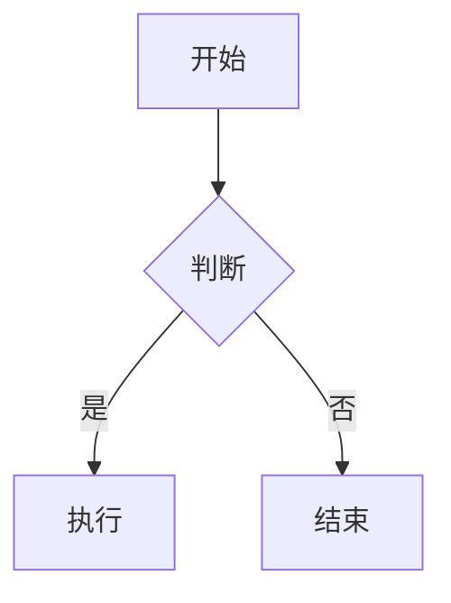

# Quartz 定制完整教程

> Quartz 静态网站生成器定制与配置完整指南
> 
> **适用场景**：Obsidian 笔记发布、知识库网站、文档站点
> 
> **学习目标**：
> - 掌握 Quartz 的配置方法
> - 掌握主题和样式定制
> - 掌握插件和功能扩展
> - 掌握布局和组件定制

---

## 📋 目录

- [一、Quartz 简介](#一quartz-简介)
- [二、项目结构](#二项目结构)
- [三、配置文件详解](#三配置文件详解)
- [四、主题定制](#四主题定制)
- [五、布局定制](#五布局定制)
- [六、插件配置](#六插件配置)
- [七、功能扩展](#七功能扩展)
- [八、常见定制需求](#八常见定制需求)
- [九、最佳实践](#九最佳实践)
- [十、参考资源](#十参考资源)

---

## 一、Quartz 简介

### 1.1 什么是 Quartz

**Quartz** 是一个专门为 Obsidian 笔记设计的静态网站生成器，可以将 Obsidian 笔记转换为美观的网站。

### 1.2 核心特性

- ✅ **完美支持 Obsidian**：支持 wikilink、双链、标签等
- ✅ **现代化设计**：美观的界面和交互
- ✅ **全文搜索**：强大的搜索功能
- ✅ **知识图谱**：可视化笔记关系
- ✅ **高度可定制**：主题、布局、功能都可以定制

### 1.3 适用场景

- Obsidian 笔记发布
- 知识库网站
- 技术文档站点
- 个人博客

---

## 二、项目结构

### 2.1 基本目录结构

```
项目根目录/
├── .github/
│   └── workflows/
│       └── deploy.yml          # GitHub Actions 部署配置
├── content/                    # 笔记内容目录（可选）
├── public/                     # 构建输出目录
├── quartz/                     # Quartz 核心文件（自动生成）
│   ├── cfg.ts                  # 配置类型定义
│   ├── components.ts           # 组件定义
│   └── plugins.ts             # 插件定义
├── quartz.config.ts            # Quartz 主配置文件
├── quartz.layout.ts            # 布局配置文件
├── package.json                # 项目依赖
├── .gitignore                  # Git 忽略文件
└── README.md                   # 项目说明
```

### 2.2 关键文件说明

- **`quartz.config.ts`**：配置插件、主题、行为等
- **`quartz.layout.ts`**：配置页面布局和组件
- **`package.json`**：项目依赖和脚本

---

## 三、配置文件详解

### 3.1 quartz.config.ts

这是 Quartz 的主配置文件，控制所有功能和行为。

#### 基本结构

```typescript
import { QuartzConfig } from "quartz/config"
import * as Plugin from "quartz/plugins"

const config: QuartzConfig = {
  configuration: {
    // 基本配置
  },
  plugins: {
    // 插件配置
  },
}

export default config
```

#### 基本配置项

```typescript
configuration: {
  pageTitle: "我的笔记",           // 网站标题
  enableSPA: true,                  // 启用单页应用模式
  enablePopovers: true,             // 启用链接预览
  locale: "zh-CN",                  // 语言设置
  baseUrl: "example.com",           // 网站基础 URL
  ignorePatterns: [                 // 忽略的文件/目录
    "private",
    ".obsidian",
    "node_modules",
  ],
  defaultDateType: "created",       // 默认日期类型
  theme: {
    // 主题配置
  },
}
```

### 3.2 插件系统

Quartz 使用插件系统来扩展功能，插件分为三类：

#### Transformers（转换器）

处理 Markdown 文件，转换为可用的格式：

```typescript
transformers: [
  Plugin.FrontMatter(),              // 处理前置元数据
  Plugin.CreatedModifiedDate(),      // 处理创建/修改日期
  Plugin.SyntaxHighlighting(),      // 代码高亮
  Plugin.ObsidianFlavoredMarkdown(), // Obsidian 格式支持
  Plugin.GitHubFlavoredMarkdown(),  // GitHub 格式支持
  Plugin.TableOfContents(),         // 生成目录
  Plugin.CrawlLinks(),              // 爬取链接
  Plugin.Description(),             // 生成描述
  Plugin.Latex(),                   // LaTeX 支持
  Plugin.Mermaid(),                 // Mermaid 图表
]
```

#### Filters（过滤器）

过滤不需要的文件：

```typescript
filters: [
  Plugin.RemoveDrafts(),            // 移除草稿
  // 可以添加自定义过滤器
]
```

#### Emitters（发射器）

生成最终的 HTML 文件：

```typescript
emitters: [
  Plugin.ComponentResources(),      // 组件资源
  Plugin.ContentPage(),             // 内容页面
  Plugin.FolderPage(),              // 文件夹页面
  Plugin.TagPage(),                 // 标签页面
  Plugin.ContentIndex(),            // 内容索引
  Plugin.Search(),                   // 搜索索引
  Plugin.Assets(),                   // 静态资源
  Plugin.NotFoundPage(),            // 404 页面
]
```

---

## 四、主题定制

### 4.1 颜色主题

在 `quartz.config.ts` 中配置颜色：

```typescript
theme: {
  colors: {
    lightMode: {
      light: "#faf8f8",           // 背景色
      lightgray: "#e5e0e0",       // 浅灰色
      gray: "#b8b8b8",            // 灰色
      darkgray: "#4e4e4e",        // 深灰色
      dark: "#2b2b2b",            // 文字色
      secondary: "#284b63",        // 次要色
      tertiary: "#84a59d",         // 第三色
      highlight: "rgba(143, 159, 169, 0.15)", // 高亮色
    },
    darkMode: {
      light: "#161618",           // 背景色
      lightgray: "#393639",        // 浅灰色
      gray: "#646464",             // 灰色
      darkgray: "#d4d4d4",         // 深灰色
      dark: "#ebebec",             // 文字色
      secondary: "#7b97aa",        // 次要色
      tertiary: "#84a59d",         // 第三色
      highlight: "rgba(143, 159, 169, 0.15)", // 高亮色
    },
  },
}
```

#### 颜色选择建议

- **背景色**：浅色模式使用白色或浅灰色，深色模式使用深灰色或黑色
- **文字色**：确保与背景色对比度足够（建议 4.5:1 以上）
- **次要色**：用于链接、按钮等交互元素
- **高亮色**：用于选中、悬停等状态

### 4.2 字体配置

```typescript
theme: {
  fontOrigin: "googleFonts",       // 字体来源：googleFonts 或 local
  cdnCaching: true,                // 启用 CDN 缓存
  typography: {
    header: "Schibsted Grotesk",   // 标题字体
    body: "Source Sans Pro",       // 正文字体
    code: "IBM Plex Mono",         // 代码字体
  },
}
```

#### 常用字体组合

**现代风格**：
```typescript
header: "Inter",
body: "Inter",
code: "JetBrains Mono",
```

**经典风格**：
```typescript
header: "Merriweather",
body: "Lato",
code: "Fira Code",
```

**中文友好**：
```typescript
header: "Noto Sans SC",
body: "Noto Sans SC",
code: "JetBrains Mono",
```

### 4.3 自定义 CSS

如果需要更深入的样式定制，可以创建自定义 CSS 文件：

1. 创建 `public/custom.css`：

```css
/* 自定义样式 */
.quartz-title {
  font-size: 2.5rem;
  font-weight: 700;
}

/* 自定义链接样式 */
a {
  color: #284b63;
  text-decoration: none;
}

a:hover {
  color: #84a59d;
  text-decoration: underline;
}

/* 自定义代码块样式 */
pre {
  background-color: #f5f5f5;
  border-radius: 8px;
  padding: 1rem;
}
```

2. 在 `quartz.layout.ts` 中引入：

```typescript
import * as Component from "quartz/components"

export const sharedPageComponents: SharedLayout = {
  // ...
  header: [
    Component.ComponentResources({
      css: ["/custom.css"],  // 引入自定义 CSS
    }),
  ],
}
```

---

## 五、布局定制

### 5.1 quartz.layout.ts 详解

`quartz.layout.ts` 控制页面的布局和组件位置。

#### 基本结构

```typescript
import { PageLayout, SharedLayout } from "quartz/cfg"
import * as Component from "quartz/components"

// 左侧边栏
const left: Component.ComponentId[] = [
  Component.PageTitle(),
  Component.Search(),
  // ... 其他组件
]

// 右侧边栏
const right: Component.ComponentId[] = [
  Component.TableOfContents(),
  Component.Backlinks(),
]

// 页面顶部
const header: Component.ComponentId[] = []

// 页面底部
const footer: Component.ComponentId[] = []

export const sharedPageComponents: SharedLayout = {
  left,
  right,
  header,
  footer,
}

export const defaultContentPageLayout: PageLayout = {
  beforeBody: [
    Component.Breadcrumbs(),
    Component.ArticleTitle(),
  ],
  left: [],
  right: [],
}
```

### 5.2 可用组件

#### 导航组件

- **`Component.PageTitle()`**：页面标题
- **`Component.Search()`**：搜索框
- **`Component.Darkmode()`**：深色模式切换
- **`Component.Explorer()`**：文件浏览器
- **`Component.Breadcrumbs()`**：面包屑导航

#### 内容组件

- **`Component.ArticleTitle()`**：文章标题
- **`Component.ContentMeta()`**：内容元数据（日期、标签等）
- **`Component.TableOfContents()`**：文章目录
- **`Component.Backlinks()`**：反向链接
- **`Component.TagList()`**：标签列表

#### 功能组件

- **`Component.Graph()`**：知识图谱
- **`Component.RecentNotes()`**：最近笔记
- **`Component.GitHubLink()`**：GitHub 链接

#### 响应式组件

- **`Component.DesktopOnly()`**：仅桌面端显示
- **`Component.MobileOnly()`**：仅移动端显示

### 5.3 组件配置示例

#### 文件浏览器配置

```typescript
Component.Explorer({
  title: "📁 目录",
  folderClickBehavior: "collapse",  // link 或 collapse
  folderDefaultState: "collapsed",   // collapsed 或 open
  useSavedState: true,               // 保存状态到本地存储
})
```

#### 知识图谱配置

```typescript
Component.Graph({
  title: "知识图谱",
  localGraph: {
    drag: true,                      // 允许拖拽
    zoom: true,                      // 允许缩放
    depth: -1,                       // 深度（-1 表示全部）
    scale: 1.1,                      // 缩放比例
    repelForce: 0.5,                 // 排斥力
    centerForce: 0.3,                // 中心力
    linkDistance: 30,                // 链接距离
    linkStrength: 0.9,               // 链接强度
    fontSize: 0.6,                   // 字体大小
    opacityScale: 1,                 // 透明度缩放
  },
  globalGraph: {
    // 全局图谱配置（同上）
  },
})
```

#### 文章目录配置

```typescript
Component.TableOfContents({
  title: "📑 目录",
  showByDefault: true,               // 默认显示
  collapseByDefault: false,          // 默认折叠
})
```

### 5.4 自定义布局

#### 调整组件顺序

```typescript
const left: Component.ComponentId[] = [
  Component.PageTitle(),             // 1. 标题
  Component.Search(),                // 2. 搜索（保持在前）
  Component.Darkmode(),             // 3. 深色模式
  Component.Explorer(),              // 4. 目录浏览器
  Component.RecentNotes(),           // 5. 最近笔记
  Component.TagList(),               // 6. 标签列表
  Component.Graph(),                 // 7. 知识图谱
]
```

#### 隐藏某些组件

```typescript
const left: Component.ComponentId[] = [
  Component.PageTitle(),
  Component.Search(),
  // Component.Graph(),              // 隐藏知识图谱
  // Component.RecentNotes(),        // 隐藏最近笔记
]
```

#### 移动端和桌面端不同布局

```typescript
const right: Component.ComponentId[] = [
  Component.DesktopOnly(
    Component.TableOfContents({      // 桌面端：目录在右侧
      title: "📑 目录",
    })
  ),
  Component.MobileOnly(
    Component.TableOfContents({      // 移动端：目录在顶部
      title: "📑 目录",
    })
  ),
]
```

---

## 六、插件配置

### 6.1 目录插件（TableOfContents）

生成文章目录：

```typescript
Plugin.TableOfContents({
  minEntries: 1,                     // 最少条目数
  maxDepth: 6,                      // 最大深度
  collapseByDefault: false,          // 默认折叠
  showByDefault: true,               // 默认显示
})
```

### 6.2 搜索插件（Search）

启用全文搜索：

```typescript
Plugin.Search({
  // 搜索配置选项
  fuseOptions: {
    threshold: 0.3,                 // 搜索阈值
    ignoreLocation: true,            // 忽略位置
  },
})
```

### 6.3 代码高亮插件（SyntaxHighlighting）

```typescript
Plugin.SyntaxHighlighting({
  theme: {
    light: "github-light",           // 浅色主题
    dark: "github-dark",             // 深色主题
  },
  keepBackground: false,             // 保持背景色
})
```

### 6.4 Mermaid 图表插件

```typescript
Plugin.Mermaid({
  // Mermaid 配置
})
```

在 Markdown 中使用：

````markdown

````

### 6.5 LaTeX 插件

```typescript
Plugin.Latex({
  renderEngine: "katex",             // 渲染引擎：katex 或 mathjax
})
```

在 Markdown 中使用：

```markdown
行内公式：$E = mc^2$

块级公式：

$$
\int_{-\infty}^{\infty} e^{-x^2} dx = \sqrt{\pi}
$$
```

---

## 七、功能扩展

### 7.1 添加自定义页面

创建 `content/custom-page.md`：

```markdown
---
title: "自定义页面"
---

# 自定义页面

这是自定义页面的内容。
```

### 7.2 自定义 404 页面

`Plugin.NotFoundPage()` 会自动生成 404 页面，如果需要自定义，可以创建 `content/404.md`。

### 7.3 添加分析统计

在 `quartz.config.ts` 中配置：

```typescript
analytics: {
  provider: "plausible",             // 或 "googleAnalytics"
  host: "example.com",              // Plausible 域名
},
```

### 7.4 添加评论系统

使用 Giscus 评论系统：

```typescript
Plugin.Giscus({
  repo: "你的用户名/仓库名",
  repoId: "你的仓库ID",
  category: "Announcements",
  categoryId: "你的分类ID",
})
```

---

## 八、常见定制需求

### 8.1 修改网站标题和描述

在 `quartz.config.ts` 中：

```typescript
configuration: {
  pageTitle: "我的知识库",
  // ...
}
```

### 8.2 修改首页内容

创建 `content/index.md` 作为首页：

```markdown
---
title: "欢迎"
---

# 欢迎来到我的知识库

这是首页内容。
```

### 8.3 排除某些文件

在 `ignorePatterns` 中添加：

```typescript
ignorePatterns: [
  "private",
  "xx-归档",
  "xx-草稿",
  ".obsidian",
  "node_modules",
],
```

### 8.4 自定义文件排序

可以使用 `sortBy` 配置，但通常按文件路径自动排序。

### 8.5 添加社交链接

在 `quartz.layout.ts` 的 `footer` 中添加：

```typescript
const footer: Component.ComponentId[] = [
  Component.GitHubLink({
    link: "https://github.com/你的用户名",
  }),
  // 可以添加其他链接组件
]
```

---

## 九、最佳实践

### 9.1 配置文件管理

- 将配置文件放在版本控制中
- 使用环境变量管理敏感信息
- 为不同环境创建不同的配置文件

### 9.2 性能优化

- 使用 `ignorePatterns` 排除不需要的文件
- 优化图片大小
- 使用 CDN 加速静态资源

### 9.3 内容组织

- 使用清晰的目录结构
- 使用 MOC（Map of Content）组织内容
- 使用标签分类内容

### 9.4 样式一致性

- 使用统一的颜色主题
- 保持字体和间距一致
- 遵循设计规范

---

## 十、参考资源

### 10.1 官方文档

- [Quartz 官方文档](https://quartz.jzhao.xyz/)
- [Quartz 配置选项](https://quartz.jzhao.xyz/configuration)
- [Quartz 插件列表](https://quartz.jzhao.xyz/plugins)
- [Quartz GitHub](https://github.com/jackyzha0/quartz)

### 10.2 相关资源

- [Obsidian 文档](https://help.obsidian.md/)
- [Markdown 语法](https://www.markdownguide.org/)
- [Mermaid 图表语法](https://mermaid.js.org/)

### 10.3 示例配置

- [Quartz 示例仓库](https://github.com/jackyzha0/quartz)
- [Quartz 主题示例](https://quartz.jzhao.xyz/showcase)

---

## 📝 总结

通过本文档，你应该能够：

1. ✅ 理解 Quartz 的配置结构
2. ✅ 定制主题和样式
3. ✅ 调整布局和组件
4. ✅ 配置插件和功能
5. ✅ 实现常见定制需求

**下一步**：
- 尝试修改配置
- 探索更多插件
- 参考其他项目的配置

---

**最后更新**：2025  
**相关文档**：
- [GitHub Pages 部署指南](./GitHub-Pages部署指南.md)
- [快速开始](../../../快速开始.md)

