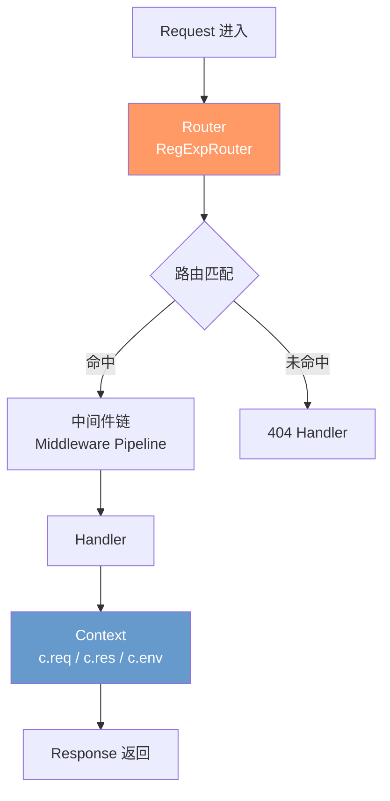

# 🎯 概念理解：Hono

> **一句话**：Hono 是一个基于 **Web 标准 API**（`Request` / `Response`）构建的超轻量 Web 框架，无任何依赖，同一套代码可运行在 Cloudflare Workers、Deno、Bun、Node.js 等任意 JavaScript 运行时上。

---

## 🤔 是什么 (Definition)

Hono（日语「炎」🔥）由 Yusuke Wada（@yusukebe）创建，核心理念是 **"Write once, run on any runtime"**。

### 核心特征

| 特征 | 说明 |
|------|------|
| **零依赖** | 不依赖任何第三方库，纯 Web 标准实现 |
| **极致轻量** | `hono/tiny` 预设 minify + gzip 后仅 ~4KB |
| **超快路由** | `RegExpRouter` 采用正则一次性匹配，而非线性遍历，基准测试 ~402K req/s |
| **多运行时** | 同一套代码运行在 Cloudflare Workers / Deno / Bun / Node.js / Vercel / AWS Lambda / Netlify 等 |
| **一等 TypeScript** | 路径参数精确类型推断、类型安全的 RPC 客户端 |
| **内置丰富** | 中间件、Helper、JSX、RPC、测试工具等开箱即用 |

### 与 Express 的关键差异

| 维度 | Express | Hono |
|------|---------|------|
| 体积 | ~572KB（未压缩） | ~4KB（gzip） |
| 依赖 | 30+ 依赖包 | 零依赖 |
| 运行时 | 仅 Node.js | Node.js / Deno / Bun / CF Workers / Vercel / Lambda... |
| 基准 API | Node.js `http` 模块 | Web Standard `Request` / `Response` |
| 路由匹配 | 线性遍历中间件栈 | 基于正则的 Tinder 路由树 |
| TypeScript | `@types/express` 外挂 | 内置一等支持，路径参数字面量类型推断 |

---

## 💡 为什么诞生 (Why it exists)

### 历史痛点

Express 自 2010 年发布以来统治了 Node.js 服务端生态，但它诞生于 **callback 时代**，设计上严重依赖 Node.js 原生 API（`req` / `res` / `next`），天生无法跨运行时。

2017 年 Cloudflare Workers 发布后，**边缘计算**成为趋势——代码部署在全球 CDN 节点上，要求：
- **极小体积**：冷启动必须在毫秒级
- **跨运行时**：不绑定 Node.js
- **Web 标准**：`Request` / `Response` 是边缘环境的通用语言

传统框架（Express / Koa / Fastify）无法满足这三条，Hono 应运而生。

### 设计哲学

1. **只使用 Web 标准**：不引入任何运行时特有 API
2. **按需装配**：不像 Express 加载全部中间件，Hono 只加载你用到的部分
3. **极简 API**：用最少的代码完成最多的事情

```typescript
// 一个完整的 Hono API 服务
import { Hono } from 'hono'

const app = new Hono()

app.get('/hello/:name', (c) => {
  return c.json({ message: `Hello, ${c.req.param('name')}!` })
})

export default app
```

---

## 👁️ 怎么看 (Mental Model)

### 架构分层模型



### 核心概念对照

| Hono 概念 | 对应 Express | 关键差异 |
|-----------|-------------|----------|
| `Hono()` | `express()` | 应用实例，可嵌套（子路由） |
| `c.req` | `req` | Web Standard `Request` 包装 |
| `c.res` | `res` | 返回 `Response` 对象，而非操作 `res` |
| `c.env` | `process.env` | 运行时无关的环境绑定 |
| `c.json()` | `res.json()` | 返回 `Response` 而非 send |
| `c.req.param()` | `req.params` | TypeScript 自动推断类型 |
| `c.req.query()` | `req.query` | 同上 |
| `c.req.valid()` | — | 校验后的类型安全数据（配合 Zod） |

### 中间件模型

```text
Request
   │
   ▼
┌──────────────┐
│  Middleware 1 │ ← await next() 前：前置逻辑
│  await next() │
│  Middleware 1 │ ← await next() 后：后置逻辑（洋葱模型）
└──────────────┘
   │
   ▼
┌──────────────┐
│  Middleware 2 │
│  await next() │
│  Middleware 2 │
└──────────────┘
   │
   ▼
┌──────────────┐
│   Handler    │ ← 返回 Response，回传洋葱外层
└──────────────┘
```

设计思路：Hono 的中间件采用与 Koa 一致的 **洋葱模型**，这一点和 Express 不同——Express 的中间件是单向管线，无法"回程"处理。

---

## 🗺️ 运行时版图

```
              ┌─────────────────────────────────┐
              │       Hono Application           │
              │   (同一套代码，零修改部署)         │
              └──────────────┬──────────────────┘
                             │
        ┌────────────────────┼────────────────────┐
        │                    │                    │
        ▼                    ▼                    ▼
┌───────────────┐   ┌───────────────┐   ┌───────────────┐
│  边缘运行时    │   │  现代运行时    │   │  Serverless   │
│               │   │               │   │               │
│ Cloudflare    │   │   Node.js     │   │ AWS Lambda    │
│ Workers       │   │   Deno        │   │ Vercel        │
│ Pages         │   │   Bun         │   │ Netlify       │
│ Fastly        │   │               │   │               │
└───────────────┘   └───────────────┘   └───────────────┘
```

---

## 🧭 适用场景矩阵

| 场景 | 适合程度 | 说明 |
|------|----------|------|
| **边缘 API 网关** | ⭐⭐⭐⭐⭐ | 完美适配，轻量+快速冷启动 |
| **BFF（Backend for Frontend）** | ⭐⭐⭐⭐⭐ | 类型安全 RPC 极大提升前后端协作效率 |
| **Serverless 函数** | ⭐⭐⭐⭐⭐ | 多平台支持，一套代码多云部署 |
| **微服务 API** | ⭐⭐⭐⭐ | 适合轻量级服务，重计算场景仍建议 Go/Rust |
| **全栈 SSR** | ⭐⭐⭐⭐ | 内置 JSX 支持，可做服务端渲染 |
| **WebSocket 服务** | ⭐⭐⭐ | 支持但非核心优势场景 |
| **传统 MVC 应用** | ⭐⭐ | 生态不如 Nest.js 成熟 |

---

## 🔗 关联知识

- 官方文档：[Hono Documentation](https://hono.dev/docs/)
- GitHub：[honojs/hono](https://github.com/honojs/hono)
- 运行时对比：Cloudflare Workers / Deno / Bun（后续补充链接）
