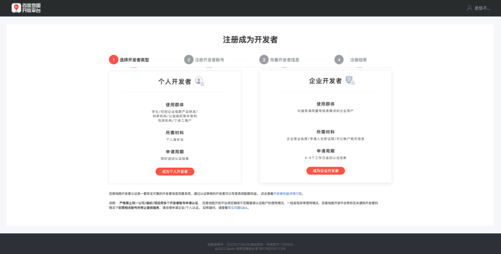

## 账号和获取密钥

### 账号注册

1.进入百度地图开放平台[官网](https://lbsyun.baidu.com/)，点击右上角【登录】按钮，进入百度账号登录页面 


2.如您已经拥有百度账号，请通过扫码/用户名验证的方式直接登录；如您还未拥有百度账号请您点击【注册】完成账号注册


3.通过百度账号注册成为百度地图开放平台开发者，选择开发者类型（个人/企业），完成开发者认证即可



### AK秘钥申请

JavaScript API只支持浏览端的AK进行接入与访问，请开发者在申请AK时注意选择正确的AK类型。

1.进入百度地图开放平台官网控制台，点击【应用管理】-【我的应用】


2.点击【创建应用】进入AK申请页面，填写应用名称，务必选择AK类型为“浏览器端”，JS API只支持浏览器端AK进行请求与访问


3.为了防止您的AK被盗用，请您务必配置refer白名单，只有该白名单中的网站才能成功发起调用。如下方示例所示，配置了*.mysite.com*为域名白名单，即代表域名中包含.mysite.com的网站=才可以使用该AK访问JS API的服务


## html Demo

```HTML
<!DOCTYPE html>
<html lang="en">

<head>
    <meta charset="UTF-8">
    <meta http-equiv="X-UA-Compatible" content="IE=edge">
    <meta name="viewport" content="width=device-width, initial-scale=1.0">
    <title>Hello, World</title>
    <style type="text/css">
        html {
            height: 100%
        }
        body {
            height: 100%;
            margin: 0px;
            padding: 0px
        }
        #container {
            height: 100%
        }
        .box {
            width: 80%;
            height: 80%;
        }
    </style>
    <script type="text/javascript"
        src="https://api.map.baidu.com/api?v=1.0&&type=webgl&ak=9sFvptwGN91eaNjCwuFIujmNxvoKkjfx">
        </script>
</head>
<body>
    <div class="box">
       
        <!-- 创建地图容器元素 -->
        <div id="container"></div>
    </div>
</body>

<script>
	/**
		创建地图实例
		
		位于BMapGL命名空间下的Map类表示地图,
		通过new操作符可以创建一个地图实例。
		其参数可以是元素id也可以是元素对象。
	*/ 
    var map = new BMapGL.Map("container");
	/**
		设置中心点坐标
		
		这里我们使用BMapGL命名空间下的Point类来创建一个坐标点。
		Point类描述了一个地理坐标点，其中116.404表示经度，39.915表示纬度。（为天安门坐标）
	*/ 
    var point = new BMapGL.Point(116.404, 39.915);
    
    /**
		地图初始化，同时设置地图展示级别
		
		在创建地图实例后，我们需要对其进行初始化，
		BMapGL.Map.centerAndZoom()方法要求设置中心点坐标和地图级别。 
		地图必须经过初始化才可以执行其他操作
	*/ 
    map.centerAndZoom(point, 15); 
</script>

</html>
```


## React-BMapGL

### 快速入门

1. 引入脚本

首先，需要在你的index.html模板页面头部加载百度地图JavaScript API代码，密钥获取看文章开头

```html
<script type="text/javascript" src="//api.map.baidu.com/api?type=webgl&v=1.0&ak=您的密钥"></script>
```

然后，使用npm方式安装react组件库，然后通过es模块加载

```
npm install react-bmapgl --save
```


2. demo

```JSX
import React from 'react';
import ReactDOM from 'react-dom';
import {Map, Marker, NavigationControl, InfoWindow} from 'react-bmapgl';

class App extends React.Component {
    render() {
        return <Map center={{lng: 116.402544, lat: 39.928216}} zoom="11">
            <Marker position={{lng: 116.402544, lat: 39.928216}} />
            <NavigationControl /> 
            <InfoWindow position={{lng: 116.402544, lat: 39.928216}} text="内容" title="标题"/>
        </Map>
    }
}
ReactDOM.render(<App />, document.getElementById('container'));
```