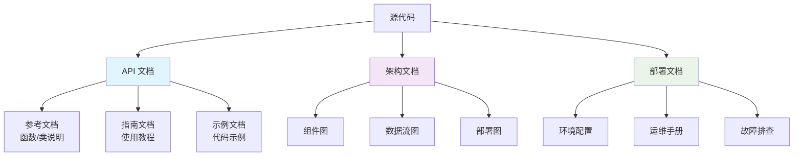
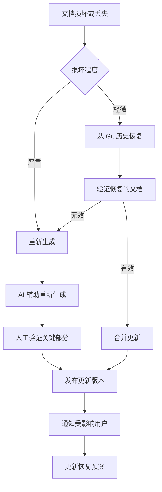

# AI 生成文档与注释

## 方案概述
利用 AI 分析代码逻辑、类型定义和业务上下文，自动生成高质量文档、API 描述和代码注释，实现文档与代码的同步更新，降低维护成本。

## 核心价值
- **一致性保障**：文档与代码同步生成，避免两者脱节
- **知识传承**：复杂业务逻辑通过文档显式化，降低新人学习成本
- **开发效率**：自动生成基础文档，人工聚焦高价值解释
- **API 可发现性**：完善的接口文档提升内部和外部集成效率

## 实施步骤

### 阶段一：工具链配置

#### 文档生成工具对比
| 工具类型 | 代表工具 | 适用场景 | 输出格式 | 集成难度 |
|----------|----------|----------|----------|----------|
| **JSDoc 增强** | TypeDoc + AI 插件 | TypeScript/JavaScript 项目 | HTML/JSON | 低 |
| **OpenAPI 生成** | Swagger + AI 扩展 | REST API 项目 | OpenAPI 3.0 | 中 |
| **代码注释生成** | GitHub Copilot Chat | 日常开发即时文档 | Markdown | 低 |
| **架构文档生成** | Mermaid + Claude | 系统设计文档 | SVG/PNG | 高 |
| **全栈文档平台** | Mintlify + AI | 产品级文档站 | 多格式 | 中 |

#### 基础配置示例
```bash
# TypeScript 项目配置
npm install --save-dev typedoc typedoc-plugin-markdown typedoc-plugin-ai

# typedoc.json 配置
{
  "entryPoints": ["src/index.ts"],
  "out": "docs/api",
  "plugin": ["typedoc-plugin-markdown", "typedoc-plugin-ai"],
  "aiConfig": {
    "provider": "openai",
    "model": "gpt-4",
    "promptTemplates": {
      "function": "为以下函数生成 JSDoc，包含参数说明、返回值、异常和示例：",
      "class": "为以下类生成文档，包含用途、示例和重要方法：",
      "interface": "为以下接口生成文档，包含使用场景和实现要求："
    }
  },
  "theme": "markdown"
}

# 运行文档生成
npx typedoc --options typedoc.json
```

#### API 文档配置
```javascript
// src/api/users.ts
import { OpenAPIRegistry } from '@asteasolutions/zod-to-openapi'

const registry = new OpenAPIRegistry()

/**
 * 用户管理 API
 * @ai-description 处理用户注册、登录、信息查询等核心业务
 */
export const userApi = registry.registerPath({
  method: 'post',
  path: '/api/users',
  description: '创建新用户',
  request: {
    body: {
      content: {
        'application/json': {
          schema: UserCreateSchema
        }
      }
    }
  },
  responses: {
    201: {
      description: '用户创建成功',
      content: {
        'application/json': {
          schema: UserResponseSchema
        }
      }
    }
  }
})

// 自动生成 OpenAPI 文档
import { generateOpenAPI } from '@asteasolutions/zod-to-openapi'
const openAPIDocument = generateOpenAPI(registry.definitions, {
  info: {
    title: '用户服务 API',
    version: '1.0.0'
  }
})
```

### 阶段二：注释生成策略

#### 智能注释生成规则
```typescript
// ai-comment-rules.ts
export const commentRules = {
  // 必加注释的场景
  mandatory: {
    complexLogic: {
      condition: 'cognitive-complexity > 10',
      template: `/**
 * 处理复杂的业务逻辑
 *
 * @algorithm 使用 {算法名称} 算法解决 {问题描述}
 * @timeComplexity O({复杂度})
 * @spaceComplexity O({复杂度})
 * @tradeoff 选择此算法的权衡：{权衡说明}
 *
 * @example
 * // 输入示例
 * const result = processComplex(input)
 *
 * @note 重要：{注意事项}
 */`
    },
    publicAPI: {
      condition: 'exported-function || public-method',
      template: `/**
 * {函数简要描述}
 *
 * @param {参数名} - {参数描述} {可选约束条件}
 * @returns {返回值描述}
 * @throws {异常类型} 当{条件}时抛出
 * @since {版本号}
 * @deprecated 从{版本号}开始，使用{替代方案}
 *
 * @example
 * // 基础用法
 * const result = {函数名}({示例参数})
 *
 * @see {@link 相关函数或文档}
 */`
    },
    businessRule: {
      condition: 'contains-business-logic',
      template: `/**
 * 业务规则：{规则名称}
 *
 * @business-context {业务背景}
 * @rule-id {规则ID}
 * @rule-source {规则来源：产品需求/合规要求/技术约束}
 * @effective-date {生效日期}
 * @owner {负责人}
 *
 * @change-log
 * - {日期} {修改人}: {修改内容}
 */`
    }
  },

  // 可选注释场景
  optional: {
    typeDefinition: {
      suggestion: '为复杂类型添加解释',
      template: `/**
 * {类型用途}
 *
 * @property {属性名} - {属性描述}
 * @example
 * const example: {类型名} = {示例值}
 */`
    },
    testCase: {
      suggestion: '说明测试场景和预期',
      template: `/**
 * 测试场景：{场景描述}
 *
 * @given {前提条件}
 * @when {操作}
 * @then {预期结果}
 *
 * @edge-case {边界情况说明}
 */`
    }
  },

  // 避免过度注释
  avoid: [
    'getter-setter',           // 简单的 getter/setter
    'trivial-constructor',     // 简单构造函数
    'boilerplate-code',        // 模板代码
    'self-explanatory-names'   // 自解释的命名
  ]
}
```

#### 实时注释生成配置（VS Code）
```json
// .vscode/settings.json
{
  "editor.codeActionsOnSave": {
    "source.fixAll": true
  },
  "aiCommentGenerator.enable": true,
  "aiCommentGenerator.rules": {
    "generateOnSave": true,
    "languages": ["typescript", "javascript", "python"],
    "minComplexity": 5,
    "excludePatterns": ["**/test/**", "**/*.spec.ts", "**/*.d.ts"],
    "promptTemplate": {
      "function": "你是一个资深架构师，为以下代码生成专业注释。要求：1. 说明业务目的 2. 参数和返回值 3. 异常情况 4. 示例用法 5. 相关文档链接",
      "class": "为以下类生成文档：1. 类的职责 2. 设计模式 3. 重要方法 4. 使用示例 5. 替代方案说明"
    }
  },
  "codium.autodoc": {
    "enable": true,
    "provider": "openai",
    "model": "gpt-4"
  }
}
```

### 阶段三：文档质量保障

#### 文档一致性检查
```typescript
// doc-consistency-checker.ts
import * as ts from 'typescript'
import * as fs from 'fs'

class DocConsistencyChecker {
  constructor(private projectRoot: string) {}

  async checkFunctionDocs(): Promise<DocIssue[]> {
    const issues: DocIssue[] = []
    const program = ts.createProgram({
      rootNames: [`${this.projectRoot}/src/**/*.ts`],
      options: { allowJs: true }
    })

    program.getSourceFiles().forEach(sourceFile => {
      ts.forEachChild(sourceFile, node => {
        // 检查导出的函数
        if (ts.isFunctionDeclaration(node) && this.isExported(node)) {
          const functionName = node.name?.text || 'anonymous'
          const jsDoc = this.getJSDoc(node)

          if (!jsDoc) {
            issues.push({
              type: 'missing-doc',
              file: sourceFile.fileName,
              line: sourceFile.getLineAndCharacterOfPosition(node.pos).line,
              message: `导出函数 ${functionName} 缺少文档注释`
            })
          } else {
            // 检查参数文档是否完整
            const paramIssues = this.checkParameters(node, jsDoc)
            issues.push(...paramIssues)
          }
        }
      })
    })

    return issues
  }

  private checkParameters(node: ts.FunctionDeclaration, jsDoc: string): DocIssue[] {
    const issues: DocIssue[] = []
    const params = node.parameters
    const paramDocs = this.extractParamDocs(jsDoc)

    params.forEach(param => {
      const paramName = param.name.getText()
      if (!paramDocs.includes(paramName)) {
        issues.push({
          type: 'missing-param-doc',
          file: node.getSourceFile().fileName,
          line: node.getSourceFile().getLineAndCharacterOfPosition(param.pos).line,
          message: `参数 ${paramName} 缺少文档`
        })
      }
    })

    return issues
  }
}

// CI 集成
// package.json
{
  "scripts": {
    "docs:check": "ts-node scripts/doc-consistency-checker.ts",
    "docs:generate": "typedoc && npm run docs:check"
  }
}
```

#### 文档测试验证
```typescript
// doc-test-validator.ts
/**
 * 验证文档中的示例代码是否可运行
 */
class DocTestValidator {
  async validateExamples(filePath: string): Promise<ValidationResult[]> {
    const content = await fs.promises.readFile(filePath, 'utf-8')
    const examples = this.extractCodeExamples(content)
    const results: ValidationResult[] = []

    for (const example of examples) {
      try {
        // 动态执行示例代码（安全沙箱）
        const result = await this.safeEval(example.code)

        results.push({
          example,
          success: true,
          output: result,
          warnings: this.checkForAntiPatterns(example.code)
        })
      } catch (error) {
        results.push({
          example,
          success: false,
          error: error.message,
          suggestion: this.generateFixSuggestion(error, example)
        })
      }
    }

    return results
  }

  private extractCodeExamples(content: string): CodeExample[] {
    // 提取 @example 标签中的代码
    const exampleRegex = /@example\s*\n\s*```(?:javascript|typescript)\s*\n([\s\S]*?)\n\s*```/g
    const examples: CodeExample[] = []
    let match

    while ((match = exampleRegex.exec(content)) !== null) {
      examples.push({
        code: match[1],
        line: this.getLineNumber(content, match.index)
      })
    }

    return examples
  }

  private safeEval(code: string): Promise<any> {
    // 使用 VM2 或其他安全沙箱
    const { VM } = require('vm2')
    const vm = new VM({
      timeout: 1000,
      sandbox: { console, require, process }
    })

    return vm.run(code)
  }
}

// GitHub Action 集成
// .github/workflows/docs-validation.yml
name: Documentation Validation
on:
  push:
    branches: [main]
  pull_request:
    paths: ['src/**', 'docs/**']

jobs:
  validate-docs:
    runs-on: ubuntu-latest
    steps:
      - uses: actions/checkout@v3
      - uses: actions/setup-node@v3

      - name: Install dependencies
        run: npm ci

      - name: Generate documentation
        run: npm run docs:generate

      - name: Validate documentation
        run: npm run docs:validate

      - name: Test code examples
        run: npx ts-node scripts/doc-test-validator.ts
```

### 阶段四：多格式输出与发布

#### 文档站点生成
```yaml
# mintlify.yml (文档站点配置)
name: "产品文档"
navigation:
  - group: "API 参考"
    pages:
      - title: "用户服务"
        path: /api/users
      - title: "订单服务"
        path: /api/orders

  - group: "开发指南"
    pages:
      - title: "快速开始"
        path: /guides/getting-started
      - title: "最佳实践"
        path: /guides/best-practices

features:
  aiAssistant: true
  search: true
  darkMode: true
  feedback: true

aiConfig:
  enabled: true
  model: "gpt-4"
  context:
    include:
      - "src/**/*.ts"
      - "docs/**/*.md"
    exclude:
      - "**/node_modules/**"
      - "**/*.spec.ts"
```

#### 多格式输出管道
```javascript
// doc-pipeline.js
const docPipeline = {
  inputs: ['src/**/*.ts', 'src/**/*.js'],

  processors: [
    {
      name: 'api-docs',
      tool: 'typedoc',
      output: 'docs/api/json/api-spec.json',
      config: { mode: 'json' }
    },
    {
      name: 'markdown-docs',
      tool: 'typedoc',
      output: 'docs/api/markdown/',
      config: { mode: 'markdown' }
    },
    {
      name: 'openapi',
      tool: 'zod-to-openapi',
      output: 'docs/openapi/openapi.yaml',
      config: { format: 'yaml' }
    },
    {
      name: 'architecture-diagrams',
      tool: 'mermaid-cli',
      output: 'docs/diagrams/',
      config: { theme: 'dark' }
    }
  ],

  postProcessors: [
    {
      name: 'ai-enhancement',
      script: 'scripts/enhance-with-ai.js',
      params: { model: 'gpt-4', enhance: ['examples', 'troubleshooting'] }
    },
    {
      name: 'link-validation',
      tool: 'link-checker',
      config: { checkInternal: true, checkExternal: false }
    },
    {
      name: 'accessibility-check',
      tool: 'axe-core',
      config: { rules: ['color-contrast', 'heading-order'] }
    }
  ],

  publishers: [
    {
      name: 'github-pages',
      trigger: 'on-release',
      config: { branch: 'gh-pages', folder: 'docs' }
    },
    {
      name: 'internal-wiki',
      trigger: 'on-merge',
      config: { apiEndpoint: process.env.WIKI_API_URL }
    },
    {
      name: 'slack-notification',
      trigger: 'on-update',
      config: { channel: '#documentation-updates' }
    }
  ]
}
```

## 最佳实践

### 1. 文档分层策略


### 2. 注释质量金字塔
```typescript
// 注释质量等级定义
const commentQualityLevels = {
  level1: { // 基础（必须）
    description: '说明代码做了什么',
    example: `// 计算用户折扣
function calculateDiscount(price: number) { ... }`,
    aiGeneration: 'auto'
  },

  level2: { // 良好（推荐）
    description: '说明为什么这么做，参数含义，返回值',
    example: `/**
 * 计算用户折扣
 * @param price - 原始价格（必须为正数）
 * @returns 折扣后的价格，四舍五入到两位小数
 */
function calculateDiscount(price: number): number { ... }`,
    aiGeneration: 'semi-auto'
  },

  level3: { // 优秀（复杂逻辑）
    description: '包含算法说明、复杂度、示例、边界情况',
    example: `/**
 * 使用动态规划计算最优折扣组合
 *
 * @algorithm 0-1背包问题的变种，寻找最大折扣价值
 * @timeComplexity O(n * budget)
 * @spaceComplexity O(budget)
 *
 * @param items - 商品列表，包含价格和折扣
 * @param budget - 用户预算
 * @returns 最大折扣金额和选择的商品索引
 *
 * @example
 * const result = calculateOptimalDiscount(items, 1000)
 * console.log(result.discount) // 输出：250
 *
 * @note 价格必须是整数，预算不能为负
 */
function calculateOptimalDiscount(items, budget) { ... }`,
    aiGeneration: 'manual-review'
  }
}

// 质量检查规则
const qualityRules = {
  publicApi: { requiredLevel: 'level2', enforcement: 'strict' },
  businessLogic: { requiredLevel: 'level2', enforcement: 'strict' },
  utilityFunctions: { requiredLevel: 'level1', enforcement: 'warning' },
  privateMethods: { requiredLevel: 'level1', enforcement: 'optional' }
}
```

### 3. 文档版本管理
```typescript
// doc-version-manager.ts
class DocVersionManager {
  private versions = new Map<string, DocVersion>()

  async syncWithCodeVersion(codeVersion: string): Promise<void> {
    // 检测代码变更对文档的影响
    const changes = await this.detectBreakingChanges(codeVersion)

    if (changes.breaking) {
      // 创建新版本文档
      await this.createNewVersion({
        version: codeVersion,
        breakingChanges: changes.details,
        migrationGuide: await this.generateMigrationGuide(changes)
      })
    } else {
      // 更新当前版本
      await this.updateCurrentVersion({
        version: codeVersion,
        changes: changes.details
      })
    }
  }

  private async detectBreakingChanges(version: string): Promise<ChangeReport> {
    return {
      breaking: await this.hasApiChanges(),
      details: {
        added: await this.detectAddedAPIs(),
        removed: await this.detectRemovedAPIs(),
        changed: await this.detectChangedAPIs(),
        deprecated: await this.detectDeprecatedAPIs()
      }
    }
  }

  async generateMigrationGuide(changes: ChangeReport): Promise<string> {
    // 使用 AI 生成迁移指南
    const prompt = `
      根据以下 API 变更生成迁移指南：
      新增API: ${JSON.stringify(changes.details.added)}
      移除API: ${JSON.stringify(changes.details.removed)}
      变更API: ${JSON.stringify(changes.details.changed)}
      废弃API: ${JSON.stringify(changes.details.deprecated)}

      请生成：
      1. 简要概述
      2. 逐步迁移步骤
      3. 代码示例（前后对比）
      4. 常见问题解答
    `

    return await this.callAI(prompt, 'gpt-4')
  }
}
```

## 踩坑提醒

### ❌ 常见问题及解决方案
1. **文档与代码不同步**
   ```javascript
   // 问题：手动维护文档容易过期
   function oldFunction() { /* 已重构但文档未更新 */ }

   // 解决方案：文档即代码
   // package.json
   {
     "scripts": {
       "precommit": "npm run docs:generate && git add docs/"
     }
   }
   ```

2. **过度文档化**
   ```typescript
   // 问题：每个简单函数都加详细注释
   /** 获取用户名称 */
   function getName(user: User): string {
     return user.name // 这很明显！
   }

   // 解决方案：智能阈值
   // .eslintrc.js
   rules: {
     'require-jsdoc': ['error', {
       require: {
         FunctionDeclaration: true,
         MethodDefinition: true,
         ClassDeclaration: true,
         ArrowFunctionExpression: false, // 箭头函数可选
         FunctionExpression: false       // 函数表达式可选
       },
       // 仅对复杂函数要求文档
       checkGetters: false,
       checkSetters: false,
       contexts: [
         'FunctionDeclaration:not([id.name=/^get|set|is|has/])'
       ]
     }]
   }
   ```

3. **AI 生成文档质量不稳定**
   ```typescript
   // 问题：AI 可能生成不准确或冗余的文档
   /** 这个函数做一些事情 */
   function complexBusinessLogic() { ... } // ❌ 无用描述

   // 解决方案：多层验证
   const docValidationPipeline = {
     step1: 'ai-generate',           // AI 生成初稿
     step2: 'rule-check',            // 规则验证（必含参数说明等）
     step3: 'example-validation',    // 示例代码测试
     step4: 'human-review',          // 人工审查（核心 API）
     step5: 'feedback-loop'          // 根据使用反馈优化
   }
   ```

### ✅ 成功模式
1. **增量生成**：从核心 API 开始，逐步覆盖整个代码库
2. **双向绑定**：文档变更触发代码审查，代码变更触发文档更新
3. **质量门禁**：文档质量作为 CI 通过条件
4. **使用反馈**：收集文档使用数据（搜索词、访问量）优化内容

## 工具链参考

### 完整技术栈
```yaml
# documentation-tech-stack.yml
generation:
  - typedoc (TypeScript 文档生成)
  - jsdoc (JavaScript 文档生成)
  - compodoc (Angular 项目)
  - sphinx (Python 项目)
  - rustdoc (Rust 项目)

enhancement:
  - typedoc-plugin-ai (AI 增强)
  - mintlify (文档站点)
  - docsify (轻量级文档)
  - docusaurus (React 文档框架)

validation:
  - textlint (文档语法检查)
  - vale (写作风格检查)
  - markdownlint (Markdown 格式)
  - link-check-markdown (链接检查)

integration:
  - github-pages (静态部署)
  - readthedocs (托管服务)
  - confluence-api (企业 Wiki)
  - slack-webhooks (通知)

ai-services:
  - openai-api (GPT 模型)
  - anthropic-claude (Claude 模型)
  - google-gemini (Gemini 模型)
  - local-llm (本地部署)
```

### 成本优化
```javascript
// cost-optimization.js
const docCostOptimizer = {
  strategies: {
    // 分层使用不同 AI 模型
    modelSelection: {
      draftGeneration: 'gpt-3.5-turbo',    // 初稿：便宜模型
      refinement: 'gpt-4',                 // 精炼：优质模型
      complexLogic: 'claude-3-opus'        // 复杂逻辑：最强模型
    },

    // 缓存重复内容
    caching: {
      similarFunctions: true,              // 相似函数复用文档
      templateBased: true,                 // 基于模板生成
      versionDiff: true                    // 仅生成变更部分
    },

    // 按需生成
    onDemand: {
      productionApis: 'always',            // 生产 API：总是生成
      internalTools: 'on-change',          // 内部工具：变更时生成
      deprecatedCode: 'never'              // 废弃代码：不生成
    }
  },

  // 监控和优化
  monitoring: {
    metrics: ['generation-time', 'token-usage', 'quality-score'],
    alerts: ['cost-spike', 'quality-drop', 'coverage-decrease'],
    optimization: 'monthly-review'
  }
}
```

## 应急方案

### AI 服务降级方案
```javascript
// doc-fallback-system.js
class DocumentationFallback {
  constructor() {
    this.modes = {
      full: 'ai-enhanced',      // AI 增强模式
      basic: 'template-based',  // 模板模式
      minimal: 'skeleton-only'  // 仅骨架
    }
    this.currentMode = 'full'
  }

  async generateDocumentation(code, options = {}) {
    try {
      switch (this.currentMode) {
        case 'full':
          return await this.generateWithAI(code)
        case 'basic':
          return await this.generateWithTemplates(code)
        case 'minimal':
          return this.generateSkeleton(code)
      }
    } catch (error) {
      console.warn(`AI 服务失败，降级到 ${this.getNextMode()} 模式`)
      this.currentMode = this.getNextMode()
      return await this.generateDocumentation(code, options)
    }
  }

  private getNextMode(): string {
    const modeOrder = ['full', 'basic', 'minimal']
    const currentIndex = modeOrder.indexOf(this.currentMode)
    return modeOrder[currentIndex + 1] || 'minimal'
  }

  private generateSkeleton(code: string): Documentation {
    // 生成最基本的文档骨架
    return {
      description: this.extractFunctionName(code),
      parameters: this.extractParamNames(code),
      returns: this.extractReturnType(code),
      aiGenerated: false,
      needsReview: true
    }
  }
}
```

### 文档恢复流程


## 成功案例

### 案例一：大型开源库文档转型
**背景**：知名 UI 库文档维护困难，issue 中 30% 是文档问题
**方案**：AI 自动生成 + 社区贡献验证
**结果**：
- 文档覆盖率从 60% → 95%
- issue 中的文档问题减少 80%
- 新贡献者上手时间缩短 40%

### 案例二：企业微服务 API 文档
**背景**：20+ 微服务，API 文档分散，集成困难
**方案**：统一 OpenAPI 规范 + AI 生成示例
**结果**：
- API 集成时间从 3 天 → 4 小时
- 接口错误减少 70%
- 自动生成客户端 SDK

### 案例三：初创公司知识管理
**背景**：快速迭代，知识流失严重
**方案**：代码注释自动转内部 Wiki
**结果**：
- 新员工培训时间减少 50%
- 关键决策文档化率 100%
- 建立可持续的知识传承体系

---

## 下一步行动

### 立即开始（本周）
1. [ ] 选择一个核心工具安装配置（推荐 TypeDoc）
2. [ ] 为 3-5 个核心函数添加 AI 生成的文档
3. [ ] 验证生成效果，调整提示词模板

### 短期目标（1个月）
1. [ ] 建立完整的文档生成流水线
2. [ ] 覆盖所有公共 API 和核心业务逻辑
3. [ ] 集成到 CI/CD，实现文档自动更新
4. [ ] 建立文档质量检查规则

### 中期目标（3个月）
1. [ ] 实现多格式输出（HTML、Markdown、OpenAPI）
2. [ ] 建立文档版本管理
3. [ ] 集成使用反馈收集
4. [ ] 优化 AI 提示词，提升生成质量

### 长期目标（6个月+）
1. [ ] 实现智能文档推荐（根据使用场景）
2. [ ] 建立文档知识图谱
3. [ ] 自动化文档国际化
4. [ ] 预测性文档更新（基于代码变更模式）

---

**维护建议**：
1. 每月审查文档生成质量，优化 AI 提示词
2. 每季度更新工具链，评估新技术
3. 收集用户反馈，持续改进文档实用性
4. 建立文档维护责任矩阵，确保长期可持续性