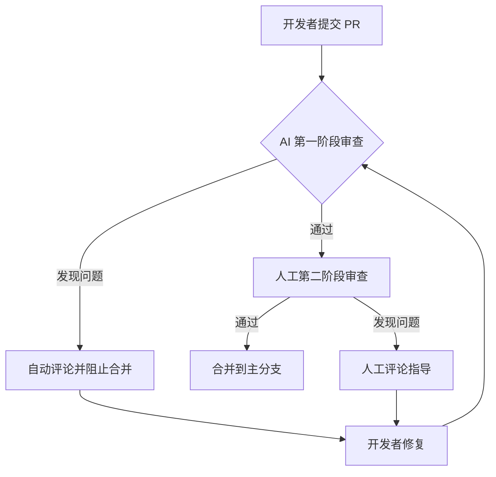
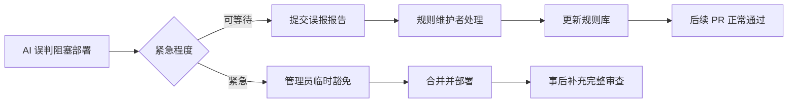

# AI 辅助代码审查

## 方案概述
将 AI 作为第一道代码审查关卡，自动化检查代码质量、安全漏洞和最佳实践，释放人工审查时间用于业务逻辑和架构设计。

## 核心价值
- **效率提升**：自动化检查基础问题，人工聚焦高价值审查
- **质量一致性**：统一团队编码规范，减少风格争议
- **安全防线**：提前发现常见安全漏洞（XSS、SQL 注入等）
- **知识传承**：AI 规则成为团队编码标准的可执行文档

## 实施步骤

### 阶段一：工具选型与配置

#### 选项对比
| 工具 | 类型 | 优势 | 适合场景 | 成本 |
|------|------|------|----------|------|
| **SonarQube** | 自托管平台 | 规则丰富，可定制性强，企业级特性 | 大型团队，需要深度集成的企业环境 | 开源版免费，企业版付费 |
| **GitHub Copilot** | IDE 插件 | 实时建议，与开发流程无缝集成 | 日常开发中的即时反馈 | 按用户付费 |
| **CodeGPT/Claude** | API 集成 | 灵活性高，可深度定制提示词 | 需要定制审查逻辑的团队 | API 调用费用 |
| **Reviewdog** | CLI 工具 | 轻量，易集成 CI/CD | 需要自动化流水线的小型团队 | 开源免费 |

#### 推荐配置（中小团队）
```bash
# 1. 安装基础工具
npm install --save-dev eslint @typescript-eslint/eslint-plugin eslint-plugin-security

# 2. 配置 ESLint 规则扩展
# .eslintrc.js
module.exports = {
  extends: [
    'eslint:recommended',
    'plugin:@typescript-eslint/recommended',
    'plugin:security/recommended'
  ],
  plugins: ['@typescript-eslint', 'security'],
  rules: {
    // 团队自定义规则
    'complexity': ['error', { max: 10 }], // 圈复杂度限制
    'max-lines-per-function': ['error', 50] // 函数行数限制
  }
}

# 3. 集成 AI 审查
npm install --save-dev @sourcery-ai/sourcery  # 或选择其他 AI 工具
```

### 阶段二：CI/CD 集成

#### GitHub Actions 示例
```yaml
# .github/workflows/ai-code-review.yml
name: AI Code Review
on:
  pull_request:
    branches: [main, develop]

jobs:
  review:
    runs-on: ubuntu-latest
    steps:
      - uses: actions/checkout@v3

      - name: Setup Node.js
        uses: actions/setup-node@v3
        with:
          node-version: '18'

      - name: Install dependencies
        run: npm ci

      - name: Run ESLint (静态分析)
        run: npx eslint src/ --max-warnings=0

      - name: Run AI Code Review
        uses: reviewdog/action-suggester@v1
        with:
          tool: codegpt
          level: warning
          reporter: github-pr-review
          filter_mode: added # 只检查新增代码

      - name: Security Scan
        run: npx audit-ci --critical
```

#### GitLab CI 示例
```yaml
# .gitlab-ci.yml
stages:
  - review

ai_review:
  stage: review
  image: node:18
  script:
    - npm ci
    - npx eslint src/ --max-warnings=0
    - |
      # 调用 AI API 进行代码审查
      curl -X POST https://api.openai.com/v1/chat/completions \
        -H "Authorization: Bearer $OPENAI_API_KEY" \
        -H "Content-Type: application/json" \
        -d '{
          "model": "gpt-4",
          "messages": [
            {
              "role": "system",
              "content": "你是一个资深代码审查专家，请分析以下代码并指出问题："
            },
            {
              "role": "user",
              "content": "$(cat diff.txt)"
            }
          ]
        }'
  only:
    - merge_requests
```

### 阶段三：规则定制与训练

#### 团队编码规范转 AI 规则
```javascript
// ai-rules/team-conventions.js
module.exports = {
  // 命名约定
  naming: {
    require: {
      components: 'PascalCase',      // 组件：PascalCase
      hooks: 'useCamelCase',         // Hook：use开头 + CamelCase
      constants: 'UPPER_SNAKE_CASE', // 常量：大写蛇形
      variables: 'camelCase'         // 变量：camelCase
    },
    forbid: {
      singleLetterVars: ['l', 'o', 'I'], // 禁止单字母变量（易混淆）
      vagueNames: ['data', 'temp', 'stuff'] // 禁止模糊命名
    }
  },

  // 安全规则
  security: {
    xss: {
      pattern: /innerHTML|outerHTML|document\.write/,
      suggestion: '使用 textContent 或安全的 DOM API',
      severity: 'critical'
    },
    sql: {
      pattern: /\$.*\{.*SELECT|INSERT|UPDATE.*\}/,
      suggestion: '使用参数化查询或 ORM',
      severity: 'critical'
    }
  },

  // 性能规则
  performance: {
    avoidNestedLoops: {
      pattern: /for.*\{.*for.*\{/,
      suggestion: '考虑使用 Map/Set 优化 O(n²) 算法',
      severity: 'warning'
    },
    memoization: {
      pattern: /useCallback|useMemo|React\.memo/,
      context: 'expensive-computation',
      suggestion: '对昂贵计算使用缓存',
      severity: 'info'
    }
  }
}
```

#### AI 提示词模板
```markdown
## 代码审查专家角色设定

**角色**：资深前端架构师，10年 React/TypeScript 经验
**审查标准**：
1. 安全性第一（XSS、CSRF、数据泄漏）
2. 性能优化（渲染次数、内存泄漏）
3. 可维护性（单一职责、清晰命名）
4. 团队规范一致性

**输出格式**：
```json
{
  "issues": [
    {
      "file": "src/components/UserForm.tsx",
      "line": 45,
      "type": "security",
      "severity": "high",
      "description": "直接使用 innerHTML 可能导致 XSS",
      "suggestion": "改用 React.createElement 或 textContent",
      "codeBefore": "element.innerHTML = userInput",
      "codeAfter": "element.textContent = userInput"
    }
  ],
  "summary": {
    "critical": 1,
    "high": 3,
    "medium": 2,
    "low": 5
  }
}
```

**审查范围**：
- 新增和修改的文件
- 重点关注业务逻辑复杂度和测试覆盖
- 忽略格式化问题（由 Prettier 处理）
```

### 阶段四：人工审查流程优化

#### 双阶段审查流程


#### 审查优先级矩阵
| 问题类型 | AI 处理 | 人工处理 | 处理时限 |
|----------|---------|----------|----------|
| **语法错误** | ✅ 自动修复 | - | 立即 |
| **安全漏洞** | ✅ 检测并阻止 | ✅ 验证修复 | 阻塞 |
| **性能问题** | ✅ 建议优化 | ✅ 评估影响 | 24小时 |
| **代码风格** | ✅ 格式化建议 | - | 非阻塞 |
| **业务逻辑** | ⚠️ 表面检查 | ✅ 深度审查 | 48小时 |
| **架构设计** | ⚠️ 模式识别 | ✅ 决策指导 | 按需 |

## 最佳实践

### 1. 分层审查策略
```javascript
// 审查优先级配置
const reviewLayers = {
  layer1: { // 立即阻塞
    tools: ['eslint-security', 'sonarqube-security'],
    rules: ['xss', 'sql-injection', 'secrets-exposure'],
    action: 'block'
  },
  layer2: { // 警告但可合并
    tools: ['codeclimate-complexity', 'ai-performance'],
    rules: ['cognitive-complexity > 15', 'function-lines > 50'],
    action: 'warn'
  },
  layer3: { // 仅记录
    tools: ['ai-naming-convention'],
    rules: ['variable-naming', 'comment-quality'],
    action: 'log'
  }
}
```

### 2. 误报处理机制
```typescript
// 误报标记系统
interface FalsePositive {
  ruleId: string;
  filePattern: string;
  codePattern: string;
  reason: 'third-party-code' | 'legacy-exception' | 'false-alarm';
  expiresAt?: Date; // 临时例外可设置过期时间
}

// 误报配置文件
const falsePositives: FalsePositive[] = [
  {
    ruleId: 'security/no-inner-html',
    filePattern: '**/legacy/**/*.js',
    reason: 'legacy-exception',
    expiresAt: new Date('2024-12-31') // 年底前需重构
  },
  {
    ruleId: 'performance/no-nested-loops',
    filePattern: '**/utils/matrix-operations.ts',
    reason: 'algorithm-necessity', // 算法必要嵌套
    expiresAt: undefined // 永久例外
  }
]
```

### 3. 审查效果度量
```typescript
// 审查指标监控
class ReviewMetrics {
  async collectMetrics(period: 'daily' | 'weekly' | 'monthly') {
    return {
      // 效率指标
      averageReviewTime: await this.getAverageTime(),
      aiAutofixRate: await this.getAutofixRate(),

      // 质量指标
      bugEscapedToProd: await this.getEscapedBugs(),
      securityIssuesCaught: await this.getSecurityCatches(),

      // 团队指标
      developerSatisfaction: await this.getSurveyResults(),
      knowledgeTransfer: await this.getLearningMetrics()
    }
  }

  // 生成改进报告
  generateImprovementReport(metrics: Metrics) {
    return {
      strengths: this.identifyStrengths(metrics),
      weaknesses: this.identifyWeaknesses(metrics),
      actionItems: this.generateActionItems(metrics)
    }
  }
}
```

## 踩坑提醒

### ❌ 常见陷阱
1. **过度依赖 AI**
   ```javascript
   // 错误：完全信任 AI 审查
   if (aiSaysOk) mergePR() // ❌ 危险！

   // 正确：AI 辅助，人工决策
   if (aiPasses && humanApproves) mergePR() // ✅
   ```

2. **规则过严扼杀创新**
   ```javascript
   // 错误：禁止所有实验性语法
   rules: { 'no-experimental-features': 'error' } // ❌ 可能阻碍技术演进

   // 正确：允许在指定区域实验
   rules: {
     'no-experimental-features': 'error',
     overrides: [{
       files: ['**/experimental/**'],
       rules: { 'no-experimental-features': 'off' }
     }]
   } // ✅
   ```

3. **忽视上下文差异**
   ```javascript
   // 错误：统一规则适用于所有项目
   applySameRulesToAllProjects() // ❌ 不同项目需求不同

   // 正确：项目特定配置
   const projectRules = {
     ecommerce: { strictSecurity: true, moderatePerformance: true },
     adminPanel: { moderateSecurity: true, strictPerformance: false },
     prototype: { lenientAll: true } // ✅
   }
   ```

### ✅ 成功模式
1. **渐进采用**：从新项目开始，逐步覆盖遗留代码
2. **定期调优**：每月审查规则效果，调整权重和阈值
3. **团队共治**：规则变更需团队讨论通过，避免个人偏好
4. **工具整合**：与现有工作流（Jira、Slack）深度集成

## 工具链参考

### 完整技术栈示例
```yaml
# tech-stack.yml
version: '1.0'
tools:
  static-analysis:
    - eslint (代码质量)
    - typescript (类型检查)
    - sonarqube (深度分析)

  ai-assistance:
    - github-copilot (实时建议)
    - claude-api (定制审查)
    - openai-codex (代码生成)

  security:
    - snyk (依赖漏洞)
    - checkmarx (源码扫描)
    - git-secrets (密钥检测)

  integration:
    - github-actions (CI/CD)
    - slack-bot (通知)
    - jira-webhooks (任务同步)

  monitoring:
    - datadog (性能监控)
    - sentry (错误跟踪)
    - custom-metrics (自定义指标)
```

### 成本优化策略
```javascript
// 按使用量阶梯计费
const costOptimizer = {
  freeTier: {
    tools: ['eslint', 'prettier'],
    limit: 'unlimited'
  },
  basicTier: {
    tools: ['github-copilot', 'snyk-free'],
    limit: '50 PRs/month',
    cost: '$10/user/month'
  },
  proTier: {
    tools: ['sonarqube', 'checkmarx', 'full-ai-suite'],
    limit: 'unlimited',
    cost: 'contact-sales'
  },

  // 使用策略
  strategy: 'hybrid',
  rules: {
    useFreeFor: ['formatting', 'basic-linting'],
    usePaidFor: ['security', 'ai-review', 'performance']
  }
}
```

## 应急方案

### AI 服务中断处理
```javascript
// fallback-system.js
class ReviewFallback {
  constructor() {
    this.primarySystem = 'ai-review-service'
    this.fallbackSystems = ['rule-based-review', 'human-backup']
  }

  async reviewCode(code, options = {}) {
    try {
      return await this.callAIReview(code)
    } catch (error) {
      console.warn('AI 服务中断，启用降级方案')

      // 降级方案 1：基于规则的审查
      const ruleResults = await this.ruleBasedReview(code)

      // 降级方案 2：人工审查队列
      if (options.urgent) {
        await this.queueForHumanReview(code)
      }

      return {
        ...ruleResults,
        warning: 'AI 服务暂时不可用，部分检查可能不完整'
      }
    }
  }
}
```

### 误判紧急修复流程


## 成功案例

### 案例一：电商平台安全提升
**背景**：频繁发生 XSS 漏洞，安全团队负担重
**方案**：引入 AI 安全审查 + 自定义规则
**结果**：
- XSS 漏洞减少 85%
- 安全审查时间从 4 小时/PR → 30 分钟/PR
- 开发团队安全意识显著提升

### 案例二：金融系统代码规范统一
**背景**：10 个团队不同编码风格，合并冲突多
**方案**：AI 规范检查 + 自动格式化
**结果**：
- 代码风格一致性从 60% → 95%
- 合并冲突减少 70%
- 新员工上手时间缩短 50%

### 案例三：初创公司快速迭代
**背景**：小团队快速迭代，质量波动大
**方案**：轻量级 AI 审查（GitHub Copilot + ESLint）
**结果**：
- 生产环境 bug 率降低 40%
- 未增加显著开发时间
- 建立了可持续的质量文化

---

## 下一步行动

### 立即开始（本周）
1. [ ] 选择并配置一个基础工具（推荐 ESLint + 安全插件）
2. [ ] 在 1-2 个新 PR 中试运行
3. [ ] 收集团队初步反馈

### 短期目标（1个月）
1. [ ] 建立完整的 CI 集成流程
2. [ ] 定制 5-10 个核心团队规则
3. [ ] 培训团队使用 AI 审查工具
4. [ ] 建立误报处理机制

### 中期目标（3个月）
1. [ ] 覆盖 80% 的代码库
2. [ ] 集成安全扫描工具
3. [ ] 建立效果度量体系
4. [ ] 优化 AI 提示词和规则

### 长期目标（6个月+）
1. [ ] 实现预测性分析（提前发现潜在问题）
2. [ ] 建立知识图谱（问题模式关联分析）
3. [ ] 自动化修复建议生成
4. [ ] 形成团队特有的 AI 审查最佳实践

---

**维护提示**：此文档应每季度回顾更新，反映工具变化和团队经验积累。建议指派专人负责规则维护和效果跟踪。