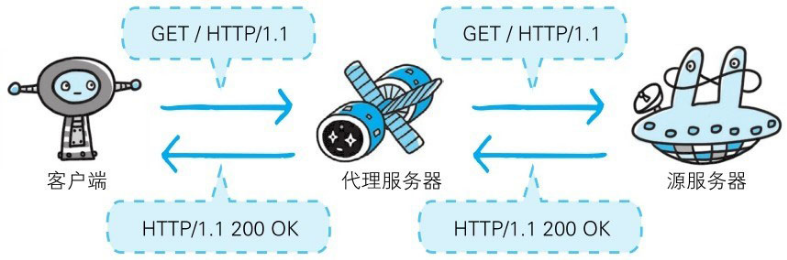
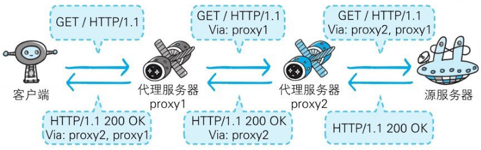
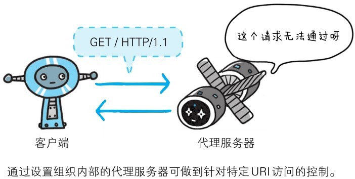

 #读书笔记/图解HTTP 

代理是一种有转发功能的应用程序，它扮演了位于服务器和客户端“中间人”的角色，接收由客户端发送的请求并转发给服务器，同时也接收服务器返回的响应并转发给客户端。

代理服务器的基本行为就是接收客户端发送的请求后转发给其他服务器。代理不改变请求URI，会直接发送给前方持有资源的目标服务器。

持有资源实体的服务器被称为源服务器。从源服务器返回的响应经过代理服务器后再传给客户端。

每次通过代理服务器转发请求或响应时，会追加写入Via首部信息

在HTTP通信过程中，可级联多台代理服务器。请求和响应的转发会经过数台类似锁链一样连接起来的代理服务器。转发时，需要附加Via首部字段以标记出经过的主机信息。

使用代理服务器的理由有：利用缓存技术（稍后讲解）减少网络带宽的流量，组织内部针对特定网站的访问控制，以获取访问日志为主要目的，等等。代理有多种使用方法，按两种基准分类。一种是是否使用缓存，另一种是是否会修改报文。

### 缓存代理

代理转发响应时，缓存代理（Caching Proxy）会预先将资源的副本（缓存）保存在代理服务器上。

当代理再次接收到对相同资源的请求时，就可以不从源服务器那里获取资源，而是将之前缓存的资源作为响应返回。

### 透明代理

转发请求或响应时，不对报文做任何加工的代理类型被称为透明代理（Transparent Proxy）。反之，对报文内容进行加工的代理被称为非透明代理。

