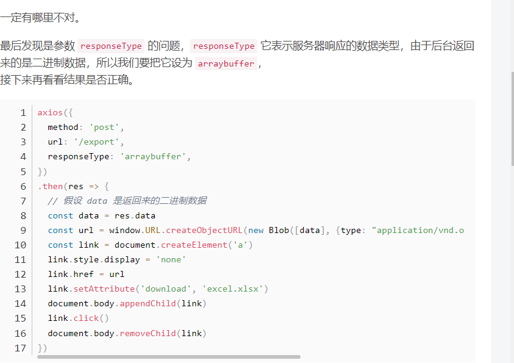

# 下载二进制文件

> [参考链接](https://blog.csdn.net/q411020382/article/details/97625532)



```javascript
// blobData 后台返回的文件流二进制数据
// fileName 自定义文件名称
// suffixName 文件后缀名
// fileType 文件后缀名对应的type值
function exportFile(blobData, fileName, suffixName, fileType) {
    let blob = new Blob([blobData], { type: fileType })
    let downloadElement = document.createElement('a')
    let href = window.URL.createObjectURL(blob) // 创建下载的链接
    downloadElement.href = href
    downloadElement.download =  fileName+ suffixName // 下载后文件名
    document.body.appendChild(downloadElement)
    downloadElement.click() // 点击下载
    document.body.removeChild(downloadElement) // 下载完成移除元素
}
//示例：
exportFile(blobData, '订单明细', '.xls', 'application/vnd.ms-excel');

```
