## 前言

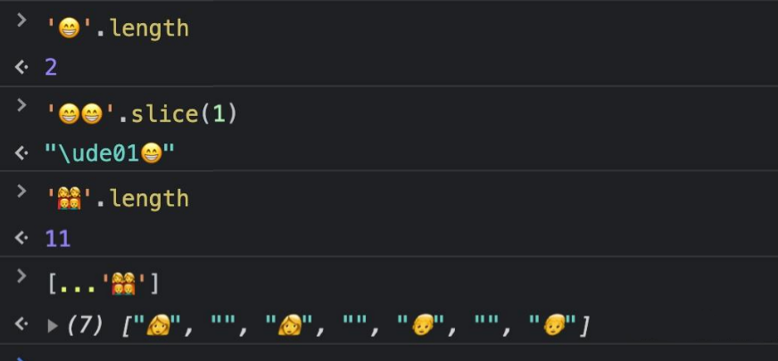

[📜Emoji: 一段历史 | EmojiAll](https://www.emojiall.com/zh-hans/blog/340)

## 需要消化的知识点

### 统一码 Unicode

统一码 Unicode，又译作万国码、统一字元码、统一字符编码，是一种国际标准，由非营利机构 Unicode 联盟（Unicode Consortium）负责维护。目标是把全世界的字符用数字编号编起来。（unicode给每个字符分配了一个独一无二的编号。）在7.0版中，一共收入了109449个符号。

它整理、编码了世界上大部分的文字系统，使得电脑能以通用划一的字符集来处理和显示文字，不但减轻在不同编码系统间切换和转换的困扰，更提供了一种跨平台的乱码问题解决方案。

### 码位 Code point

码位 Code point 是字符集（例如 Unicode）中用于表示抽象字符的数值。通俗点讲，不同的字符集，有自己的一张“字典表”，码位就是表示某个字符在这张“字典表”中的“坐标”，在 JavaScript 中一般会用十六进制去表示。

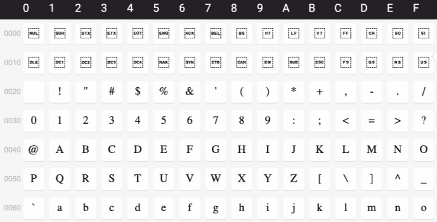

> 编号为U+0041的字符为大写字母A;编号为U+004F的字符为大写字母O

### 码元 Code unit

码元 Code unit，字符编码系统（例如 UTF-8 或 UTF-16）的最小单位。一个 Unicode 码位需要由一个或者多个码元去表示。

在 UTF-16（JavaScript 字符串使用的字符编码系统）中，一个码元是 16 位。索引到字符串，或者获取字符串长度这些操作，都是在码元的基础上进行的。所以有可能会出现一个特殊字符长度不是 1：

```js
const str = "\u006E\u0303"; // \u006E 和 \u0303 即两个码元
console.log(str); // 'ñ'
console.log(str.length); // 2
```

此外，由于并非 Unicode 定义的所有码位都适合 16 位，因此很多 Unicode 码位都编码为一对 UTF-16 码元，称为代理对：

```js
const face = "😂";
console.log(face.length); // 2
```

### 几种编码格式

我们经常会听到"UTF-8", "UTF-16"这些编码格式。其中UTF 的全称为 Unicode/UCS Transformation Format，即Unicode字符转换为某种格式之意。（划重点：unicode只是给字符分配了一个编号，UTF-16、UTF-8解决了如何在计算机中存储、表示这些字符或者说编号的问题）

**UTF-8**

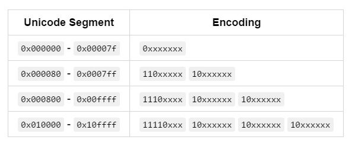

UTF-8 的编码规则很简单：如果只有一个字节，那么最高的比特位为 0；如果有多个字节，那么第一
个字节从最高位开始，连续有几个比特位的值为 1，就使用几个字节编码，剩下的字节均以 10 开头。

具体的表现形式为：
0xxxxxxx：单字节编码形式，这和 ASCII 编码完全一样，因此 UTF-8 是兼容 ASCII 的；
110xxxxx 10xxxxxx：双字节编码形式；
1110xxxx 10xxxxxx 10xxxxxx：三字节编码形式；
11110xxx 10xxxxxx 10xxxxxx 10xxxxxx：四字节编码形式。

**UTF-16**

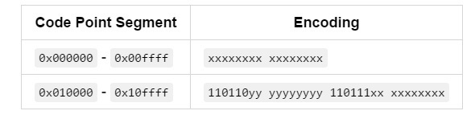
UFT-16 比较奇葩，它使用 2 个或者 4 个字节来存储。

把两个字节长的比特位为一组，称作**码元**。那么每个码元有16个比特位，总共可以表示2^16种字符。

对于 Unicode 编号范围在 0 ~ FFFF 之间的字符，UTF-16 使用两个字节存储，并且直接存储 Unicode 编号，不用进行编码转换，这跟 UTF-32 非常类似。

那么对于编号大于 FFFF 的字符怎么办？

这时utf-16会用两个码元来表示。表示一个字符的两个码元叫做**代理对**（Surrogate Pair）。

那么我在解析的时候，怎么知道某个码元自己代表一个字符，还是跟相邻的另一个码元一起来表示一个字符呢？

这里另外一个小知识是，unicode编码的 D800~0xDFFF , 是不映射任何字符的。所以当解析到一个码元位于D800-DBFF之间时，就知道需要和后边的一个码元一起解析。

例如，对于UTF-16编码出来的以下数据：

`\u0041\ud842\udfb7`

+ 0x0041小于0xD800，所以它单独表示一个字符，查找unicode字符对照表可以查出表示大写字母： A
+ \ud842介于D800-DBFF，需要和后边的码元一起解析。'\ud842\udfb7'一起解析出'𠮷'字，这是一个古汉语，跟'吉'是同一个意思。

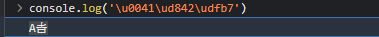

**UTF-32**

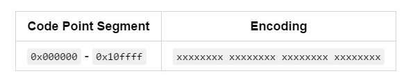

UTF-32 是固定长度的编码，始终占用 4 个字节，足以容纳所有的 Unicode 字符，所以直接存储 Unicode 编号即可，不需要任何编码转换。浪费了空间，提高了效率。

## 前端使用 emoji 的一些技巧

### 直接输入 emoji

不管在 HTML 中还是在 JavaScript 中，emoji 都可以像普通字符那样直接键盘输入的，你可以当它们为特殊的文字。

```html
<!-- 在 HTML 中直接使用 -->
<span>😂😴🥰</span>
```

```js
// 在 JS 中直接使用
const str = '😂😴🥰'
console.log(str) // '😂😴🥰'
```

你可以在这里找到 eomji 表情，直接复制粘贴。

[Emoji大全 | Emoji表情符号词典 📓 | EmojiAll中文官方网站](https://www.emojiall.com/zh-hans)

### HTML 中通过 「HTML 实体」使用 emoji

单说 HTML 实体（HTML Entities），可能小伙伴们会比较陌生，但是在初学 HTML 的时候，你一定学过怎么在 HTML 中输入符号 `<`，对没错，可以这么输入：`<span>&lt;</span>`。其中 &lt; 就是一个 HTML 实体，也可以称作 HTML 字符实体（转义字符串）。

HTML 实体常常用于显示保留字符（这些字符会被解析为 HTML 代码）和不可见的字符（如“不换行空格”），也可以用实体来代替其他难以用标准键盘键入的字符。

一个 HTML 实体，可以有两种转义格式：实体名称（entity name）、实体编号（entity numbers）。`&lt; `使用的是实体名称，可以改写成实体编号的形式：`&#60;` 或 `&#x3C;`，编号可以是十进制也可以是十六进制。

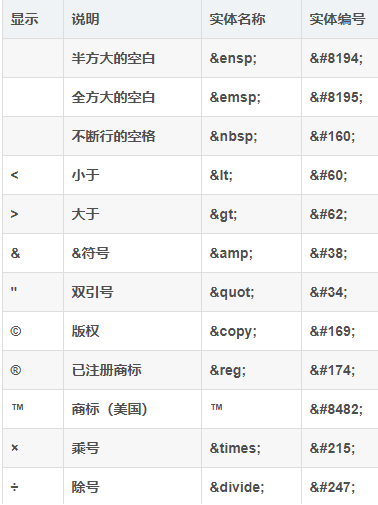

可以使用 HTML 实体解码工具查看各种字符的 HTML 实体。[HTML entity encoder/decoder](https://mothereff.in/html-entities)

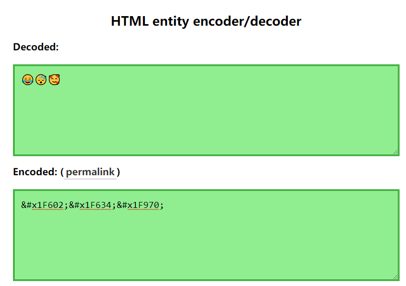


### 通过「零宽连字」连接多个 emoji 表情

零宽连字 ZWJ（Zero-width joiner）的 Unicode 码位是 U+200D，主要用于一些复杂排版语言（阿拉伯语、印地语）的两个字符之间，可以使这两个本不会发生连字的字符产生了连字效果。

它可以用在 emoji 表情之间，让 emoji 表情连在一起，比如：

```js
const zwj = '\u200D';
const family1 = [
  '👨', // 男人
  '👩', // 女人
  '👦' // 男孩
]
console.log(family1.join(zwj)) // '👨‍👩‍👦'

const family2 = [
  '👨', // 男人
  '👩', // 女人
  '👦' // 女孩
]
console.log(family2.join(zwj)) // '👨‍👩‍👦'
```

「男人+女人+孩子」，三个 eomji 图标变成了一个「家庭」的 emoji 图标。

实际上加几个人都没关系，其他非人物类型的的 emoji 也可以随意连接，只不过不一定有“连字”效果：

```js
const zwj = '\u200D';
const family1 = ['👨', '👨', '👦']
// 可以两个爸爸......
console.log(family1.join(zwj)) // '👨‍👨‍👦'

const family2 = ['👩', '👩', '👧' ]
// 也可以两个妈妈......
console.log(family2.join(zwj)) // '👩‍👩‍👦'

const family3 = ['👨', '👩', '👦', '👧']
// 两个孩子
console.log(family3.join(zwj)) // '👨‍👩‍👦‍👧'

const family4 = ['👴', '👵', '👨', '👩', '👦', '👧']
// 三世同堂
console.log(family4.join(zwj)) // '👴‍👵‍👨‍👩‍👦‍👧'

const family5 = ['👩', '👩', '👧', '👧']
// 神奇的家庭组合：两个妈妈和两个女儿
console.log(family5.join(zwj)) // '👩‍👩‍👧‍👧'

const other = ['😂', '🥰', '😘', '😀']
console.log(other.join(zwj)) // '😂‍🥰‍😘‍😀'
```

还有一些特定的 emoji 之间会有“连字”效果，比如：

```js
const zwj = '\u200D';
// 白旗 彩虹
const demo1 = ['🏳️', '🌈']
// 彩虹旗
console.log(demo1.join(zwj)) // '🏳️‍🌈'

// 男人 学士帽
const demo2 = ['👨', '🎓']
// 男学生
console.log(demo2.join(zwj)) // '👨‍🎓'

// 男人 电脑
const demo3 = ['👨', '💻']
// 技术人员
console.log(demo3.join(zwj)) // '👨‍💻'
```

### 键帽 emoji

除了通过「零宽连字」进行连接产出新的 emoji，还可以用 0-9*# 拼上键帽修饰符的代理对： '\ufe0f\u20e3'，会产出一组键帽 emoji：

```js
const res = [0, 1, 2, 3, 4, 5, 7, 8, 9, '*', '#'].map(
  num => num + '\ufe0f\u20e3'
)
console.log(res) // ['0️⃣', '1️⃣', '2️⃣', '3️⃣', '4️⃣', '5️⃣', '7️⃣', '8️⃣', '9️⃣', '*️⃣', '#️⃣']
```

### 通过菲茨帕特里克修饰符修改人物肤色

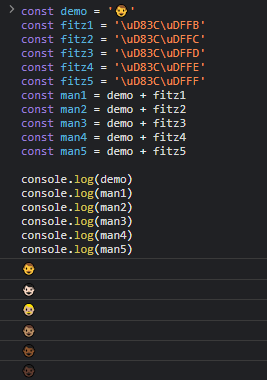

菲茨帕特里克修饰符的五个肤色分类 -1-2、-3、-4、-5和-6，分别对应了代理对：

+ `\uD83C\uDFFB`
+ `\uD83C\uDFFC`
+ `\uD83C\uDFFD`
+ `\uD83C\uDFFE`
+ `\uD83C\uDFFF`

在 JavaScript 中只需要通过字符串连接就可以实现肤色改变：

```js
const demo1 = '👨'
const fitz6 = '\uD83C\uDFFF'
const blackMan = demo1 + fitz6
// 黑人
console.log(blackMan) // '👨🏿'

const fitz12 = '\uD83C\uDFFB'
// 已经有肤色修饰符的 emoji 不可以再追加更改
console.log(blackMan + fitz12) // '👨🏿🏻'

const fitzPattern =
  /\uD83C\uDFFB|\uD83C\uDFFC|\uD83C\uDFFD|\uD83C\uDFFE|\uD83C\uDFFF/
// 修改有肤色的 emoji 前，须先剔除原本的修饰符
console.log(blackMan.replace(fitzPattern, '') + fitz12) // 👨🏻
```


### emoji 的长度问题

JavaScript 中字符串的 length 只读属性，返回的是字符串中的码元的长度（以 UTF-16 编码表示）。
如果直接用 length 去获取 emoji 的长度，会有什么问题？请看示例：

```js
console.log('😂'.length) // 2
console.log('👨🏿'.length) // 4
console.log('👩‍👩‍👧‍👧'.length) // 11
console.log('👴‍👵‍👨‍👩‍👦‍👧'.length) // 17
```

出现这种情况，是因为基础的 emoji 是两个码元长度，还有不少 emoji 是拼接而成的。可以通过展开运算符查看是否拼接：

```js
console.log([...'😂']) // ['😂']
console.log([...'👨🏿']) // ['👨', '🏿']
console.log([...'👩‍👩‍👧‍👧']) // ['👩', '‍', '👩', '‍', '👧', '‍', '👧']
console.log([...'👴‍👵‍👨‍👩‍👦‍👧']) // ['👴', '‍', '👵', '‍', '👨', '‍', '👩', '‍', '👦', '‍', '👧']
```

所以对于基础的 emoji，可以通过展开运算符查看真实的长度：

```js
console.log([...'😂'].length) // 1
```

但是对于拼接的 emoji，就不太好弄了：

```js
console.log([...'👨🏿'].length) // 2
console.log([...'👩‍👩‍👧‍👧'].length) // 7
console.log([...'👴‍👵‍👨‍👩‍👦‍👧'].length) // 11
```

如果一串字符串中含有 emoji，就是想要拿到直觉上的真实的长度，只能先把 emoji 替换成其他单个普通字符，然后再计算长度。

```js
const emojiPattern =
  /(?:[\u2700-\u27bf]|(?:\ud83c[\udde6-\uddff]){2}|[\ud800-\udbff][\udc00-\udfff])[\ufe0e\ufe0f]?(?:[\u0300-\u036f\ufe20-\ufe23\u20d0-\u20f0]|\ud83c[\udffb-\udfff])?(?:\u200d(?:[^\ud800-\udfff]|(?:\ud83c[\udde6-\uddff]){2}|[\ud800-\udbff][\udc00-\udfff])[\ufe0e\ufe0f]?(?:[\u0300-\u036f\ufe20-\ufe23\u20d0-\u20f0]|\ud83c[\udffb-\udfff])?)*/g

const sentence = '你好👋，我一家有六口人👴‍👵‍👨‍👩‍👦‍👧，我经常沉迷工作👨‍💻无法自拔'
const result = sentence.replace(
  emojiPattern,
  match => `a`
)

console.log(result.length) // 25
```

## 微信密文

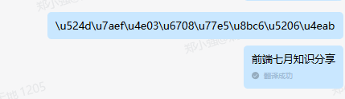

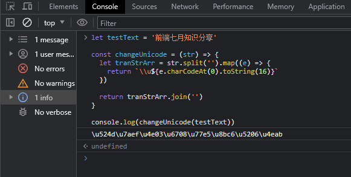

```js
let testText = '前端七月知识分享'

const changeUnicode = (str) => {
  let tranStrArr = str.split('').map((e) => {
    return `\\u${e.charCodeAt(0).toString(16)}`
  })

  return tranStrArr.join('')
}

console.log(changeUnicode(testText))
```