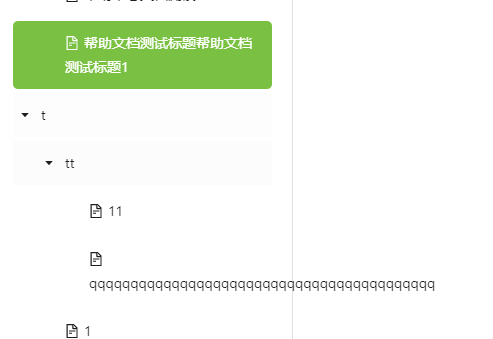
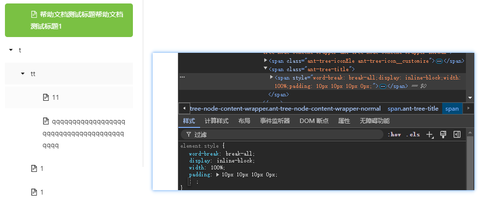

### 探索中文和英文换行的奥秘：为什么英文单词总是超出容器边界？

在前端开发中，我们经常会遇到一个有趣的问题：当中文文本在网页中自然换行时，英文单词却往往不那么合作，总是超出容器的边界。这种现象背后的原理是什么？如何解决它？本文将为你解答这些疑问。



先说答案



#### 一、中文与英文换行的差异

1. **中文字符的换行**：  
   中文字符通常是连续的，没有明确的分隔符（如空格或标点）来划分单词或短语。浏览器在处理中文文本时，会将其视为一个可以随意断开的字符串。当中文文本达到容器的边界时，浏览器会自动将其换行。

2. **英文单词的换行**：  
   英文单词之间通常使用空格分隔，浏览器在渲染英文文本时，会尽量保持单词的完整性。在没有适当的换行机会（例如空格）时，长单词可能会直接超出容器边界，而不会自动换行。

这种现象让混合文本的排版变得复杂，因为你可能会发现中文与英文在同一段落中处理方式截然不同。

#### 二、如何解决英文单词不换行的问题

为了让英文单词在容器边界处也能进行换行，可以采用以下几种方法：

1. **使用 `word-break: break-all;` 强制换行**
   ```css
   p {
     word-break: break-all;
   }
   ```
   **效果**：浏览器会在任何位置对英文单词进行强制换行。这意味着，即使是在单词中间，也会断开换行，从而防止文本超出容器的边界。

2. **使用 `overflow-wrap: break-word;` 或 `word-wrap: break-word;` 智能换行**
   ```css
   p {
     overflow-wrap: break-word;
     /* 或者使用 word-wrap: break-word; */
   }
   ```
   **效果**：这些属性会在合适的位置（例如单词边界）进行换行，而不是在单词中间。这种方式比 `break-all` 更加自然，不会破坏英文单词的完整性。

3. **使用 `white-space: pre-wrap;` 处理混合文本**
   ```css
   p {
     white-space: pre-wrap;
   }
   ```
   **效果**：此属性不仅保留文本中的所有空白符（例如换行符），还允许自动换行。适用于包含大量空格、换行符或需要保留用户输入格式的文本。

4. **调整容器宽度**
   如果页面布局允许，适当增加容器宽度以容纳长英文单词，或者使用响应式设计让文本内容自适应不同设备的屏幕宽度。

#### 三、实战示例

通过以下示例代码，我们可以看到不同换行方式的具体表现：

```html
<!DOCTYPE html>
<html lang="en">
<head>
<meta charset="UTF-8">
<meta name="viewport" content="width=device-width, initial-scale=1.0">
<title>Text Wrap Example</title>
<style>
  .text {
    width: 200px;
    border: 1px solid black;
    word-break: break-all;
    /* overflow-wrap: break-word; 可以替换上面的 word-break */
  }
</style>
</head>
<body>

<div class="text">
  这是一段包含中文和verylongwordthatiswaytoolongtotfit单词的文本，用来测试换行效果。
</div>

</body>
</html>
```

在这个示例中，文本容器宽度被限制为 200px。通过 `word-break: break-all;` 属性，长英文单词将在边界处被强制换行，从而避免了超出容器的情况。

#### 四、总结

- **中文换行**：由于没有空格，浏览器会自动在字符边界处换行。
- **英文不换行**：浏览器默认会保留单词的完整性，除非在单词边界处有合适的换行机会（例如空格）。
- **解决方案**：通过 `word-break: break-all;` 强制换行，或者使用 `overflow-wrap: break-word;` 进行智能换行，以保证英文单词不会超出容器边界。

理解和解决文本换行问题，不仅能提升页面的视觉美观度，还能优化用户体验。通过合理的 CSS 设置，你可以轻松应对中文与英文文本的混排问题，打造更优质的网页布局。
