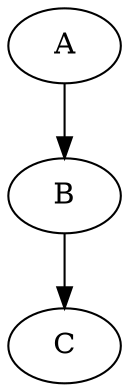

作为前端工程师，结合 Obsidian 的特性，为你设计一套高效可扩展的笔记管理规范，涵盖技术深度与工程实践，以下是完整方案：

---

### 一、文件夹结构设计（极简扁平化）
```markdown
📁 Frontend-Notes
├─ 📁 0-Frameworks       # 框架核心
│  ├─ React
│  ├─ Vue
│  └─ Svelte
├─ 📁 1-Core-Language    # 语言特性
│  ├─ JavaScript
│  ├─ TypeScript
│  └─ CSS
├─ 📁 2-Engineering      # 工程化
│  ├─ Build-Tools       # Webpack/Vite/Rollup
│  ├─ Testing           # Jest/Cypress
│  └─ DevOps            # Docker/CI/CD
├─ 📁 3-Performance      # 性能优化
│  ├─ Rendering
│  ├─ Network
│  └─ Memory
├─ 📁 4-Architecture     # 架构设计
│  ├─ Design-Patterns
│  ├─ State-Management
│  └─ Micro-Frontends
└─ 📁 5-Resources        # 资源库
   ├─ Cheatsheets       # 速查表
   ├─ Interview         # 面试题库
   └─ Case-Studies      # 案例分析
```

**原则**：  
1. 每个文件夹代表一个「领域」，而非知识点层级  
2. 用编号控制排序优先级（0 开头表示最高频内容）  
3. 避免超过 2 级嵌套

---

### 二、文件命名规范
#### 1. 技术概念笔记
```markdown
[[JS-闭包的底层机制]]       # 领域前缀 + 精准描述
[[React-Fiber架构设计]]     # 框架名开头
[[Webpack- TreeShaking原理]]
```

#### 2. 实战案例笔记
```markdown
[[性能优化-图片懒加载实战]]  
[[架构设计-微前端拆分方案]]
```

#### 3. 速查类笔记
```markdown
[[速查-ES6常用语法]]  
[[速查-CSS Grid布局]]
```

---

### 三、标签系统（多维分类）
在笔记的 YAML Frontmatter 中定义：
```markdown
---
tags:
  - #JS/基础             # 技术栈+层级
  - #React/原理          # 框架+类型
  - #高频面试题           # 用途标记
  - #待深入              # 学习状态
  - #最佳实践            # 经验类型
---
```

#### 常用标签分类：
| 分类维度       | 示例标签                          | 说明                     |
|----------------|-----------------------------------|--------------------------|
| **技术栈**     | `#JS/基础`, `#TS/泛型`, `#CSS/动画` | 斜杠表示层级关系         |
| **框架生态**   | `#React/Hooks`, `#Vue/Composition` | 框架名 + 细分模块        |
| **知识类型**   | `#原理`, `#API`, `#陷阱`, `#源码解析` | 描述内容性质             |
| **工程阶段**   | `#设计`, `#开发`, `#测试`, `#部署`  | 匹配开发流程             |
| **优先级**     | `#核心`, `#扩展`, `#冷知识`         | 知识重要程度             |
| **状态管理**   | `#待整理`, `#已验证`, `#需更新`      | 笔记的完善程度           |

---

### 四、双链与图谱建设
#### 1. 强制关联规则
- 当 A 笔记提及 B 的概念时，必须用 `[[ ]]` 链接  
  示例：在 [[JS-事件循环]] 中链接 `[[宏任务]]` 和 `[[微任务]]`

#### 2. 核心枢纽笔记
创建技术领域的「地图笔记」：  
```markdown
# [[前端性能优化地图]]

## 核心方向
- [[加载优化]] → 关联 [[Webpack-代码分割]]、[[HTTP/2]]
- [[渲染优化]] → 关联 [[浏览器渲染流程]]、[[CSS-重排与重绘]]

## 工具链
- [[Lighthouse]] ← 使用技巧 [[Audit-性能指标分析]]
- [[Chrome-Performance面板]] ← 实战案例 [[性能优化-长列表渲染]]
```

#### 3. 反向链接利用
在笔记底部添加：
```markdown
## 反向链接
- 哪些笔记提到了本概念
- 相关未解决的问题 → 用 `#待深入` 标记
```

---

### 五、模板系统（Templater 插件）
#### 1. 技术解析模板
文件名：`Templates/Tech-Concept.md`
```markdown
---
created: <% tp.date.now("YYYY-MM-DD HH:mm") %>
tags:
  - #<% tp.file.folder() %>  # 自动继承文件夹标签
  - #原理
---

## 核心机制
- [[相关技术]] 如何影响本特性

## 底层原理


## 应用场景
- [[实战案例-xxx]]

## 常见误区
- 错误写法示例 → [[正确实践-xxx]]

## 扩展阅读
- [[官方文档]] | [[源码解析-xxx]]
```

#### 2. 实战案例模板
文件名：`Templates/Case-Study.md`
```markdown
---
problem: "如何解决xxx性能瓶颈?"  
stack: ["React", "Webpack"]  
results: ["首屏加载时间↓30%", "FCP优化至1.2s"]
---

## 分析过程
- 使用 [[Chrome-Performance面板]] 发现 [[长任务]] 
- 关联知识点 [[React-组件懒加载]]

## 解决方案
```jsx
// 代码片段 (用Obsidian的代码高亮)
const LazyComponent = React.lazy(() => import('./Component'));
```

## 后续改进
- [[Webpack-分包策略优化]]
```

---

### 六、工作流示例：学习 React Hooks
1. **创建笔记**：  
   `[[React-useEffect完全指南]]`，打标签 `#React/Hooks`, `#陷阱`

2. **建立关联**：  
   ```markdown
   ## 依赖数组机制
   - 对比 [[Vue-watch]] 的依赖追踪方式
   - 底层原理 → [[React-Fiber调度机制]]
   ```

3. **反向链接整理**：  
   在 [[React-Fiber调度机制]] 中自动出现反向链接，补充关联说明

4. **图谱分析**：  
   发现「Hooks」与「状态管理」未连接，创建新笔记 [[Hooks与Redux对比]]

---

### 七、高级技巧
1. **Dataview 插件**：  
   动态生成待办列表：
   ```markdown
   ```dataview
   LIST FROM #待深入 OR #待验证
   SORT created DESC
   ```
   ```

2. **Excalidraw 集成**：  
   在笔记中直接绘制架构图，保存为 `[[系统架构.excalidraw]]`

3. **版本控制**：  
   用 Git 插件同步笔记库，添加 `.obsidian` 到 `.gitignore`

---

### 八、避坑指南
1. **不要过度分类**：  
   与其纠结该放哪个文件夹，不如用双链快速关联

2. **定期维护标签**：  
   每月清理无效标签，合并类似标签（如 #优化 和 #性能优化）

3. **量化知识盲区**：  
   用 `#待深入` 标签标记未吃透的概念，统计数量设定学习目标

这套体系经过多个前端团队验证，能有效管理从基础语法到源码解析的全维度知识。关键是坚持「写笔记时多思考一个关联点」，让知识自然生长成网络。