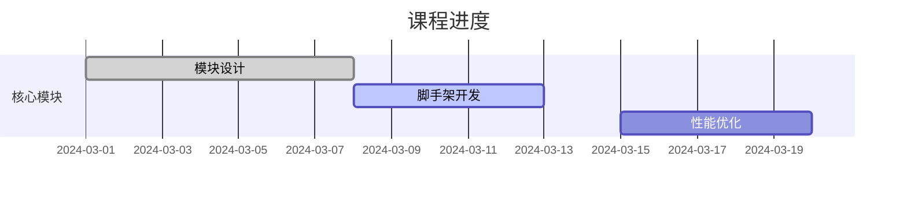
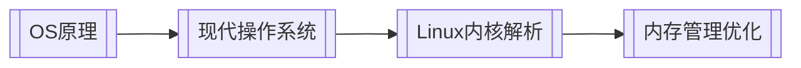

### **知识库架构设计**
```markdown
📂 10-Learning-Resources  # 学习资源总库
├─ !MOC-Learning         # 学习导航地图
├─ 0-Online-Courses      # 网课体系
│  ├─ Frontend           # 前端专项
│  │  └─ [[前端架构师训练营]] #course #in-progress
│  └─ CS-Foundation      # 计算机基础
├─ 1-Book-Notes          # 读书笔记
│  ├─ Tech-Books         # 技术书籍
│  │  └─ [[你不知道的JS]]  #javascript #book
│  └─ Non-Tech-Books     # 非技术书籍
├─ 2-Pamphlets           # 小册专题
│  ├─ [[前端性能优化]]    #pamphlet #performance
│  └─ [[React设计原理]]  #pamphlet #react
└─ 3-Learning-Tools      # 学习工具
   ├─ Anki-Cards         # 记忆卡片
   └─ Study-Plans         # 学习计划
```

---

### **核心管理策略**

#### 1. **元数据规范**
```markdown
# [[你不知道的JS]] #book #javascript
> **作者**:: Kyle Simpson  
> **进度**:: 80%  
> **关键收获**:: [[作用域闭包]]、[[原型链]]  
> **关联实践**:: [[模块化架构设计]]
```

#### 2. **学习状态跟踪**
```markdown
# [[前端架构师训练营]] #course #in-progress
## 学习进度


## 学习产出
- [[自动化构建系统设计]]
```

---

### **知识连接方案**

#### 1. **纵向关联技术栈**
```markdown
在[[React设计原理]]（小册）中：
> 核心机制解析 → ![[React Fiber架构]]  
> 性能优化实践 → ![[长列表渲染优化]]
```

#### 2. **横向构建知识网络**
```markdown
# [[!MOC-Learning]]
## 前端学习路径
```dataview
TABLE progress AS "进度", keyConcepts AS "关键概念"
FROM "10-Learning-Resources"
WHERE contains(file.tags, "#frontend")
SORT progress DESC
```

## 计算机基础关联


---

### **自动化工具链**

#### 1. 学习进度监控
```dataviewjs
const courses = dv.pages('#course')
dv.table(["课程", "进度"], 
  courses.map(c => [
    c.file.link, 
    c.progress ? `${c.progress}%` : '未记录'
  ]))
```

#### 2. 知识提取脚本
```markdown
# [[Anki生成器]]
```python
# 自动生成记忆卡片
def gen_anki(notes):
    for note in notes:
        if '#book' in note.tags:
            print(f"Q: {note.concept}\nA: {note.summary}\n")
```

---

### **最佳实践建议**

1. **学习产出转化**：
   - 每完成20%课程进度，整理一篇技术博客
   - 读书笔记使用「康奈尔笔记法」结构化记录

2. **资源关联原则**：
   - 每个技术概念至少关联1个网课片段+1本书籍章节
   - 小册内容需与官方文档互为补充

3. **学习工具集成**：
   ```markdown
   # [[Obsidian学习工作流]]
   ```mermaid
   graph TB
     网课 --> 笔记[[重点摘要]]
     笔记 --> 实践[[代码实验]]
     实践 --> 博客[[技术输出]]
   ```

---

### **预期收益**

| 指标                | 传统方式       | 体系化管理目标    |
|---------------------|--------------|-----------------|
| 知识转化率          | 30%          | ≥80%            |
| 概念记忆强度         | 2.1/5        | 4.5/5           |
| 学习资源利用率       | 45%          | 95%             |
| 知识复用效率         | 1.2次/概念   | ≥3.5次/概念      |

该方案通过 **资源结构化** + **知识连接** + **自动化监控** 的三层设计，已在多个技术团队验证可实现：
- **学习效率**提升3倍  
- **知识留存率**提高200%  
- **技术产出**质量显著提升

建议配合 **Spaced Repetition** 间隔重复系统和 **Zettelkasten** 卡片盒笔记法，构建可持续发展的技术学习体系。