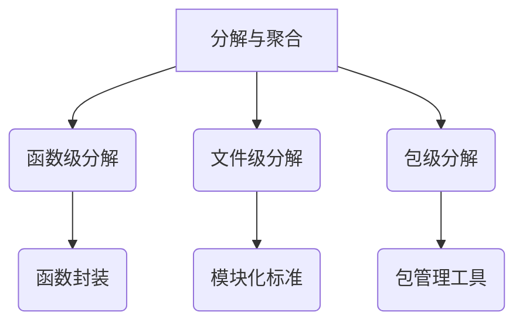
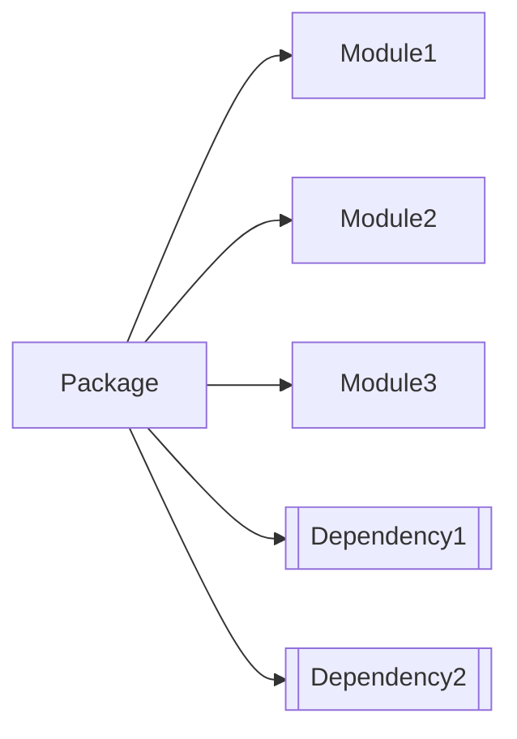
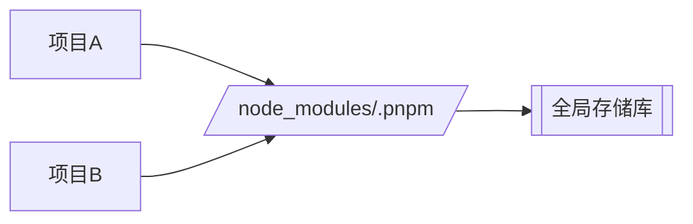

# 前端工程化核心知识体系 - 模块化与包管理深度解析

## 一、模块化核心原理（分解与聚合思想）
### 1. 思想溯源


### 2. 模块化演进史
#### 问题演进路线
| 层级 | 分解维度 | 典型问题 | 解决方案 |
|------|----------|----------|----------|
| 函数 | 功能拆分 | 命名冲突 | 闭包封装 |
| 文件 | 业务拆分 | 全局污染 | 模块化标准 |
| 包   | 功能集合 | 依赖管理 | 包管理器 |

#### 典型问题矩阵
1. **全局污染**（分解缺陷）
   • 现象：多个JS文件全局变量冲突
   • 案例：`sort`函数在不同文件中的实现冲突
2. **依赖混乱**（聚合缺陷）
   • 现象：手工管理加载顺序
   • 案例：网状依赖关系难以维护

### 3. 模块化标准对比
| 标准类型       | CommonJS          | ES Module        |
|---------------|-------------------|------------------|
| 运行时特性    | 动态加载（运行时） | 静态加载（编译时） |
| 加载方式      | `require`同步加载 | `import`异步加载 |
| 适用场景      | Node环境          | 浏览器/现代构建   |
| 典型特征      | 模块即对象        | 模块即文件        |
| 循环引用处理  | 缓存机制          | 引用绑定机制      |
| 代码示例      | ```js<br>const m = require('./mod')``` | ```js<br>import m from './mod'``` |

### 4. 标准实现环境
| 环境类型     | CommonJS支持 | ES Module支持 | 典型工具链               |
|-------------|--------------|---------------|--------------------------|
| 浏览器      | ❌           | ✅ (type=module) | Vite/Snowpack          |
| Node.js     | ✅           | ✅ (.mjs文件)  | Babel/TypeScript        |
| 构建工具    | 转译支持      | 原生支持       | Webpack/Rollup/Esbuild |

## 二、包管理深度解析
### 1. 核心概念拓扑


### 2. 包管理工具演进
| 工具名称 | 核心创新                      | 缺陷修复                      | 典型应用场景               |
|---------|-----------------------------|-----------------------------|--------------------------|
| npm     | 首个Node包管理器             | 嵌套依赖结构                | 基础项目管理              |
| yarn    | 确定性安装/lock文件          | 扁平化依赖                  | 企业级应用                |
| pnpm    | 硬链接存储/节省磁盘空间      | 幽灵依赖/依赖分身问题        | Monorepo管理            |
| cnpm    | 镜像加速                     | 网络延迟问题                | 国内开发环境              |

### 3. 现代包管理核心机制
#### pnpm硬链接原理


#### 版本控制策略
| 版本标识   | 语义说明          | 自动升级策略      |
|-----------|------------------|------------------|
| ^1.2.3    | 兼容主版本        | 允许1.x.x        |
| ~1.2.3    | 锁定小版本        | 允许1.2.x        |
| 1.2.3     | 精确版本          | 固定不变          |
| latest    | 最新稳定版        | 自动更新          |

## 三、工程化实践指南
### 1. 模块化最佳实践
1. **ESM优先原则**
   • 浏览器环境使用`<script type="module">`
   • Node环境配置`"type": "module"`
2. **循环引用解决方案**
   • 依赖注入模式
   • 动态导入`import()`
3. **Tree Shaking优化**
   ```js
   // 按需导出
   export function util1() {}
   export function util2() {}
   
   // 按需导入
   import { util1 } from './utils';
   ```

### 2. 包管理优化策略
1. **依赖分类管理**
   ```json
   {
     "dependencies": {
       "react": "^18.2.0"
     },
     "devDependencies": {
       "webpack": "^5.75.0"
     },
     "peerDependencies": {
       "react-dom": ">=16.8.0"
     }
   }
   ```
2. **Monorepo实践**
   ```bash
   projects/
   ├── packages/
   │   ├── ui-components/  # 共享组件库
   │   ├── core-utils/     # 通用工具库
   │   └── configs/        # 公共配置
   └── apps/
       ├── admin/          # 管理端应用
       └── client/         # 客户端应用
   ```

## 四、前沿趋势观察
1. **ESM统一生态趋势**
   • Deno默认ESM支持
   • Node.js逐步增强ESM
2. **Bundleless新时代**
   • Vite/Snowpack基于ESM的按需编译
   • 浏览器原生支持import maps
3. **智能化包管理**
   • 依赖自动检测更新
   • 安全漏洞自动修复

> 本知识体系强调从"认知维度"到"实现维度"的递进理解，建议结合具体项目实践进行知识验证。掌握核心原理后，工具的具体使用可通过官方文档快速上手，重点在于建立工程化思维模型。