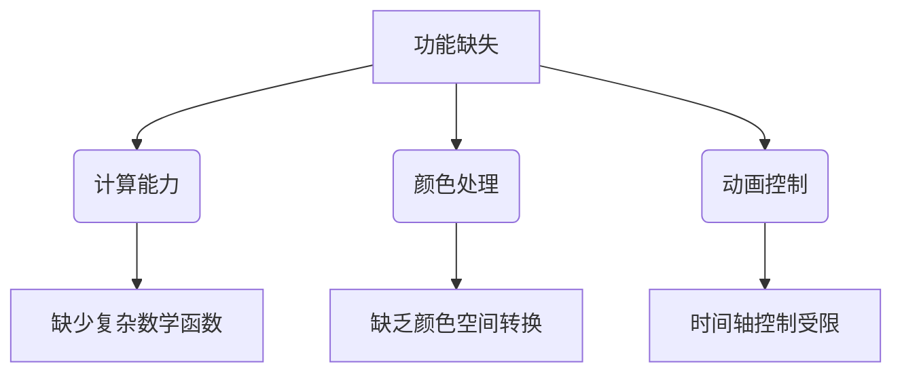
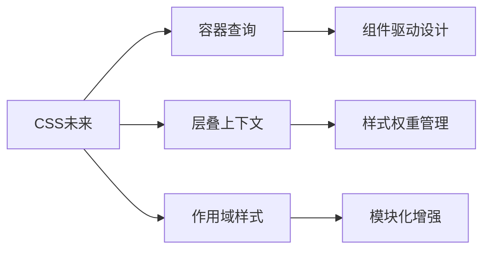

## 一、CSS语言的核心问题分析

### 1.1 语法体系缺陷
| 缺陷维度          | 具体表现                                                                 | 工程化影响                     |
|-------------------|--------------------------------------------------------------------------|------------------------------|
| **选择器系统**     | 缺乏动态选择器能力，无法实现条件渲染                                      | 复杂UI场景实现困难             |
| **变量系统**       | 原生CSS变量（CSS Custom Properties）存在兼容性和功能限制                  | 主题切换等场景维护成本高        |
| **逻辑控制**       | 不支持循环、条件判断等编程基础结构                                        | 动态样式生成依赖预处理器         |
| **嵌套规则**       | 原生不支持选择器嵌套（CSS Nesting Module草案阶段）                        | 代码组织困难                   |

### 1.2 功能体系缺陷


## 二、现代CSS工程化解决方案

### 2.1 预编译器体系
#### 2.1.1 Sass核心特性矩阵
```scss
// 变量系统
$primary-color: #1890ff;
$theme-colors: (
  primary: $primary-color,
  success: #52c41a
);

// 混合宏系统
@mixin center-flex {
  display: flex;
  justify-content: center;
  align-items: center;
}

// 嵌套规则
.navbar {
  @include center-flex;
  
  &-item {
    padding: 1rem;
    
    &:hover {
      background: darken($primary-color, 10%);
    }
  }
}

// 流程控制
@for $i from 1 through 3 {
  .col-#{$i} {
    width: percentage($i/12);
  }
}
```

#### 2.1.2 编译优化策略
```bash
# 生产环境编译命令
sass src/:dist/ \
  --style=compressed \
  --no-source-map \
  --embed-sources \
  --watch
```

### 2.2 后处理器体系
#### 2.2.1 PostCSS插件矩阵
| 插件类别          | 代表插件               | 功能描述                     |
|-------------------|-----------------------|----------------------------|
| 兼容性处理        | autoprefixer          | 自动添加厂商前缀            |
| 代码优化          | cssnano               | CSS代码压缩                 |
| 现代语法支持      | postcss-preset-env    | 支持CSS新特性               |
| 模块化方案        | postcss-modules       | CSS作用域隔离               |

#### 2.2.2 典型配置方案
```javascript
// postcss.config.js
module.exports = {
  plugins: [
    require('postcss-preset-env')({
      stage: 3,
      features: {
        'nesting-rules': true,
        'custom-media-queries': true
      }
    }),
    require('cssnano')({
      preset: 'advanced'
    })
  ]
}
```

## 三、原子化CSS范式实践

### 3.1 Tailwind CSS工程化配置
```javascript
// tailwind.config.js
module.exports = {
  content: [
    './src/**/*.{html,js,tsx}',
    './public/index.html'
  ],
  theme: {
    extend: {
      spacing: {
        '128': '32rem',
        '144': '36rem'
      },
      colors: {
        primary: {
          DEFAULT: '#0ea5e9',
          light: '#7dd3fc'
        }
      }
    }
  },
  plugins: [
    require('@tailwindcss/forms'),
    require('@tailwindcss/typography')
  ]
}
```

### 3.2 响应式布局案例
```html
<div class="
  container
  mx-auto
  px-4
  py-8
  grid
  grid-cols-1
  md:grid-cols-2
  lg:grid-cols-4
  gap-6
">
  <div class="
    bg-white
    rounded-lg
    shadow-md
    hover:shadow-xl
    transition-shadow
    duration-300
  ">
    <!-- Card Content -->
  </div>
</div>
```

## 四、工程化架构集成

### 4.1 Webpack完整配置示例
```javascript
// webpack.config.js
module.exports = {
  module: {
    rules: [
      {
        test: /\.scss$/,
        use: [
          'style-loader',
          {
            loader: 'css-loader',
            options: {
              modules: {
                localIdentName: '[name]__[local]--[hash:base64:5]'
              }
            }
          },
          {
            loader: 'postcss-loader',
            options: {
              postcssOptions: {
                plugins: [require('autoprefixer')]
              }
            }
          },
          'sass-loader'
        ]
      }
    ]
  }
}
```

### 4.2 Vite优化配置方案
```javascript
// vite.config.js
export default {
  css: {
    preprocessorOptions: {
      scss: {
        additionalData: `@import "@/styles/variables.scss";`
      }
    },
    postcss: {
      plugins: [
        require('postcss-preset-env')({
          stage: 3,
          features: { 'nesting-rules': true }
        })
      ]
    }
  }
}
```

## 五、企业级最佳实践

### 5.1 样式规范体系
```markdown
1. **命名规范**
   - BEM命名法 + Sass嵌套
   - 组件前缀制度（如`c-button`）

2. **变量管理**
   - 设计令牌分级（基础/语义/组件）
   - 类型化CSS变量系统

3. **响应式策略**
   - 移动优先断点设计
   - 容器查询渐进增强方案
```

### 5.2 性能监控指标
```javascript
// 性能检查报告示例
{
  "css": {
    "size": "145KB (gzip 32KB)",
    "unused": {
      "percentage": "12%",
      "selectors": 145
    },
    "specificity": {
      "avg": 1.2,
      "max": 3
    },
    "animations": {
      "count": 8,
      "composite": 92%
    }
  }
}
```

## 六、未来演进方向

### 6.1 CSS新特性路线图


### 6.2 构建工具革新
| 工具名称         | 核心优势                      | 适用场景               |
|------------------|-----------------------------|----------------------|
| Lightning CSS    | Rust编写，编译速度提升10倍    | 超大型项目构建         |
| ESBuild          | 毫秒级编译体验                | 开发环境热更新         |
| Parcel 3         | 零配置CSS模块化支持           | 快速原型开发           |
