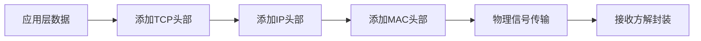

```text
一、网络分层模型
  ∟ 五层模型详解
  ∟ 模型对比分析
  ∟ 数据传输流程

二、URL核心解析
  ∟ 标准格式解剖
  ∟ 路径认知误区
  ∟ URI与URL辨析

三、HTTP协议精要
  ∟ 协议基础特性
  ∟ 请求报文剖析
  ∟ 响应报文解读
  ∟ 开发工具实践

四、高频面试题集
五、扩展学习资源
```

---

## 一、网络分层模型

### 1. 五层架构详解

|层级|🔑 核心功能|典型协议/地址|
|---|---|---|
|​**物理层**​|物理信号传输（电/光信号）|RS-232、RJ45|
|​**链路层**​|局域网设备寻址（MAC地址）|ARP、MAC地址|
|​**网络层**​|广域网路由寻址（IP地址）|IP、ICMP|
|​**传输层**​|端到端可靠传输|TCP、UDP|
|​**应用层**​|应用程序通信规范|HTTP、FTP、SMTP|

### 2. 模型对比矩阵


```diff
+------------------+------------------------------+-----------------------------+
|                  | OSI七层模型                   | TCP/IP四层模型              |
+------------------+------------------------------+-----------------------------+
| 应用处理         | 拆分为会话层/表示层/应用层     | 合并为应用层                |
| 网络接口         | 拆分为物理层/数据链路层         | 合并为网络接口层            |
| 典型应用         | 理论教学                      | 实际网络工程                |
+------------------+------------------------------+-----------------------------+
```

### 3. 数据传输可视化流程




---

## 二、URL深度解析

### 1. 标准格式分解


```url
https://www.example.com:443/api/data?category=tech#section2
```

| 组件     | 说明            | 默认值/规则              |
| ------ | ------------- | ------------------- |
| `协议`   | 通信协议规范        | http(80)/https(443) |
| `域名`   | 服务器地址标识       | 需DNS解析              |
| `路径`   | 资源逻辑定位（非物理路径） | /index.html         |
| `查询参数` | URL编码键值对      | ?name=张三&age=20     |
| `哈希`   | 前端锚点定位        | `#chapter1`         |

### 2. 路径认知误区


```javascript
// 后端路由示例（Express框架）
app.get('/virtual/path', (req, res) => {
  res.send('路径仅表示资源逻辑标识');
});
```

> 💡 关键提示：服务器路径映射完全由程序控制，与文件系统无必然关联

---

## 三、HTTP协议精要

### 1. 协议特性矩阵

|特性|说明|解决方案|
|---|---|---|
|无状态|请求间无记忆性|Cookie/Session|
|明文传输|HTTP默认不加密|HTTPS/TLS|
|持久连接|HTTP/1.1默认特性|Connection: keep-alive|

### 2. 请求报文解剖

​**报文结构示例：​**​


```http
POST /api/login HTTP/1.1
Host: api.example.com
Content-Type: application/json
Authorization: Bearer xyz123

{
  "username": "dev",
  "password": "securePass!"
}
```

#### 核心组件解析

1. ​**请求行**​
    
    - 方法：`POST`
    - 路径：`/api/login`
    - 协议版本：`HTTP/1.1`
2. ​**请求头**​
    
    
```http
    Content-Type: application/json  # 数据格式声明
    User-Agent: Mozilla/5.0          # 客户端标识
```
    
3. ​**请求体**​
    
    
    ```json
    {
      "username": "dev",
      "password": "securePass!"
    }
    ```
    

### 3. 响应报文模板


```http
HTTP/1.1 200 OK
Content-Type: application/json
Cache-Control: max-age=3600

{
  "status": "success",
  "data": {...}
}
```

#### 状态码速查表

|代码|类型|典型场景|
|---|---|---|
|200|✅ 成功|正常响应|
|301|🔀 永久重定向|域名迁移|
|404|❌ 客户端错误|资源不存在|
|500|💥 服务端错误|服务器内部异常|

## 四、🚀 高频面试题

1. ​**GET vs POST本质区别**​

```diff
    + GET :: 获取资源 | 参数在URL | 可缓存
    - POST :: 提交数据 | 参数在Body | 不缓存
```

    
2. ​**HTTPS加密原理**​
    
    
    ```markdown
    1. 非对称加密交换密钥
    2. 对称加密传输数据
    3. 数字证书验证身份
    ```
    

## 五、扩展资源库

```text
📚 推荐阅读：
- 《HTTP权威指南》- David Gourley
- 《计算机网络：自顶向下方法》- James Kurose

🌐 在线资源：
- MDN HTTP文档：https://developer.mozilla.org/zh-CN/docs/Web/HTTP
- RFC 7230规范：https://tools.ietf.org/html/rfc7230

​**明日预告**​：AJAX实战开发与Fetch API深度解析，请准备好VS Code环境！