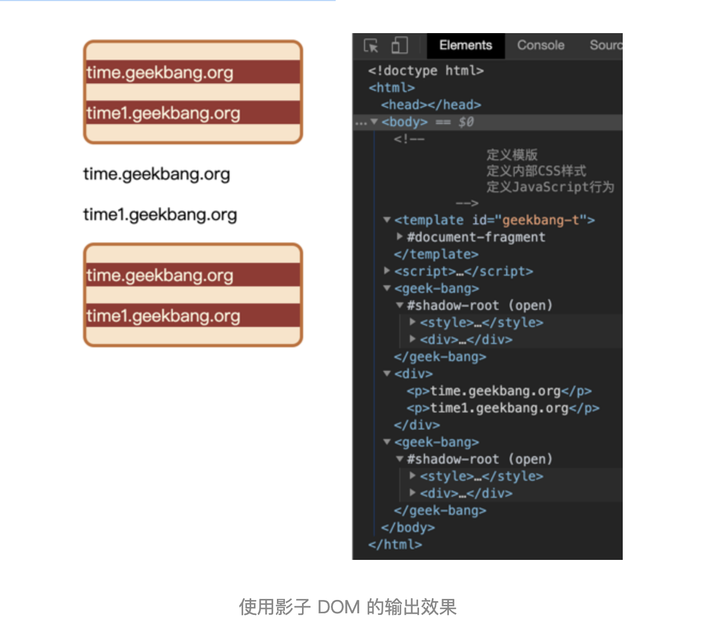
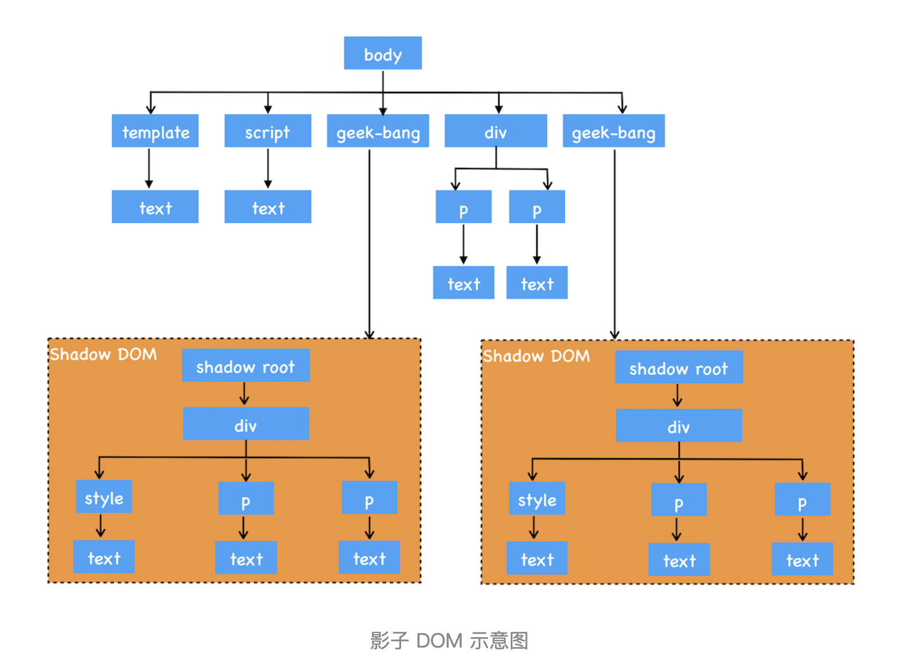

# webComponent：像搭积木一样构建web应用

什么是组件化呢？

其实组件化并没有一个明确的定义，不过这里我们可以使用 10 个字来形容什么是组件化，那就是：对内高内聚，对外低耦合。对内各个元素彼此紧密结合、相互依赖，对外和其他组件的联系最少且接口简单。

可以说，程序员对组件化开发有着天生的需求，因为一个稍微复杂点的项目，就涉及到多人协作开发的问题，每个人负责的组件需要尽可能独立完成自己的功能，其组件的内部状态不能影响到别人的组件，在需要和其他组件交互的地方得提前协商好接口。通过组件化可以降低整个系统的耦合度，同时也降低程序员之间沟通复杂度，让系统变得更加易于维护。

使用组件化能带来很多优势，所以很多语言天生就对组件化提供了很好的支持，比如 C/C++ 就可以很好地将功能封装成模块，无论是业务逻辑，还是基础功能，抑或是 UI，都能很好地将其组合在一起，实现组件内部的高度内聚、组件之间的低耦合。

大部分语言都能实现组件化，归根结底在于编程语言特性，大多数语言都有自己的函数级作用域、块级作用域和类，可以将内部的状态数据隐藏在作用域之下或者对象的内部，这样外部就无法访问了，然后通过约定好的接口和外部进行通信。

JavaScript 虽然有不少缺点，但是作为一门编程语言，它也能很好地实现组件化，毕竟有自己的函数级作用域和块级作用域，所以封装内部状态数据并提供接口给外部都是没有问题的。

既然 JavaScript 可以很好地实现组件化，那么我们所谈论的 WebComponent 到底又是什么呢？

## 阻碍前端组件化的因素

在前端虽然 HTML、CSS 和 JavaScript 是强大的开发语言，但是在大型项目中维护起来会比较困难，如果在页面中嵌入第三方内容时，还需要确保第三方的内容样式不会影响到当前内容，同样也要确保当前的 DOM 不会影响到第三方的内容。

所以要聊 WebComponent，得先看看 HTML 和 CSS 是如何阻碍前端组件化的，这里我们就通过下面这样一个简单的例子来分析下：


```
<style>
p {
      background-color: brown;
      color: cornsilk
   }
</style>
<p>time.geekbang.org</p>
```

```
<style>
p {
      background-color: red;
      color: blue
   }
<p>time.geekbang</p>
```

上面这两段代码分别实现了自己 p 标签的属性，如果两个人分别负责开发这两段代码的话，那么在测试阶段可能没有什么问题，不过当最终项目整合的时候，其中内部的 CSS 属性会影响到其他外部的 p 标签的，之所以会这样，是因为 CSS 是影响全局的。

我们在《23 | 渲染流水线：CSS 如何影响首次加载时的白屏时间？》这篇文章中分析过，渲染引擎会将所有的 CSS 内容解析为 CSSOM，在生成布局树的时候，会在 CSSOM 中为布局树中的元素查找样式，所以有两个相同标签最终所显示出来的效果是一样的，渲染引擎是不能为它们分别单独设置样式的。

除了 CSS 的全局属性会阻碍组件化，DOM 也是阻碍组件化的一个因素，因为在页面中只有一个 DOM，任何地方都可以直接读取和修改 DOM。所以使用 JavaScript 来实现组件化是没有问题的，但是 JavaScript 一旦遇上 CSS 和 DOM，那么就相当难办了

## WebComponent 组件化开发

现在我们了解了CSS 和 DOM 是阻碍组件化的两个因素，那要怎么解决呢？

WebComponent 给出了解决思路，它提供了对局部视图封装能力，可以让 DOM、CSSOM 和 JavaScript 运行在局部环境中，这样就使得局部的 CSS 和 DOM 不会影响到全局。

了解了这些，下面我们就结合具体代码来看看 WebComponent 是怎么实现组件化的。

前面我们说了，WebComponent 是一套技术的组合，具体涉及到了Custom elements（自定义元素）、Shadow DOM（影子 DOM）和HTML templates（HTML 模板），详细内容你可以参考 MDN 上的[相关链接](https://developer.mozilla.org/zh-CN/docs/Web/Web_Components)。

下面我们就来演示下这 3 个技术是怎么实现数据封装的，如下面代码所

下面我们就来演示下这 3 个技术是怎么实现数据封装的，如下面代码所示：


```html
<!DOCTYPE html>
<html>
 
 
<body>
    <!--
            一：定义模板
            二：定义内部 CSS 样式
            三：定义 JavaScript 行为
    -->
    <template id="geekbang-t">
        <style>
            p {
                background-color: brown;
                color: cornsilk
            }
 
 
            div {
                width: 200px;
                background-color: bisque;
                border: 3px solid chocolate;
                border-radius: 10px;
            }
        </style>
        <div>
            <p>time.geekbang.org</p>
            <p>time1.geekbang.org</p>
        </div>
        <script>
            function foo() {
                console.log('inner log')
            }
        </script>
    </template>
    <script>
        class GeekBang extends HTMLElement {
            constructor() {
                super()
                // 获取组件模板
                const content = document.querySelector('#geekbang-t').content
                // 创建影子 DOM 节点
                const shadowDOM = this.attachShadow({ mode: 'open' })
                // 将模板添加到影子 DOM 上
                shadowDOM.appendChild(content.cloneNode(true))
            }
        }
        customElements.define('geek-bang', GeekBang)
    </script>
 
 
    <geek-bang></geek-bang>
    <div>
        <p>time.geekbang.org</p>
        <p>time1.geekbang.org</p>
    </div>
    <geek-bang></geek-bang>
</body>
 
 
</html>
```

详细观察上面这段代码，我们可以得出：要使用 WebComponent，通常要实现下面三个步骤。

**首先，使用 template 属性来创建模板**。利用 DOM 可以查找到模板的内容，但是模板元素是不会被渲染到页面上的，也就是说 DOM 树中的 template 节点不会出现在布局树中，所以我们可以使用 template 来自定义一些基础的元素结构，这些基础的元素结构是可以被重复使用的。一般模板定义好之后，我们还需要在模板的内部定义样式信息。

**其次，我们需要创建一个 GeekBang 的类**。在该类的构造函数中要完成三件事：

- 查找模板内容；
- 创建影子 DOM；
- 再将模板添加到影子 DOM 上

上面最难理解的是影子 DOM，其实影子 DOM 的作用是将模板中的内容与全局 DOM 和 CSS 进行隔离，这样我们就可以实现元素和样式的私有化了。你可以把影子 DOM 看成是一个作用域，其内部的样式和元素是不会影响到全局的样式和元素的，而在全局环境下，要访问影子 DOM 内部的样式或者元素也是需要通过约定好的接口的。

总之，通过影子 DOM，我们就实现了 CSS 和元素的封装，在创建好封装影子 DOM 的类之后，我们就可以使用 `customElements.define` 来自定义元素了（可参考上述代码定义元素的方式）。

> 最后，就很简单了，可以像正常使用 HTML 元素一样使用该元素，如上述代码中的`<geek-bang></geek-bang>`。


上述代码最终渲染出来的页面，如下图所示：



从图中我们可以看出，影子 DOM 内部的样式是不会影响到全局 CSSOM 的。另外，使用 DOM 接口也是无法直接查询到影子 DOM 内部元素的，比如你可以使用document.getElementsByTagName('div')来查找所有 div 元素，这时候你会发现影子 DOM 内部的元素都是无法查找的，因为要想查找影子 DOM 内部的元素需要专门的接口，所以通过这种方式又将影子内部的 DOM 和外部的 DOM 进行了隔离。

通过影子 DOM 可以隔离 CSS 和 DOM，不过需要注意一点，影子 DOM 的 JavaScript 脚本是不会被隔离的，比如在影子 DOM 定义的 JavaScript 函数依然可以被外部访问，这是因为 JavaScript 语言本身已经可以很好地实现组件化了。

## 浏览器如何实现影子 DOM

关于 WebComponent 的使用方式我们就介绍到这里。WebComponent 整体知识点不多，内容也不复杂，我认为核心就是影子 DOM。上面我们介绍影子 DOM 的作用主要有以下两点：

- 影子 DOM 中的元素对于整个网页是不可见的；
- 影子 DOM 的 CSS 不会影响到整个网页的 CSSOM，影子 DOM 内部的 CSS 只对内部的元素起作用。

那么浏览器是如何实现影子 DOM 的呢？下面我们就来分析下，如下图：



该图是上面那段示例代码对应的 DOM 结构图，从图中可以看出，我们使用了两次 geek-bang 属性，那么就会生成两个影子 DOM，并且每个影子 DOM 都有一个 shadow root 的根节点，我们可以将要展示的样式或者元素添加到影子 DOM 的根节点上，每个影子 DOM 你都可以看成是一个独立的 DOM，它有自己的样式、自己的属性，内部样式不会影响到外部样式，外部样式也不会影响到内部样式。

浏览器为了实现影子 DOM 的特性，在代码内部做了大量的条件判断，比如当通过 DOM 接口去查找元素时，渲染引擎会去判断 geek-bang 属性下面的 shadow-root 元素是否是影子 DOM，如果是影子 DOM，那么就直接跳过 shadow-root 元素的查询操作。所以这样通过 DOM API 就无法直接查询到影子 DOM 的内部元素了。

另外，当生成布局树的时候，渲染引擎也会判断 geek-bang 属性下面的 shadow-root 元素是否是影子 DOM，如果是，那么在影子 DOM 内部元素的节点选择 CSS 样式的时候，会直接使用影子 DOM 内部的 CSS 属性。所以这样最终渲染出来的效果就是影子 DOM 内部定义的样式。

## 总结

好了，今天就讲到这里，下面我来总结下本文的主要内容。

首先，我们介绍了组件化开发是程序员的刚需，所谓组件化就是功能模块要实现高内聚、低耦合的特性。不过由于 DOM 和 CSSOM 都是全局的，所以它们是影响了前端组件化的主要元素。基于这个原因，就出现 WebComponent，它包含自定义元素、影子 DOM 和 HTML 模板三种技术，使得开发者可以隔离 CSS 和 DOM。在此基础上，我们还重点介绍了影子 DOM 到底是怎么实现的。

关于 WebComponent 的未来如何，这里我们不好预测和评判，但是有一点可以肯定，WebComponent 也会采用渐进式迭代的方式向前推进，未来依然有很多坑需要去填

