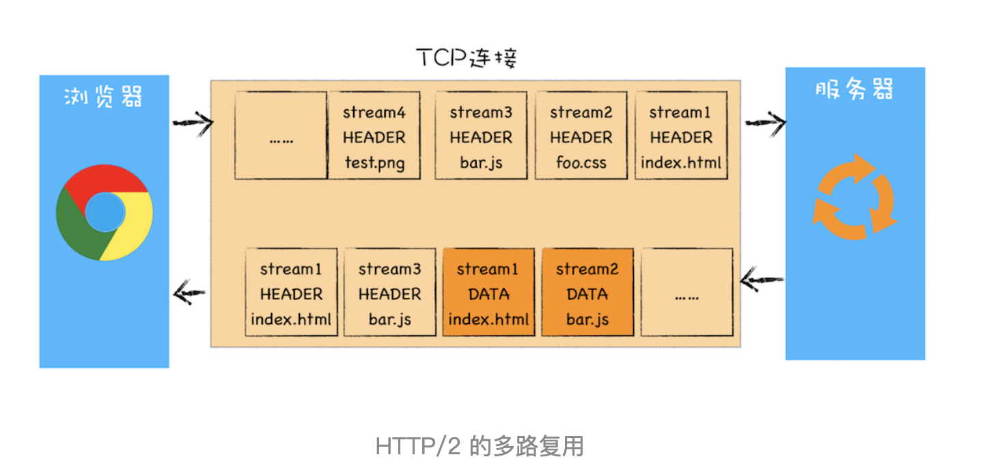

# HTTP2：如何提升网络速度

上一篇文章我们聊了 HTTP/1.1 的发展史，虽然 HTTP/1.1 已经做了大量的优化，但是依然存在很多性能瓶颈，依然不能满足我们日益变化的新需求，所以就有了我们今天要聊的 HTTP/2。

本文我们依然从需求的层面来谈，先分析 HTTP/1.1 存在哪些问题，然后再来分析 HTTP/2 是如何解决这些问题的。

我们知道 HTTP/1.1 为网络效率做了大量的优化，最核心的有如下三种方式：

- 增加了持久连接；
- 浏览器为每个域名最多同时维护 6 个 TCP 持久连接；
- 使用 CDN 的实现域名分片机制。

通过这些方式就大大提高了页面的下载速度，你可以通过下图来直观感受下：

在该图中，引入了 CDN，并同时为每个域名维护 6 个连接，这样就大大减轻了整个资源的下载时间。这里我们可以简单计算下：如果使用单个 TCP 的持久连接，下载 100 个资源所花费的时间为 100 * n * RTT；若通过上面的技术，就可以把整个时间缩短为 100 * n * RTT/(6 * CDN 个数)。从这个计算结果来看，我们的页面加载速度变快了不少

## HTTP/1.1 的主要问题

虽然 HTTP/1.1 采取了很多优化资源加载速度的策略，也取得了一定的效果，但是 HTTP/1.1对带宽的利用率却并不理想，这也是 HTTP/1.1 的一个核心问题。

带宽是指每秒最大能发送或者接收的字节数。我们把每秒能发送的最大字节数称为上行带宽，每秒能够接收的最大字节数称为下行带宽。

之所以说 HTTP/1.1 对带宽的利用率不理想，是因为 HTTP/1.1 很难将带宽用满。比如我们常说的 100M 带宽，实际的下载速度能达到 12.5M/S，而采用 HTTP/1.1 时，也许在加载页面资源时最大只能使用到 2.5M/S，很难将 12.5M 全部用满。

之所以会出现这个问题，主要是由以下三个原因导致的。

**第一个原因，TCP 的慢启动。**

一旦一个 TCP 连接建立之后，就进入了发送数据状态，刚开始 TCP 协议会采用一个非常慢的速度去发送数据，然后慢慢加快发送数据的速度，直到发送数据的速度达到一个理想状态，我们把这个过程称为慢启动。

你可以把每个 TCP 发送数据的过程看成是一辆车的启动过程，当刚进入公路时，会有从 0 到一个稳定速度的提速过程，TCP 的慢启动就类似于该过程。

慢启动是 TCP 为了减少网络拥塞的一种策略，我们是没有办法改变的。

而之所以说慢启动会带来性能问题，是因为页面中常用的一些关键资源文件本来就不大，如 HTML 文件、CSS 文件和 JavaScript 文件，通常这些文件在 TCP 连接建立好之后就要发起请求的，但这个过程是慢启动，所以耗费的时间比正常的时间要多很多，这样就推迟了宝贵的首次渲染页面的时长了。

**第二个原因，同时开启了多条 TCP 连接，那么这些连接会竞争固定的带宽。**

你可以想象一下，系统同时建立了多条 TCP 连接，当带宽充足时，每条连接发送或者接收速度会慢慢向上增加；而一旦带宽不足时，这些 TCP 连接又会减慢发送或者接收的速度。比如一个页面有 200 个文件，使用了 3 个 CDN，那么加载该网页的时候就需要建立 6 * 3，也就是 18 个 TCP 连接来下载资源；在下载过程中，当发现带宽不足的时候，各个 TCP 连接就需要动态减慢接收数据的速度。

这样就会出现一个问题，因为有的 TCP 连接下载的是一些关键资源，如 CSS 文件、JavaScript 文件等，而有的 TCP 连接下载的是图片、视频等普通的资源文件，但是多条 TCP 连接之间又不能协商让哪些关键资源优先下载，这样就有可能影响那些关键资源的下载速度了。

**第三个原因，HTTP/1.1 队头阻塞的问题。**

通过上一篇文章，我们知道在 HTTP/1.1 中使用持久连接时，虽然能公用一个 TCP 管道，但是在一个管道中同一时刻只能处理一个请求，在当前的请求没有结束之前，其他的请求只能处于阻塞状态。这意味着我们不能随意在一个管道中发送请求和接收内容。

这是一个很严重的问题，因为阻塞请求的因素有很多，并且都是一些不确定性的因素，假如有的请求被阻塞了 5 秒，那么后续排队的请求都要延迟等待 5 秒，在这个等待的过程中，带宽、CPU 都被白白浪费了。

在浏览器处理生成页面的过程中，是非常希望能提前接收到数据的，这样就可以对这些数据做预处理操作，比如提前接收到了图片，那么就可以提前进行编解码操作，等到需要使用该图片的时候，就可以直接给出处理后的数据了，这样能让用户感受到整体速度的提升。

但队头阻塞使得这些数据不能并行请求，所以队头阻塞是很不利于浏览器优化的。

## HTTP/2 的多路复用

前面我们分析了 HTTP/1.1 所存在的一些主要问题：慢启动和 TCP 连接之间相互竞争带宽是由于 TCP 本身的机制导致的，而队头阻塞是由于 HTTP/1.1 的机制导致的。

那么该如何去解决这些问题呢？

虽然 TCP 有问题，但是我们依然没有换掉 TCP 的能力，所以我们就要想办法去规避 TCP 的慢启动和 TCP 连接之间的竞争问题。

基于此，HTTP/2 的思路就是一个域名只使用一个 TCP 长连接来传输数据，这样整个页面资源的下载过程只需要一次慢启动，同时也避免了多个 TCP 连接竞争带宽所带来的问题。

另外，就是队头阻塞的问题，等待请求完成后才能去请求下一个资源，这种方式无疑是最慢的，所以 HTTP/2 需要实现资源的并行请求，也就是任何时候都可以将请求发送给服务器，而并不需要等待其他请求的完成，然后服务器也可以随时返回处理好的请求资源给浏览器。

所以，HTTP/2 的解决方案可以总结为：一个域名只使用一个 TCP 长连接和消除队头阻塞问题。可以参考下图：

该图就是 HTTP/2 最核心、最重要且最具颠覆性的多路复用机制。从图中你会发现每个请求都有一个对应的 ID，如 stream1 表示 index.html 的请求，stream2 表示 foo.css 的请求。这样在浏览器端，就可以随时将请求发送给服务器了。

服务器端接收到这些请求后，会根据自己的喜好来决定优先返回哪些内容，比如服务器可能早就缓存好了 index.html 和 bar.js 的响应头信息，那么当接收到请求的时候就可以立即把 index.html 和 bar.js 的响应头信息返回给浏览器，然后再将 index.html 和 bar.js 的响应体数据返回给浏览器。之所以可以随意发送，是因为每份数据都有对应的 ID，浏览器接收到之后，会筛选出相同 ID 的内容，将其拼接为完整的 HTTP 响应数据。

HTTP/2 使用了多路复用技术，可以将请求分成一帧一帧的数据去传输，这样带来了一个额外的好处，就是当收到一个优先级高的请求时，比如接收到 JavaScript 或者 CSS 关键资源的请求，服务器可以暂停之前的请求来优先处理关键资源的请求

## 多路复用的实现

现在我们知道为了解决 HTTP/1.1 存在的问题，HTTP/2 采用了多路复用机制，那 HTTP/2 是怎么实现多路复用的呢？你可以先看下面这张图：

从图中可以看出，HTTP/2 添加了一个二进制分帧层，那我们就结合图来分析下 HTTP/2 的请求和接收过程。

- 首先，浏览器准备好请求数据，包括了请求行、请求头等信息，如果是 POST 方法，那么还要有请求体。
- 这些数据经过二进制分帧层处理之后，会被转换为一个个带有请求 ID 编号的帧，通过协议栈将这些帧发送给服务器。
- 服务器接收到所有帧之后，会将所有相同 ID 的帧合并为一条完整的请求信息。
- 然后服务器处理该条请求，并将处理的响应行、响应头和响应体分别发送至二进制分帧层。
- 同样，二进制分帧层会将这些响应数据转换为一个个带有请求 ID 编号的帧，经过协议栈发送给浏览器。
- 浏览器接收到响应帧之后，会根据 ID 编号将帧的数据提交给对应的请求

从上面的流程可以看出，通过引入二进制分帧层，就实现了 HTTP 的多路复用技术。

上一篇文章我们介绍过，HTTP 是浏览器和服务器通信的语言，在这里虽然 HTTP/2 引入了二进制分帧层，不过 HTTP/2 的语义和 HTTP/1.1 依然是一样的，也就是说它们通信的语言并没有改变，比如开发者依然可以通过 Accept 请求头告诉服务器希望接收到什么类型的文件，依然可以使用 Cookie 来保持登录状态，依然可以使用 Cache 来缓存本地文件，这些都没有变，发生改变的只是传输方式。这一点对开发者来说尤为重要，这意味着我们不需要为 HTTP/2 去重建生态，并且 HTTP/2 推广起来会也相对更轻松了

## HTTP/2 其他特性

通过上面的分析，我们知道了多路复用是 HTTP/2 的最核心功能，它能实现资源的并行传输。多路复用技术是建立在二进制分帧层的基础之上。其实基于二进制分帧层，HTTP/2 还附带实现了很多其他功能，下面我们就来简要了解下。

### 1. 可以设置请求的优先级

我们知道浏览器中有些数据是非常重要的，但是在发送请求时，重要的请求可能会晚于那些不怎么重要的请求，如果服务器按照请求的顺序来回复数据，那么这个重要的数据就有可能推迟很久才能送达浏览器，这对于用户体验来说是非常不友好的。

为了解决这个问题，HTTP/2 提供了请求优先级，可以在发送请求时，标上该请求的优先级，这样服务器接收到请求之后，会优先处理优先级高的请求。

### 2. 服务器推送

除了设置请求的优先级外，HTTP/2 还可以直接将数据提前推送到浏览器。你可以想象这样一个场景，当用户请求一个 HTML 页面之后，服务器知道该 HTML 页面会引用几个重要的 JavaScript 文件和 CSS 文件，那么在接收到 HTML 请求之后，附带将要使用的 CSS 文件和 JavaScript 文件一并发送给浏览器，这样当浏览器解析完 HTML 文件之后，就能直接拿到需要的 CSS 文件和 JavaScript 文件，这对首次打开页面的速度起到了至关重要的作用。

### 3. 头部压缩

无论是 HTTP/1.1 还是 HTTP/2，它们都有请求头和响应头，这是浏览器和服务器的通信语言。HTTP/2 对请求头和响应头进行了压缩，你可能觉得一个 HTTP 的头文件没有多大，压不压缩可能关系不大，但你这样想一下，在浏览器发送请求的时候，基本上都是发送 HTTP 请求头，很少有请求体的发送，通常情况下页面也有 100 个左右的资源，如果将这 100 个请求头的数据压缩为原来的 20%，那么传输效率肯定能得到大幅提升。

## 总结

好了，今天就介绍这里，下面我来总结下本文的主要内容。

我们首先分析了影响 HTTP/1.1 效率的三个主要因素：TCP 的慢启动、多条 TCP 连接竞争带宽和队头阻塞。

接下来我们分析了 HTTP/2 是如何采用多路复用机制来解决这些问题的。多路复用是通过在协议栈中添加二进制分帧层来实现的，有了二进制分帧层还能够实现请求的优先级、服务器推送、头部压缩等特性，从而大大提升了文件传输效率。

HTTP/2 协议规范于 2015 年 5 月正式发布，在那之后，该协议已在互联网和万维网上得到了广泛的实现和部署。从目前的情况来看，国内外一些排名靠前的站点基本都实现了 HTTP/2 的部署。使用 HTTP/2 能带来 20%～60% 的效率提升，至于 20% 还是 60% 要看优化的程度。总之，我们也应该与时俱进，放弃 HTTP/1.1 和其性能优化方法，去“拥抱”HTTP/2