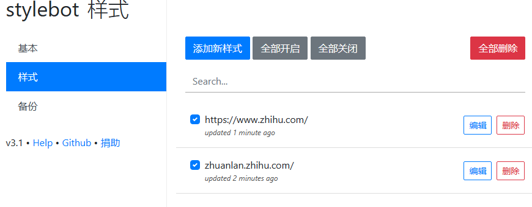

参考以上回答，使用谷歌插件stylish，经过尝试，以下是可行的：

```
https://www.zhihu.com/
zhuanlan.zhihu.com/
```

```
.ztext .content_image, .ztext .origin_image, .TitleImage, .RichContent-cover 
,.TopstoryItem img
,.Card img 
,.HotItem-img img
,.GlobalSideBar
,.VideoCard-player
,.TopstoryItem--advertCard
,.QuestionInvitation
,.Recommendations-Main
,.Question-sideColumn
{
    display:none;
}
.GifPlayer {
    display: none;
}

```

增强版

```
.Topstory-mainColumnCard{
  padding-top: 60px;
}
.TopstoryTabs,Topstory-tabs{
    position: fixed;
    top: 60px;
    z-index: 10;
}

.Topstory-mainColumn + div,
.TopstoryPageHeader,
.AppHeader-userInfo,
.AppHeader-inner a,
.AppHeader-inner ul{
      display:none;
}

.ztext .content_image,
.ztext .origin_image
{
    display:none;
}

.ztext .content_image,
.ztext .origin_image,
.TitleImage,
.RichContent-cover {
display:none;
}

.ztext .content_image, .ztext .origin_image, .TitleImage, .RichContent-cover 
,.TopstoryItem img
,.Card img 
,.HotItem-img img
,.GlobalSideBar
,.VideoCard-player
,.TopstoryItem--advertCard
,.QuestionInvitation
,.Recommendations-Main
,.Question-sideColumn
{
    display:none;
}
.GifPlayer {
    display: none;
}
```

黑暗模式

```
.TopstoryTabs,Topstory-tabs{
    position: fixed !important;
    top: -2px !important;
    border: none;
    z-index: 100 !important;
}

/* 黑暗模式 */
.QuestionHeader a ,.QuestionHeader .css-vurnku, .QuestionHeader-title,body, .WhiteBg-body, .AppHeader, .Topstory, .TopstoryItem, .TopstoryTabs, .ContentItem-actions, .VoteButton, .QuestionHeader, .QuestionHeader-footer, .ListShortcut, .Button, .Card, .ztext pre, .Post-Main, .Post-Sub, .ztext, .Popover, .Sticky, .CommentTopbar, .CommentsV2, .CommentsV2-footer, .CommentsV2-withPagination, .MCNLinkCard-cardContainer, .Button--primary.Button--blue, .Input-wrapper.Input-wrapper--grey, .Topstory-mainColumnCard .Card:not(.Topstory-tabCard),.HotList-list,.HotList-list .HotItem,.HotList-list .HotItem-excerpt,svg,path,.HoverCard,.Menu,.Menu-item{
    color:#d1d5d9;
    background-color: #18222d;
    border: 0;
}
path{
  color:#18222d;
}

/* 黑暗模式 */
.TopstoryTabs-link{
      margin: 0 12px;
}
.QuestionHeader-title,
.Topstory-mainColumn + div,
.TopstoryPageHeader,
.AppHeader-userInfo,
.AppHeader-inner a,
.AppHeader-inner ul{
      display:none;
}

.ztext .content_image,
.ztext .origin_image
{
    display:none;
}

.ztext .content_image,
.ztext .origin_image,
.TitleImage,
.RichContent-cover {
display:none;
}

.ztext .content_image, .ztext .origin_image, .TitleImage, .RichContent-cover 
,.TopstoryItem img
,.Card img 
,.HotItem-img img
,.GlobalSideBar
,.VideoCard-player
,.TopstoryItem--advertCard
,.QuestionInvitation
,.Recommendations-Main
,.Question-sideColumn
{
    display:none;
}
.GifPlayer {
    display: none;
}
```


导出的json

```
{
  "https://www.zhihu.com/": {
    "css": ".ztext .content_image, .ztext .origin_image, .TitleImage, .RichContent-cover \r\n,.TopstoryItem img\r\n,.Card img \r\n,.HotItem-img img\r\n,.GlobalSideBar\r\n,.VideoCard-player\r\n,.TopstoryItem--advertCard\r\n,.QuestionInvitation\r\n,.Recommendations-Main\r\n,.Question-sideColumn\r\n{\r\n    display:none;\r\n}\r\n.GifPlayer {\r\n    display: none;\r\n}\r\n.Topstory-mainColumnCard{\r\n  padding-top: 60px;\r\n}\r\n.TopstoryTabs,Topstory-tabs{\r\n    position: fixed;\r\n    top: 60px;\r\n    z-index: 10;\r\n}\r\n\r\n.Topstory-mainColumn + div,\r\n.TopstoryPageHeader,\r\n.AppHeader-userInfo,\r\n.AppHeader-inner a,\r\n.AppHeader-inner ul{\r\n      display:none;\r\n}\r\n\r\n.ztext .content_image,\r\n.ztext .origin_image\r\n{\r\n    display:none;\r\n}\r\n\r\n.ztext .content_image,\r\n.ztext .origin_image,\r\n.TitleImage,\r\n.RichContent-cover {\r\ndisplay:none;\r\n}\r\n\r\n.ztext .content_image, .ztext .origin_image, .TitleImage, .RichContent-cover \r\n,.TopstoryItem img\r\n,.Card img \r\n,.HotItem-img img\r\n,.GlobalSideBar\r\n,.VideoCard-player\r\n,.TopstoryItem--advertCard\r\n,.QuestionInvitation\r\n,.Recommendations-Main\r\n,.Question-sideColumn\r\n{\r\n    display:none;\r\n}\r\n.GifPlayer {\r\n    display: none;\r\n}\r\n.TopstoryTabs,Topstory-tabs{\r\n    position: fixed !important;\r\n    top: -2px !important;\r\n    border: none;\r\n    z-index: 100 !important;\r\n}\r\n\r\n/* 黑暗模式 */\r\n.QuestionHeader a ,.QuestionHeader .css-vurnku, .QuestionHeader-title,body, .WhiteBg-body, .AppHeader, .Topstory, .TopstoryItem, .TopstoryTabs, .ContentItem-actions, .VoteButton, .QuestionHeader, .QuestionHeader-footer, .ListShortcut, .Button, .Card, .ztext pre, .Post-Main, .Post-Sub, .ztext, .Popover, .Sticky, .CommentTopbar, .CommentsV2, .CommentsV2-footer, .CommentsV2-withPagination, .MCNLinkCard-cardContainer, .Button--primary.Button--blue, .Input-wrapper.Input-wrapper--grey, .Topstory-mainColumnCard .Card:not(.Topstory-tabCard),.HotList-list,.HotList-list .HotItem,.HotList-list .HotItem-excerpt,svg,path,.HoverCard,.Menu,.Menu-item{\r\n    color:#d1d5d9;\r\n    background-color: #18222d;\r\n    border: 0;\r\n}\r\npath{\r\n  color:#18222d;\r\n}\r\n\r\n/* 黑暗模式 */\r\n.TopstoryTabs-link{\r\n      margin: 0 12px;\r\n}\r\n.QuestionHeader-title,\r\n.Topstory-mainColumn + div,\r\n.TopstoryPageHeader,\r\n.AppHeader-userInfo,\r\n.AppHeader-inner a,\r\n.AppHeader-inner ul{\r\n      display:none;\r\n}\r\n\r\n.ztext .content_image,\r\n.ztext .origin_image\r\n{\r\n    display:none;\r\n}\r\n\r\n.ztext .content_image,\r\n.ztext .origin_image,\r\n.TitleImage,\r\n.RichContent-cover {\r\ndisplay:none;\r\n}\r\n\r\n.ztext .content_image, .ztext .origin_image, .TitleImage, .RichContent-cover \r\n,.TopstoryItem img\r\n,.Card img \r\n,.HotItem-img img\r\n,.GlobalSideBar\r\n,.VideoCard-player\r\n,.TopstoryItem--advertCard\r\n,.QuestionInvitation\r\n,.Recommendations-Main\r\n,.Question-sideColumn\r\n{\r\n    display:none;\r\n}\r\n.GifPlayer {\r\n    display: none;\r\n}",
    "readability": false,
    "enabled": true,
    "modifiedTime": "2024-04-11T09:16:57.872+08:00"
  }
}
```