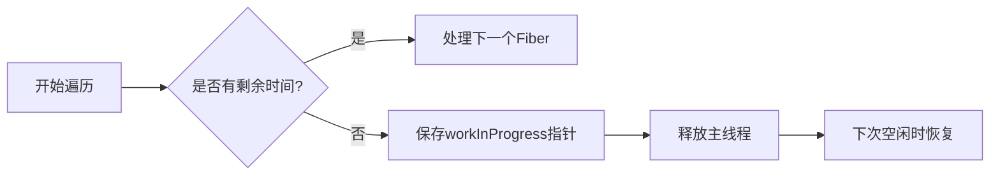

### React Fiber 架构核心原理笔记

---

#### 一、传统虚拟DOM树与Fiber结构对比
| **特性**     | **React Element 树** | **Fiber 结构**                       |
| ---------- | ------------------- | ---------------------------------- |
| **节点关系**   | 单向父子关系（父节点维护子节点数组）  | 双向指针关系（`child`/`sibling`/`return`） |
| **遍历方式**   | 递归遍历子树，无法中途暂停       | 链表式线性遍历，支持暂停/恢复                    |
| **中断恢复能力** | ❌ 无法快速定位中断点         | ✅ 通过指针链快速定位上下文                     |
| **内存占用**   | 轻量（仅存储子节点数组）        | 较高（需维护额外指针）                        |
|            |                     |                                    |

---

#### 二、Fiber 的链表化实现
##### 1. 关键指针
- **`child`**：指向第一个子节点  
- **`sibling`**：指向右侧兄弟节点  
- **`return`**：指向父节点（React 源码中命名为 `return`）

##### 2. 深度优先遍历的链表化
```javascript
// 伪代码：Fiber 遍历逻辑
function traverse(fiber) {
  while (fiber) {
    process(fiber);
    if (fiber.child) {
      fiber = fiber.child;
    } else {
      while (fiber && !fiber.sibling) {
        fiber = fiber.return;
      }
      if (fiber) fiber = fiber.sibling;
    }
  }
}
```

##### 3. 树形结构的线性展开
原始树结构：
```
       A
     /   \
    B     C
   / \     \
  D   E     F
             \
              G
```
遍历顺序：  
`A → B → D → E → C → F → G`  
（通过 `child` 优先下沉，`sibling` 横向扩展，`return` 回溯父级）

---

#### 三、并发更新机制
##### 1. 核心组件：`workInProgress` 指针
- **作用**：记录当前处理中的 Fiber 节点
- **中断逻辑**：保存指针位置 → 执行高优先级任务 → 恢复指针继续处理

##### 2. 时间分片（Time Slicing）


##### 3. 优先级调度
- **策略**：通过浏览器 `requestIdleCallback` API 实现空闲期任务处理
- **示例**：用户输入（高优先级）可打断渲染任务（低优先级）

---

#### 四、传统树结构的并发缺陷
| **问题**                | **Fiber 解决方案**                     |
|-------------------------|---------------------------------------|
| 子节点无法回溯父节点     | 通过 `return` 指针建立反向链路         |
| 无法快速定位兄弟节点     | `sibling` 指针直接访问同级节点         |
| 递归遍历导致调用栈不可控 | 链表遍历使用循环替代递归，实现可控栈   |

---

#### 五、Fiber 架构优势总结
1. **可中断渲染**：通过链表指针保存遍历状态，支持任务暂停/恢复
2. **增量更新**：将渲染拆分为多个小任务，避免长时间阻塞主线程
3. **优先级调度**：紧急操作（如动画）可优先于复杂计算执行
4. **错误边界**：通过 Fiber 节点关联关系实现组件级错误捕获

---

#### 附：Fiber 节点核心属性（简化版）
```typescript
interface Fiber {
  tag: WorkTag;          // 节点类型（函数组件/类组件等）
  key: string | null;    
  type: any;             // 对应React元素类型
  stateNode: any;        // 关联的DOM节点/组件实例

  // 指针系统
  return: Fiber | null;  // 父节点
  child: Fiber | null;   // 第一个子节点
  sibling: Fiber | null; // 右侧兄弟节点

  // 更新相关
  memoizedState: any;    // 当前状态
  updateQueue: any;      // 待处理的更新队列
  // ...其他属性
}
```

---

通过将树形结构转换为可追踪的链表，Fiber 架构使 React 具备了类似操作系统的任务调度能力，这是实现 Concurrent Mode 的基石。