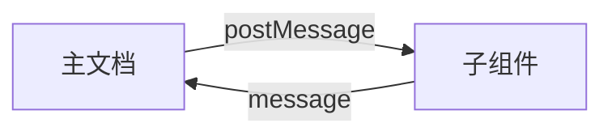

# HTML 组件化开发方案

## 1. 引言

在前端开发领域，组件化已成为提升代码复用性和可维护性的重要范式。虽然 React、Vue 等现代框架已提供成熟的组件化解决方案，但在原生 HTML 环境中实现组件化仍具实践价值。本文将深入探讨两种原生 HTML 组件化方案：`<object>` 标签方案与 `fetch` 动态加载方案，并解析其通信机制与适用场景。

---
## 2. HTML 组件化方案

### 2.1 `<object>` 标签方案

通过 W3C 标准标签实现组件隔离，适用于需要保持完整 DOM 独立性的场景。

**基础实现：**

```html
<object data="header.html"
        width="100%"
        height="100px"
        id="headerComponent">
</object>
```
#### **方案特性：**

✅ 优势：

- 完整的 DOM 隔离机制
- 零 JavaScript 依赖的静态加载
- 天然的样式作用域隔离

⚠️ 限制：

- 跨文档通信复杂度较高
- 样式继承机制存在浏览器差异
- 组件生命周期管理受限

---
### 2.2 `fetch` 动态加载方案

基于现代 Web API 的异步组件加载方案，提供更高的灵活度。

**基础实现：**

```html
<div id="dynamic-component"></div>
<script>
  fetch('component.html')
    .then(response => {
      if (!response.ok) throw new Error('Network response was not ok');
      return response.text();

    })
    .then(html => {
      const parser = new DOMParser();
      const doc = parser.parseFromString(html, 'text/html');
      document.getElementById('dynamic-component')
              .appendChild(doc.body.firstChild);
    })
    .catch(error => console.error('Fetch error:', error));
</script>

```

#### **方案特性：**

✅ 优势：

- 细粒度的 DOM 控制能力
- 原生的事件通信机制
- 支持动态内容更新

⚠️ 限制：

- 依赖 JavaScript 执行环境
- 需处理样式加载时序问题（FOUC）
- 组件作用域管理需手动控制

---
## 3. 组件通信机制

### 3.1 跨文档消息通信 (`postMessage`)

适用于 `<object>` 组件间的安全通信，支持跨源场景。

**通信架构：**


**实现示例：**

```javascript
// 主文档
const component = document.getElementById('component').contentWindow;
component.postMessage({ type: 'INIT', payload: config }, '*');

// 组件内部
window.addEventListener('message', (event) => {
  if (event.origin !== 'https://your-domain.com') return;
  handleMessage(event.data);
});
```

---

### 3.2 自定义事件通信

适用于同文档上下文的 `fetch` 加载组件，提供类型化的事件机制。

**实现模式：**

```javascript
// 组件初始化
const componentEvent = new CustomEvent('component-ready', {
  detail: { version: '1.0.0' },
  bubbles: true
});
document.dispatchEvent(componentEvent);
  
// 主文档监听
document.addEventListener('component-ready', (event) => {
  console.log('Component version:', event.detail.version);
});

```

---
## 4. 工程化实践

### 4.1 `postMessage` 工具封装

```javascript
/**
 * 在指定的 object 组件加载完成后发送消息
 * @param {string} componentId - 目标 object 组件的 ID
 * @param {any} message - 需要发送的消息内容
 * @param {string} [targetOrigin='*'] - 消息发送的目标源，默认允许所有来源（建议指定具体域名）
 */
 
function postComponentMessage(componentId, message, targetOrigin = '*') {
    if (typeof componentId !== 'string' || !componentId.trim()) {
        console.error('Invalid componentId: Expected a non-empty string.');
        return;
    }
    if (message === undefined) {
        console.error('Message cannot be undefined.');
        return;
    }
    const component = document.getElementById(componentId);
    if (!component) {
        console.error(`Component with ID "${componentId}" not found.`);
        return;
    }
    

    /**
     * 处理 object 加载完成后的消息发送
     * @param {Event} event - load 事件对象
     */
     
    const handleLoad = (event) => {
        const object = event.target;
        if (object?.contentWindow) {
            object.contentWindow.postMessage(message, targetOrigin);
        } else {
            console.error(`Failed to access contentWindow of component "${componentId}".`);
        }
    };
  
    // 监听 load 事件，并确保只执行一次
    component.addEventListener('load', handleLoad, { once: true });

    // 如果 object 已经加载完成，则立即发送消息
    if (component.contentWindow) {
        component.contentWindow.postMessage(message, targetOrigin);
    }
}


```

#### **使用示例**

**父组件通信：**

```html
<!DOCTYPE html>
<html lang="en">
<head>
    <meta charset="UTF-8">
    <meta name="viewport" content="width=device-width, initial-scale=1.0">
    <title>HTML 组件化</title>
</head>

<body>
    <h1>HTML 组件化demo</h1>
    <object id="navComponent" type="text/html" data="./components/nav.html">
    </object>
</body>
<script src="./utils/postComponentMessage.js" type="text/javascript"></script>

<script>
    postComponentMessage('navComponent', {
        protocol: 'COMPONENT_COMMUNICATION_V1',
        command: 'UPDATE_NAV',
        payload: {
            list: [
                { name: '首页', key: '1' },
                { name: '产品中心', key: '2' },
                { name: '解决方案', key: '3' }
            ]
        }
    });
</script>
</html>
```

**子组件监听（nav.html）：**

```html
<!DOCTYPE html>
<html lang="en">
<head>
    <meta charset="UTF-8">
    <meta name="viewport" content="width=device-width, initial-scale=1.0">
    <title>nav</title>
</head>

<body>
    <div>nav组件</div>
    <!-- components/nav.html -->
    <ul class="nav-list"></ul>

</body>
<script>
    window.addEventListener('message', (event) => {
        console.log('Message received', event);  // 添加调试信息
        // 安全验证
        if (event.origin !== window.location.origin) return;

        // 协议版本校验
        const message = event.data
        if (message.protocol !== 'COMPONENT_COMMUNICATION_V1') return;

        console.log('---' + message.payload)
        // 处理具体指令
        switch (message.command) {
            case 'UPDATE_NAV':
                renderNavList(message.payload.list);
                break;
            // 其他命令处理...
        }
    });

    function renderNavList(list) {
        console.log(list)
        const container = document.querySelector('.nav-list');
        container.innerHTML = list.map(item => `
    <li>
      <a>${item.name}</a>
    </li>
  `).join('');
    }
</script>

</html>

```

[完整demo代码](https://github.com/Muliminty/demo/tree/main/single-file/HTML%20%E7%BB%84%E4%BB%B6%E5%8C%96)

#### **关键实现要点：**

1. **安全验证机制：**

```
// 验证消息来源
if (event.origin !== window.location.origin) return;

// 验证协议版本
if (message.protocol !== 'COMPONENT_COMMUNICATION_V1') return;
```

**组件就绪检测：**

```
// 自动处理组件加载状态
if (component.contentWindow) {
  sendMessage();
} else {
  component.addEventListener('load', sendMessage, { once: true });
}

```

**错误处理：**

```
try {
  component.contentWindow.postMessage(/*...*/);
} catch (error) {
  console.error('PostMessage failed:', error);
}
```
### 4.2 通信协议规范

建议采用标准化消息格式：

```javascript
{
  protocol: 'COMPONENT_COMMUNICATION_V1',
  timestamp: Date.now(),
  source: 'header-component',
  command: 'UPDATE_LAYOUT',
  payload: {
    // 业务数据
  }
}
```

---
## 5. 方案选型指南

| 维度          | `<object>` 方案  | `fetch` 方案  |
| ----------- | -------------- | ----------- |
| **加载方式**    | 同步加载           | 异步加载        |
| **通信复杂度**   | 较高（跨文档）        | 较低（同文档）     |
| **样式隔离**    | 完全隔离           | 需手动管理       |
| **SEO 友好性** | 较好             | 需服务端渲染支持    |
| **适用场景**    | 独立功能模块/第三方组件集成 | 动态内容/高频交互组件 |

---
## 6. 总结

原生 HTML 组件化方案为无框架环境提供了可行的工程实践路径：<br>
• `<object>` 方案适用于需要严格隔离的静态组件场景<br>
• `fetch` 方案更契合需要深度交互的动态组件需求<br>
• 消息通信机制的选择应与组件集成方式相匹配

两种方案各有其适用边界，开发者应根据项目具体需求（如性能要求、维护成本、团队技术栈等）进行合理选型，必要时可组合使用以发挥最大效益。