网管小贾 / sysadm.cc

“哥，你啥时候回来啊？XX[业务系统](https://zhida.zhihu.com/search?content_id=219554155&content_type=Article&match_order=1&q=%E4%B8%9A%E5%8A%A1%E7%B3%BB%E7%BB%9F&zhida_source=entity)又出问题了！”

“情况紧急，老大说让你[远程处理](https://zhida.zhihu.com/search?content_id=219554155&content_type=Article&match_order=1&q=%E8%BF%9C%E7%A8%8B%E5%A4%84%E7%90%86&zhida_source=entity)，总之尽快解决！”

虽说我常年出差在外总能收到这样的消息，似乎早已习惯，但是公司小胡的这通连环轰炸却让我有些焦躁。

如今情况不同，我发现最近HS采样点都离奇地消失了！

这大老远的让我怎么回公司呢？

于是我就找啊找啊，好不容易让我给找着了，排队的人还真多，每个人都一副焦急的样子，队伍一眼望不到头，尽头处的小白房子若隐若现。

我立马排上队，急接着就给[小胡](https://zhida.zhihu.com/search?content_id=219554155&content_type=Article&match_order=2&q=%E5%B0%8F%E8%83%A1&zhida_source=entity)回消息，示意他公司电脑里有一份 `RustDesk` 搭建服务器的说明文档，让他赶紧帮忙确认一下[远程服务器](https://zhida.zhihu.com/search?content_id=219554155&content_type=Article&match_order=1&q=%E8%BF%9C%E7%A8%8B%E6%9C%8D%E5%8A%A1%E5%99%A8&zhida_source=entity)的运行情况。

如果可以的话，我先用手机远程上去看看问题。

公司出于系统安全方面的考量，在出差前我已经在 `Windows`[系统平台](https://zhida.zhihu.com/search?content_id=219554155&content_type=Article&match_order=1&q=%E7%B3%BB%E7%BB%9F%E5%B9%B3%E5%8F%B0&zhida_source=entity)上初步搭建了 `RustDesk`[中继服务器](https://zhida.zhihu.com/search?content_id=219554155&content_type=Article&match_order=1&q=%E4%B8%AD%E7%BB%A7%E6%9C%8D%E5%8A%A1%E5%99%A8&zhida_source=entity)。

现在正好用上，如果你也想了解如何自建 `RustDesk` 服务器，那么我顺便给你们说上一说。

什么，太专业，只会 `Windows` ？

没事，会 `Windows` 系统就够了，没有想象中的那么难，走起吧！

### `**RustDesk**`** 简介**
`RustDesk` 是一款免费开源可商用的[远程桌面控制软件](https://zhida.zhihu.com/search?content_id=219554155&content_type=Article&match_order=1&q=%E8%BF%9C%E7%A8%8B%E6%A1%8C%E9%9D%A2%E6%8E%A7%E5%88%B6%E8%BD%AF%E4%BB%B6&zhida_source=entity)。

它的项目地址是这个。

> [https://github.com/rustdesk/rustdesk](https://link.zhihu.com/?target=https%3A//github.com/rustdesk/rustdesk)
>

不方便访问 `Github` 的小伙伴可以下载这里的备用链接。

+ `rustdesk-server` - [服务器程序](https://zhida.zhihu.com/search?content_id=219554155&content_type=Article&match_order=1&q=%E6%9C%8D%E5%8A%A1%E5%99%A8%E7%A8%8B%E5%BA%8F&zhida_source=entity)  

    - `rustdesk-server-1.1.6.zip` - 源码
    - `rustdesk-server-linux-x64.zip` - `Linux`
    - `rustdesk-server-windows-x64.zip` - `Windows`
+ `rustdesk-1.1.9.zip` - 客户端源码
+ `rustdesk-1.1.9-fedora28-centos8.rpm` - `Fedora` 客户端
+ `rustdesk-1.1.9-manjaro-arch.pkg.tar.zst` - `Manjaro` 客户端
+ `rustdesk-1.1.9-raspberry-armhf.deb` - [树莓派](https://zhida.zhihu.com/search?content_id=219554155&content_type=Article&match_order=1&q=%E6%A0%91%E8%8E%93%E6%B4%BE&zhida_source=entity)客户端
+ `rustdesk-1.1.9.dmg` - `MacOS` 客户端
+ `rustdesk-1.1.9.deb` - `Debian`客户端
+ `rustdesk-1.1.9-suse.rpm` - `SUSE Linux` 客户端
+ `rustdesk-1.1.9.apk` - 安卓版客户端
+ `rustdesk-1.1.9-windows_x64.zip` - `Windows` 安装版客户端
+ `rustdesk-1.1.9-windows_x64-portable.zip` - `Windows` 便捷版客户端
+ `node-v18.12.0-x64.msi` - `NodeJS` 安装包

**RustDesk全家桶打包.7z(89.9M)**

下载链接：[https://pan.baidu.com/s/1_pbFBZS6_uuPxM6Adw1Qdw](https://link.zhihu.com/?target=https%3A//pan.baidu.com/s/1_pbFBZS6_uuPxM6Adw1Qdw)

[提取码](https://zhida.zhihu.com/search?content_id=219554155&content_type=Article&match_order=1&q=%E6%8F%90%E5%8F%96%E7%A0%81&zhida_source=entity)：<关注公众号，发送001001>

`RustDesk` 的具体特点大家可以到官网上查看，我这儿只说一些相比其他远程软件不同或更高级的特点。

比如说，支持多平台客户端，包括网页版。

又比如不限速度，稳定可靠，可自行搭建中继服务器。

又又比如不区分[控制端](https://zhida.zhihu.com/search?content_id=219554155&content_type=Article&match_order=1&q=%E6%8E%A7%E5%88%B6%E7%AB%AF&zhida_source=entity)和受控端，互相都可以连接控制。

`RustDesk` 的连接原理非常简单，就是通过 `ID` 中继服务器识别双方，然后再由服务器返回指令让双方直接建立连接。

如果双方无法直接建立连接，那么 `ID` 中继服务器就充当中间人在连接双方之间来回传递数据和信息。

再来让我们看看 `RustDesk` 的名字，我想各位可能猜出来了，肯定是用 `Rust` 写的。

好像了解 `Rust` 语言的人并不多，在国内似乎也没有很大的知名度。

不过这些都不打紧，`RustDesk` 的易用就是一大特点，只要我们能用会用就行。

OK，介绍完毕！

在正式开始说明前，我们先来了解一些有助于我们理解的概念术语！

### **一些概念术语**
要想自己搭建 `RustDesk` 服务器，有一些概念术语需要事先了解。

### **服务器：**
+ `hbbs` - `RustDesk``ID` 注册服务器
+ `hbbr` - `RustDesk` 中继服务器

`ID`[注册服务器](https://zhida.zhihu.com/search?content_id=219554155&content_type=Article&match_order=2&q=%E6%B3%A8%E5%86%8C%E6%9C%8D%E5%8A%A1%E5%99%A8&zhida_source=entity)（ `hbbs` ）就是管各个客户端 `ID` 的，每个客户端都有一个唯一的 `ID` 。

而中继服务器（ `hbbr` ）则是负责检测、中转各个客户端连接和数据传输。

通常这两个服务器可以是在同一台机器中运行。

### **开放端口：**
默认情况下，`hbbs` 监听 `21115(tcp)` , `21116(tcp/udp)` , `21118(tcp)` ，`hbbr` 监听 `21117(tcp)` ， `21119(tcp)` 。

务必在防火墙开启这几个端口， **注意 **`**21116**`** 要同时开启 **`**TCP**`** 和 **`**UDP**` 。 

+ `TCP/21115` - `hbbs` 用作 `NAT` 类型测试
+ `UDP/21116` - `hbbs` 用作 `ID` 注册与心跳服务
+ `TCP/21116` - `hbbs` 用作 `TCP` 打洞与连接服务
+ `TCP/21117` - `hbbr` 用作中继服务
+ `TCP/21118/21119` - 网页客户端

官方安装说明（有坑）：

> [https://rustdesk.com/docs/en/self-host/install/](https://link.zhihu.com/?target=https%3A//rustdesk.com/docs/en/self-host/install/)
>

### `**Windows**`** 上自建服务器**
打开 `Windows` 服务器程序压缩包，只看到两个文件，意思是啥前面已经解释过了。

别看只有两个文件，劝君还是不要只看官网，否则会有无数个坑等着你，比如直接运行它会报错。

虽说原因无非就是缺东西，和人一样，给到位了就好了。

问题是缺少的东西不是太好找，不过我费了点劲儿还是给找到了，老规矩文末下载。

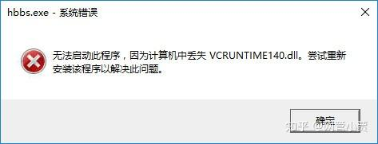

如果你不信，那么接下来就会遭遇N多问题。

给你看张图，不管如何运行都会出错和失败，服务始终无法正常工作。

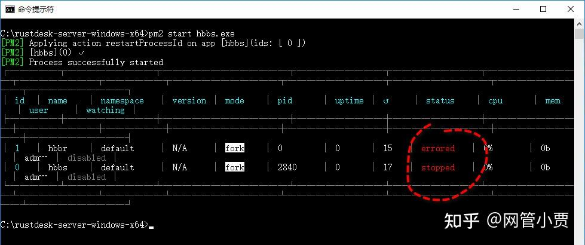

缺少组件是不是上网到处找啊？

其实大可不必，只要安装 `NodeJS` 即可，已经放在打包下载中了。

一旦搞定缺失的组件后，整个状态就会变得完全不一样了，毕竟官方为我们编译好的程序我们只要拿来用就行了，非常之爽啊！

而 `PM2` 或是 `NSSM` 也只不过是用于辅助启动的工具罢了。

当然我先声明，我对 `NodeJS` 的了解基本属于小白级别，只不过我有照猫画虎的小聪明罢了。

接下来我们就先给小伙伴们展示一下直接跑 `hbbs/hbbr` 的样子，之后再拿 `PM2` 来简述一下，毕竟后者是官方推荐的方法，可以很方便地管理 `hbbs/hbbr` 服务的启动。

跑 `hbbs/hbbr` 的方法简单得不能再简单了，直接一个命令不带任何参数。

我们先跑下 `ID` 注册服务器试试。

```plain
C:\rustdesk-server-windows-x64>hbbs
```

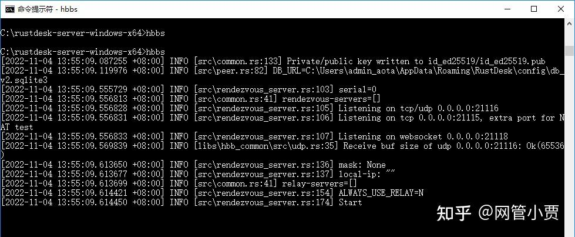

你看，它不报错了吧，与此同时也打开了几个端口。

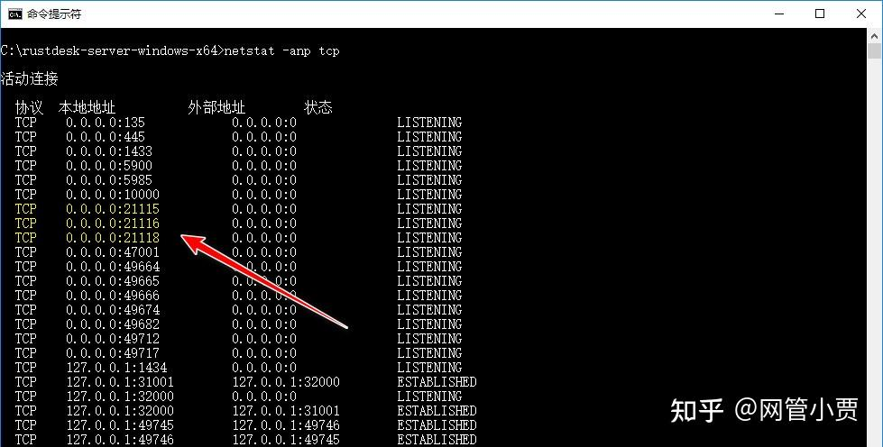

再来看看进程列表，稳稳地跑着呢。

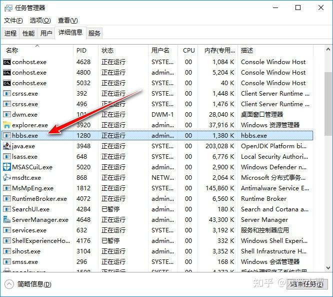

在实际连接使用过程中，服务会很敬业地分析接收我们传递的连接信息，小筒子一看就很认真嘛！

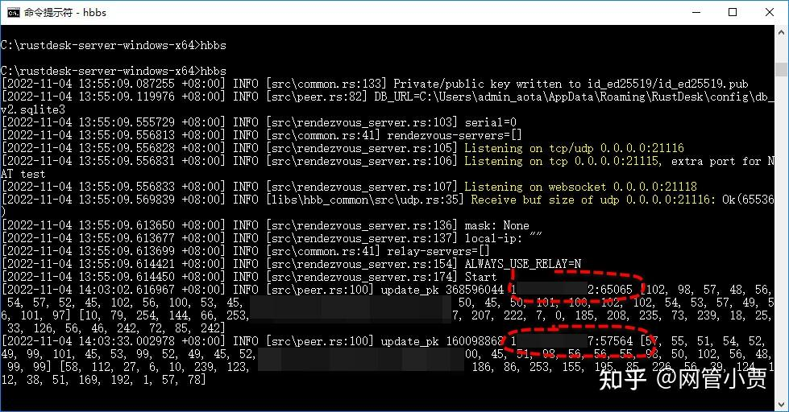

OK，中继服务器 `hbbr` 也是同理，不过我好像只开了一个 `hbbs` 就可以用了。

那么接下来我们再试试官网推荐的 `PM2` 方法。

我的理解是，这玩意应该是 `NodeJS` 程序的软件包管理器，不管怎样这一点照着官网走就是了。

首先，安装 `NodeJS` ，下载包在后面也给备好了，亦或者各位可以到其官网上下载 `LTS` 版本。

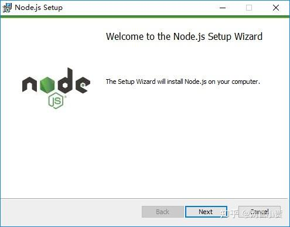

一路耐可斯特后安装完毕，接下来在命令提示窗口中依次输入三条命令，意为安装 `Windows`[启动管理器](https://zhida.zhihu.com/search?content_id=219554155&content_type=Article&match_order=1&q=%E5%90%AF%E5%8A%A8%E7%AE%A1%E7%90%86%E5%99%A8&zhida_source=entity)。

第一条命令：

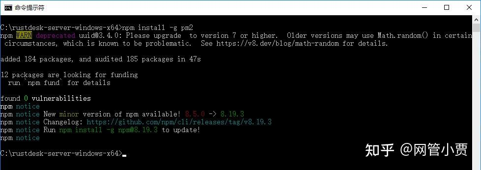

第二条命令：

```plain
npm install pm2-windows-startup -g
```

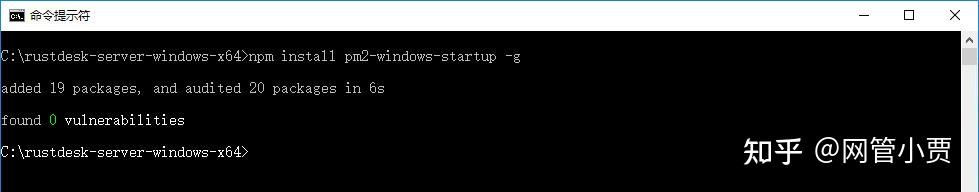

第三条命令：

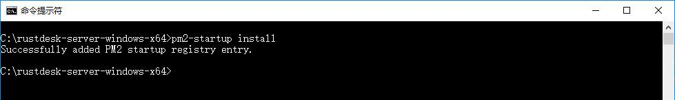

一切准备就绪了，我们可以用 `pm2` 管理并运行 `ID` 注册服务器 `hbbs` 和中继服务器 `hbbr` 了。

```plain
cd c:\rustdesk-server-windows-x64
pm2 start hbbs.exe -- -r <hbbr运行所在主机的地址>
pm2 start hbbr.exe 
pm2 save
```

看看我运行的效果，先来一张跑 `hbbs` 的截图。

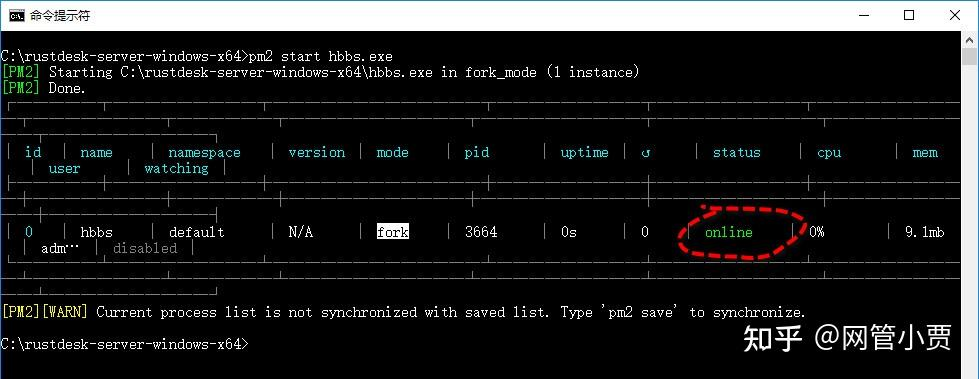

很好，`online` 状态，再瞅瞅[进程信息](https://zhida.zhihu.com/search?content_id=219554155&content_type=Article&match_order=1&q=%E8%BF%9B%E7%A8%8B%E4%BF%A1%E6%81%AF&zhida_source=entity)，用的是 `node.exe` 。

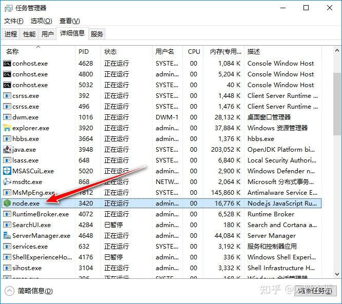

紧接着跑 `hbbr` 吧，兄弟俩齐上阵，效果刚刚滴。

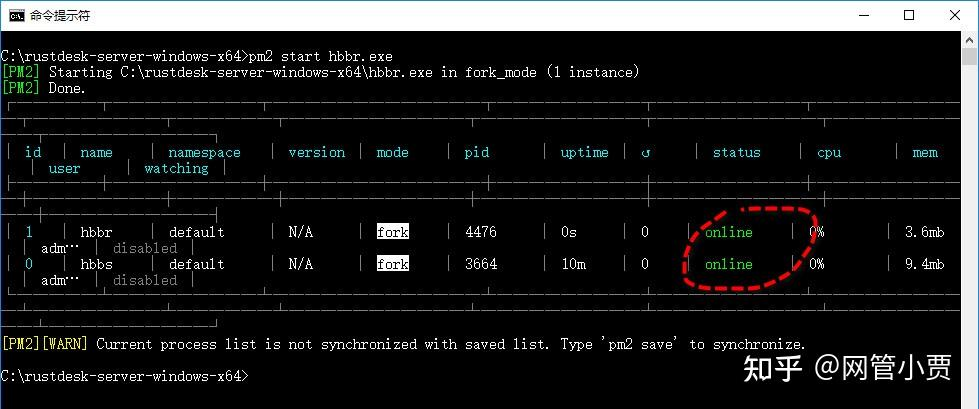

前面跑单独命令的时候我没跑 `hbbr` ，现在顺便也看一下端口状态吧。

嗯，`21117` 和 `21119` 也都开放了。

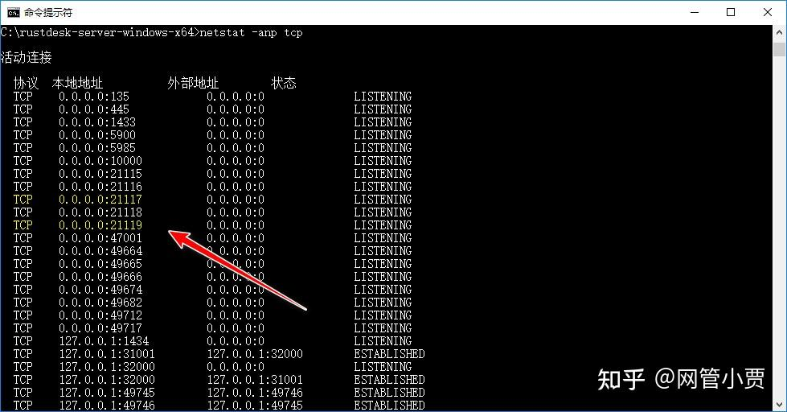

非常完美，我们把它保存起来，下次重启后还能跟着系统自动启动多好。

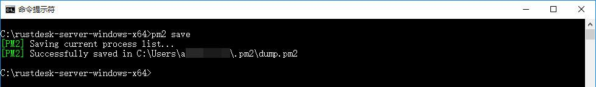

假如你不放心，还想看看它工作的样子，可以随时将它再打印出来查看。

**连连看**

服务都跑起来了，差不多也该到连连看环节了，要不光一个服务有啥好看的呢！

来吧，打开客户端程序，我用的是 `Windows` 上的客户端，它长这样。

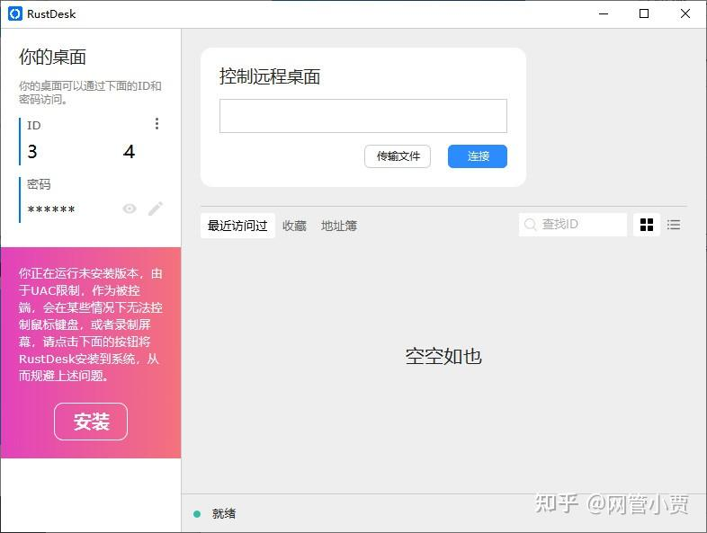

界面很简洁，左侧是系统自动计算给出的 `ID` 和密码，右侧则是我们需要连接到目标的操作区域。

通常，我们只要在文本框中输入目标对象的 `ID` 再点击 `连接` 就可以了。

一旦连接有了反馈，`RustDesk` 就会问我们要对方的密码。

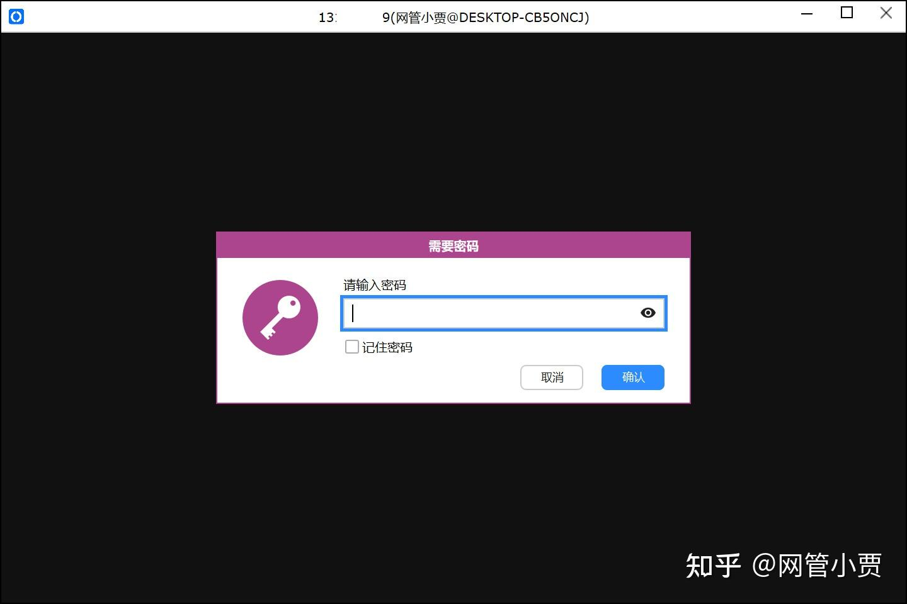

这个密码是啥，在哪儿找？

呐，就在这儿，你把鼠标放上去就看显示明文。

不过这个密码是对方的，可以通过询问了解到。

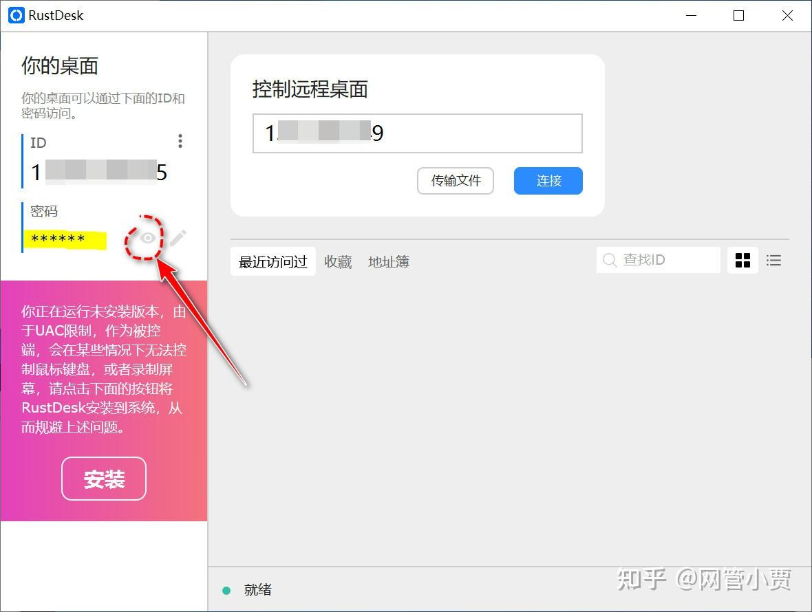

很快连接就建立好了，速度飞快，你可以开始[远程操作](https://zhida.zhihu.com/search?content_id=219554155&content_type=Article&match_order=1&q=%E8%BF%9C%E7%A8%8B%E6%93%8D%E4%BD%9C&zhida_source=entity)了。

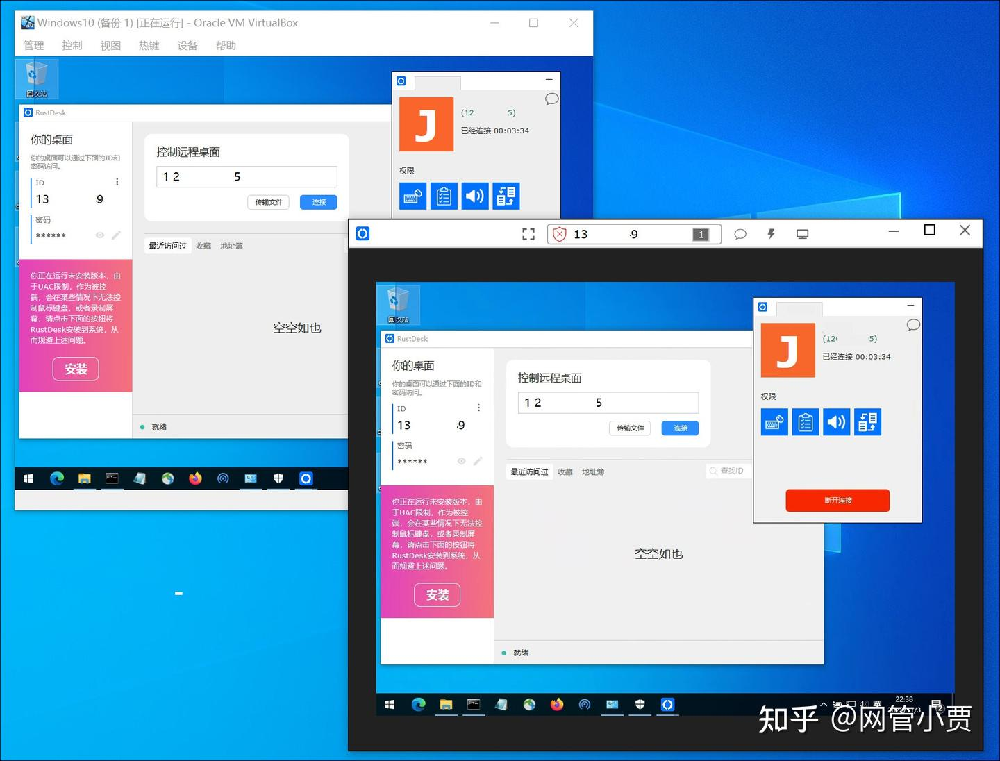

连接完成后，控制台上也会留有连接记录，方便下次快捷操作。

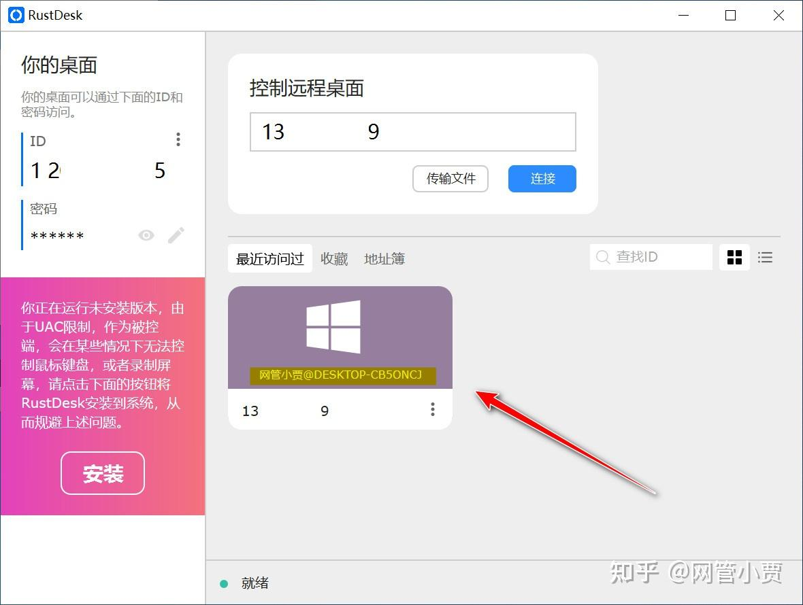

好了，到这里我就问你，完美不完美？

说实话，很完美，不过这种情况下，`RustDesk` 建立连接时会去找公网上的服务器，然后会自动帮你连接你想要的目标对象。

然而你别忘了，我们前面都自建好了服务器，放着不用浪费感情你不会心痛？

是的，要用真心，我们赶快连接我们自己的服务器吧！

告诉你，用自己的服务器也灰常简单，简单得不要不要的！

第一步，点开三个点菜单，选择 `ID/中继服务器` 。

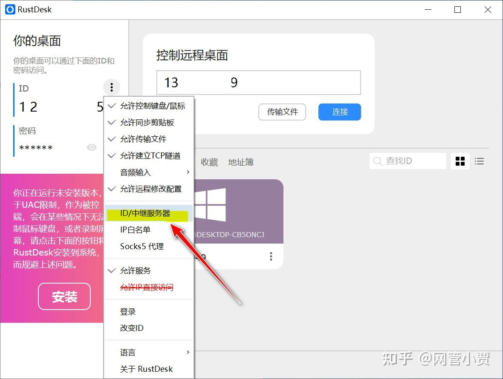

第二步，将服务器的[主机名](https://zhida.zhihu.com/search?content_id=219554155&content_type=Article&match_order=1&q=%E4%B8%BB%E6%9C%BA%E5%90%8D&zhida_source=entity)或IP地址输入到窗口文本框中，其他的不理它就是了。

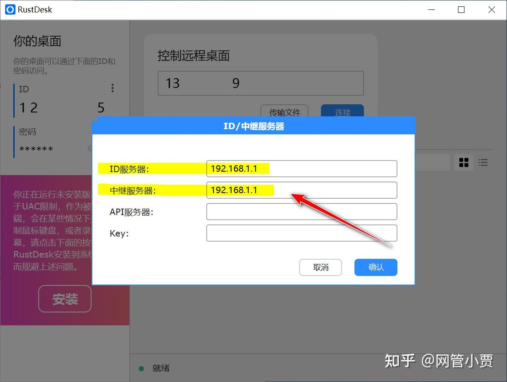

好了，就两步，有没有病都是走这两步。

你要是还不太自信，可以将服务器和客户端的网关去掉，确保它们上不了公网。

这样做的目的是为了让连接与被连接双方都明确无误地连接我们指定的自建的服务器上而非公网服务器。

最后，你可以像之前[远程连接](https://zhida.zhihu.com/search?content_id=219554155&content_type=Article&match_order=1&q=%E8%BF%9C%E7%A8%8B%E8%BF%9E%E6%8E%A5&zhida_source=entity)一样来连接目标对象了。

需要多说一嘴，使用[自建服务器](https://zhida.zhihu.com/search?content_id=219554155&content_type=Article&match_order=2&q=%E8%87%AA%E5%BB%BA%E6%9C%8D%E5%8A%A1%E5%99%A8&zhida_source=entity)来建立远程连接的方式，非常适合安全性要求高的场景，局域网或其他一些私有网络也可以这么做，安全可靠、便捷高效。

**其实还能玩直连**

`RustDesk` 的原理，服务器只是充当了中介的身份，只要连接双方是在直接能访问到的网络中（比如局域网），它就会给安排成直连。

除非无法直连或速度不理想，否则最后连接双方其实还是直连状态，也就是说 `RustDesk` 完全可以直接玩直连。

如下图，在菜单中勾选 `允许IP直接访问` ，然后输入目标主机名或IP地址即可畅快连接。

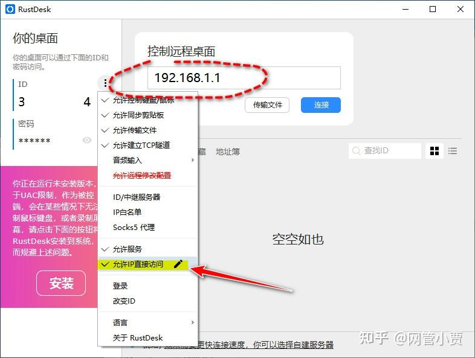

这种情况下，中继服务器也就可以退休了，说白了，比如在局域网中，我们就可以像用其他远程连接软件一样，直接连接远程操作了。

### **写在最后**
我排着队一路走走停停，最终手机成功连接到了公司的服务器上，还好问题不大很快就处理好了。

这时我一抬头，嘿，马上轮到我了，那个激动啊。

结果等我走近扶着眼镜这么仔细一瞧差点没当场社死！

只见那小白房子上挂一块硕大匾额，上写金灿灿四个大字：公共厕所......

**将技术融入生活，打造有趣之故事**

网管小贾 / [http://sysadm.cc](https://link.zhihu.com/?target=http%3A//sysadm.cc)  


> 来自: [只会 Windows 也能轻松搭建远程桌面 RustDesk 自用服务器 - 知乎](https://zhuanlan.zhihu.com/p/591391984)
>

