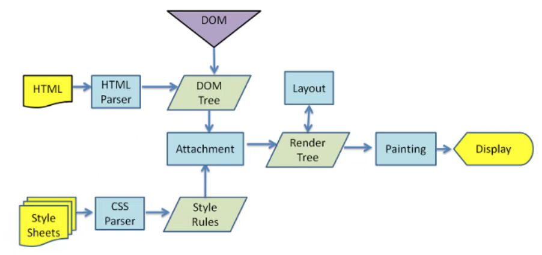

[TOC]

# 性能优化

## 怎么理解重绘和回流，什么场景会触发

在html中每一个元素都可以理解成一个盒子，在浏览器解析过程中会涉及回流与重绘。

 1. 回流：布局引擎会根据各种样式计算每个盒子在页面上的大小与位置。
 2. 重绘：计算和盒模型的位置大小以及其他属性后浏览器根据每个盒子特性进行绘制。

**浏览器的渲染机制**

- 解析HTML，生成DOM树，解析CSS，生成CSSOM树。
- 将DOM树和CSSOM树结合，生成渲染树（renderTree）。
- Layout（回流）：根据生成的渲染树，进行回流得到节点的几何信息（位置，大小）。
- Painting（重绘）：根据渲染树以及回流得到的几何信息得到节点的绝对像素。

> 说人话就是：如果页面的DOM元素位置或者大小尺寸发生了变化，页面的布局发生了改变，就会触发回流机制。
> 而如果元素只是颜色之类的样式发生了改变。就是触发重绘机制。
> 另外有一点要注意的就是，**重绘不一定会回流，但回流一定会重绘**。

**如何避免**

1. CSS中避免回流、重绘

- 尽可能在DOM树的最末端改变class

- 避免设置多层内联样式
- 动画效果应用到position属性为absolute或fixed的元素上
- 避免使用table布局
- 使用css3硬件加速，可以让transform、opacity、filters等动画效果不会引起回流重绘

2. JS操作避免回流、重绘

- 避免使用JS一个样式修改完接着改下一个样式，最好一次性更改CSS样式，或者将样式列表定义为class的名称

- 避免频繁操作DOM，使用文档片段创建一个子树，然后再拷贝到文档中
- 先隐藏元素，进行修改后再显示该元素，因为display:none上的DOM操作不会引发回流和重绘
- 避免循环读取offsetLeft等属性，在循环之前把它们存起来
- 对于复杂动画效果,使用绝对定位让其脱离文档流，否则会引起父元素及后续元素大量的回流
