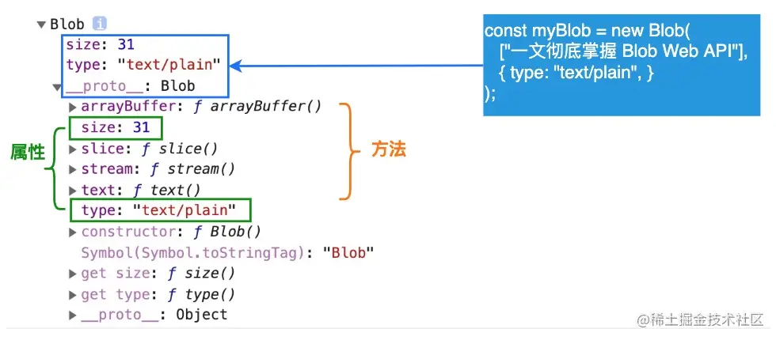

**`Blob()`** 构造函数返回一个新的 [`Blob`](https://developer.mozilla.org/zh-CN/docs/Web/API/Blob) 对象。blob 的内容由参数数组中给出的值的串联组成。

### 语法

```JavaScript
var aBlob = new Blob( array, options );
```

### 参数

-   _array_ 是一个由[`ArrayBuffer`](https://developer.mozilla.org/zh-CN/docs/Web/JavaScript/Reference/Global_Objects/ArrayBuffer), [`ArrayBufferView`](https://developer.mozilla.org/zh-CN/docs/Web/JavaScript/Reference/Global_Objects/TypedArray), [`Blob`](https://developer.mozilla.org/zh-CN/docs/Web/API/Blob), [`DOMString`](https://developer.mozilla.org/zh-CN/docs/Web/JavaScript/Reference/Global_Objects/String) 等对象构成的 [`Array`](https://developer.mozilla.org/zh-CN/docs/Web/JavaScript/Reference/Global_Objects/Array) ，或者其他类似对象的混合体，它将会被放进 [`Blob`](https://developer.mozilla.org/zh-CN/docs/Web/API/Blob)。DOMStrings 会被编码为 UTF-8。
-   _options_ 是一个可选的`BlobPropertyBag`字典，它可能会指定如下两个属性：
    -   `type`，默认值为 `""`，它代表了将会被放入到 blob 中的数组内容的 MIME 类型。
    -   `endings`，默认值为`"transparent"`，用于指定包含行结束符`\n`的字符串如何被写入。它是以下两个值中的一个：`"native"`，代表行结束符会被更改为适合宿主操作系统文件系统的换行符，或者 `"transparent"`，代表会保持 blob 中保存的结束符不变 非标准


### 示例

```JavaScript
var aFileParts = ['<a id="a"><b id="b">hey!</b></a>']; // 一个包含 DOMString 的数组
var oMyBlob = new Blob(aFileParts, {type : 'text/html'}); // 得到 blob
```

**从字符串创建 Blob**
```JavaScript
let myBlobParts = ['<html><h2>Hello Semlinker</h2></html>']; // 由单个DOMString组成的数组
let myBlob = new Blob(myBlobParts, {type : 'text/html', endings: "transparent"}); // the blob

console.log(myBlob.size + " bytes size");
// Output: 37 bytes size
console.log(myBlob.type + " is the type");
// Output: text/html is the type
```

**从类型化数组和字符串创建 Blob**
```JavaScript
let hello = new Uint8Array([72, 101, 108, 108, 111]); // 二进制格式的 "hello"
let blob = new Blob([hello, ' ', 'semlinker'], {type: 'text/plain'});
```

介绍完 Blob 构造函数，接下来我们来分别介绍 Blob 类的属性和方法：

