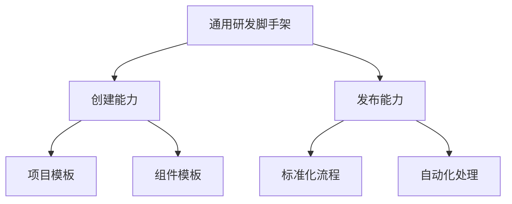

### 前端研发痛点分析与脚手架需求设计

#### 一、核心痛点分析
| 痛点类型              | 具体表现                                                                 | 影响程度 |
|-----------------------|--------------------------------------------------------------------------|----------|
| 重复代码拷贝          | 项目初始化需手动复制基础代码（埋点/请求封装/工具方法等）                  | ★★★★★    |
| Git操作不规范         | 分支混乱/合并冲突频发/未遵循Git Flow规范                                  | ★★★★☆    |
| 发布流程低效易错      | 配置错误/版本混乱/CDN未及时刷新/多环境发布效率低下                         | ★★★★☆    |

#### 二、脚手架核心需求


##### 1. 通用创建能力需求
| 功能维度          | 具体要求                                                                 | 技术指标                     |
|-------------------|--------------------------------------------------------------------------|----------------------------|
| 模板定制          | 支持用户自定义模板仓库                                                   | 模板更新后1分钟内生效        |
| 快速接入          | 新增模板接入步骤≤3步                                                     | 配置项≤5个                  |
| 多场景支持        | 支持React/Vue/Node等主流技术栈模板                                        | 预设模板≥5种                |
| 动态配置          | 根据用户选择生成差异化代码（如是否集成Redux）                             | 条件编译覆盖率100%           |

##### 2. 智能发布能力需求
| 流程环节          | 自动化要求                                                             | 规范约束                   |
|-------------------|----------------------------------------------------------------------|--------------------------|
| Git操作           | 自动创建feature分支/合并后自动删除                                    | 遵循Git Flow规范          |
| 版本管理          | 自动生成CHANGELOG/SemVer版本号升级                                    | 版本冲突检测率100%         |
| 静态资源处理      | 自动上传OSS+CDN刷新                                                  | 支持增量/全量上传模式      |
| 多环境发布        | 测试环境与生产环境配置隔离                                            | 环境切换耗时≤10s          |

#### 三、标准化流程设计


1. **Git操作规范（大厂实践）**
   ```mermaid
   sequenceDiagram
       开发者->>脚手架: 发起发布请求
       脚手架->>Git: 创建release分支
       Git-->>脚手架: 返回分支信息
       脚手架->>CI/CD: 触发构建流程
       CI/CD-->>脚手架: 返回构建结果
       脚手架->>Git: 打tag(v1.0.0)
       脚手架->>Git: 删除临时分支
   ```

2. **发布流程矩阵**
   | 阶段          | 测试环境                          | 生产环境                          |
   |---------------|-----------------------------------|-----------------------------------|
   | 构建策略      | 保留调试信息                      | 极致压缩+SourceMap分离            |
   | 域名配置      | test.example.com                 | www.example.com                  |
   | CDN策略       | 不缓存                            | 强缓存( max-age=31536000 )        |
   | 监控接入      | 基础埋点                          | 全量监控(性能/错误/用户行为)       |

#### 四、关键技术指标
| 指标项              | 目标值                          | 测量方式                     |
|---------------------|-------------------------------|----------------------------|
| 项目创建耗时        | ≤5s（冷启动）                  | 10次平均测量                |
| 模板渲染速度        | ≤100ms/文件                   | 100KB模板文件测试           |
| 发布流程耗时        | ≤60s（不含构建）               | 从git push到CDN生效         |
| 命令补全率          | ≥95%                          | 100个常用场景测试           |

#### 五、扩展能力规划
1. **生态集成**
   - 插件系统：支持第三方扩展（如接入内部NPM源）
   - 模板市场：开发者共享优质模板
   - CI/CD对接：Jenkins/GitLab CI深度集成

2. **安全增强**
   - 敏感配置加密存储
   - 操作权限分级控制
   - 发布前依赖漏洞扫描

> **实施路线图**：  
> 1. 基础功能开发（2周）  
> 2. 内部试点验证（1周）  
> 3. 全量推广+文档完善（1周）  
> 4. 生态建设阶段（持续迭代）  
